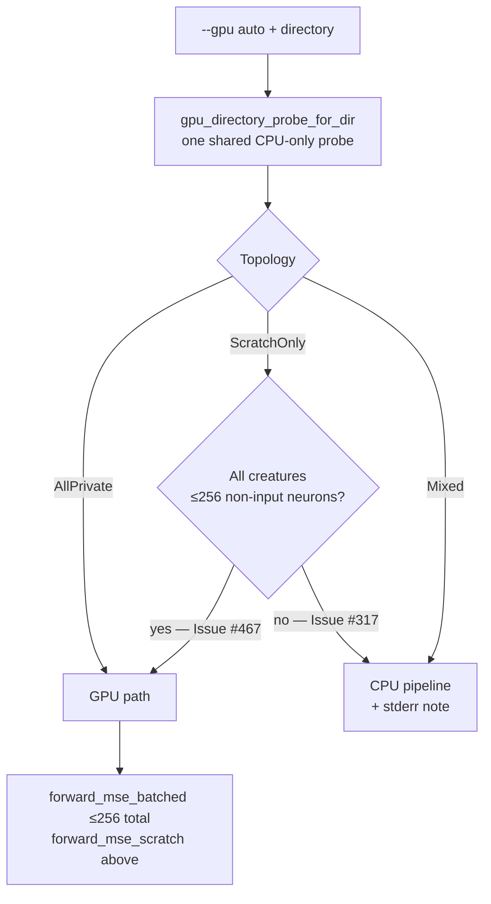

## Summary

Benchmarked `--gpu on` vs `--gpu off` for the **shallow** creature shape
(2461 inputs → 19 hidden → 1 output, 22 221 synapses) and acted on the result:
**GPU wins by 45–50 %**, so the GPU code is kept and `--gpu auto` now routes
shallow scratch pools to GPU instead of falling back to CPU. Closes #467.

Issue #317 measured CPU ~3× faster than the scratch GPU kernel and made `auto`
skip GPU for **every** `ScratchOnly` pool. That evidence came from the *deep*
production shape (~1666 hidden). A creature with thousands of inputs but a
handful of hidden neurons is scratch-routed only because inputs count towards
`num_neurons` — and it is decisively faster on GPU. `auto` now distinguishes the
two: a scratch-only pool whose creatures all have ≤ 256 **non-input** neurons
(`MAX_SHALLOW_NON_INPUT_NEURONS`, `directory_pool_is_shallow`) keeps the GPU
path and prints no topology fallback note; deep scratch-only and mixed pools are
unchanged.

Secondary fix in the same path: `auto` loaded and compiled the whole creature
directory **twice** (once for the fallback note, once for the routing decision).
Both now share one `multi_score::gpu_directory_probe_for_dir` result.

### Decisions this settles

* **#323** — GPU code is **kept** (the deletion path is not taken); confirmed by
  the issue author on #467.
* **#333** — closed: its remaining production-topology experiments are moot for
  this decision.
* **#317** — unchanged for the production shape; only the *shallow* case was
  carved out.

## Evidence

**CLI/backend change — no UI, so no screenshot.** Evidence is wall-clock
benchmark numbers plus the test suite.

Host: Apple M4 Pro (8P + 4E cores), 24 GB, macOS; release build. Corpus:
synthetic, generated locally at production record width (2462 `f32` =
9848 B/record), 37 000 records over 4 `.bin` shards (364 376 000 bytes). The full
521-bin corpus is unavailable in the worker environment (the #333 blocker) and
this repo ships no creature and fetches nothing (#448).

### Before / after — median of 5, interleaved runs

| `N` | Mode | Wall | `gpuBackend` | vs `--gpu off` |
|---|---|---|---|---|
| 50 | `--gpu off` | 5.44 s | `cpu-fallback` | CPU floor |
| 50 | `--gpu on` | **2.95 s** | `metal` | **45.8 % faster** |
| 50 | `auto` — **before** | 6.90 s | `cpu-fallback` | 26.8 % slower |
| 50 | `auto` — **after** | **4.19 s** | `metal` | **23.0 % faster** |
| 63 | `--gpu off` | 7.08 s | `cpu-fallback` | CPU floor |
| 63 | `--gpu on` | **3.52 s** | `metal` | **50.3 % faster** |
| 63 | `auto` — **before** | 8.93 s | `cpu-fallback` | 26.1 % slower |
| 63 | `auto` — **after** | **5.22 s** | `metal` | **26.3 % faster** |

`auto` before → after: **6.90 s → 4.19 s** (N=50) and **8.93 s → 5.22 s**
(N=63). The residual gap to `--gpu on` is the CPU-only pre-flight
(`gpu_directory_compatible`), which still loads and compiles the pool once more.

**Parity:** worst relative `error` delta between `--gpu off` and `--gpu on`
across the 50-creature pool was **2.6 × 10⁻⁸**, within the #81 CPU↔GPU
tolerance. Kernel: `forward_mse_scratch`, 12 dispatches, `gpuInflightChunks: 1`
(the #319 clamp still applies).

### Threshold validation

The 256 non-input-neuron cap was checked against sparse synthetic creatures at
2461 inputs with synapse count held at ~22 k (N=50, median of 3): GPU won at 20,
257, 1025 and 1667 non-input neurons (46.8 %, 39.4 %, 40.2 %, 61.4 %). Depth
alone did not flip the result on this host, so the cap is deliberately
conservative — well inside the measured win region, and it leaves #317's
real-creature / real-corpus production decision untouched.

### Routing after this change



### Reproduce

```bash
BENCH_SHALLOW_CREATURE=/path/to/Enceladus.json,/path/to/Enceladus-Terminal.json \
  BENCH_SHALLOW_N=63 ./scripts/bench-shallow-gpu.sh
```

Full write-up, including the sweep and the reproduce recipe, is in
[`docs/performance-baseline.md`](../../performance-baseline.md) under
"Shallow-creature GPU A/B — 26 July 2026 (Issue #467)".

## Test Plan

New tests:

- `rust_scorer/src/gpu/forward_mse_batched.rs`
  - `directory_pool_is_shallow_accepts_enceladus_shape` — the 2461/19 shape is
    scratch-routed **and** shallow.
  - `directory_pool_is_shallow_rejects_deep_production_shape` — 1666 hidden is
    not shallow.
  - `directory_pool_is_shallow_boundary_is_inclusive` — 256 non-input neurons
    pass, 257 do not.
  - `directory_pool_is_shallow_requires_every_creature` — one deep creature
    disqualifies the pool; an empty pool is never shallow (no evidence ≠ GPU).
- `rust_scorer/src/gpu/mod.rs`
  - `auto_should_use_gpu_directory_keeps_gpu_for_shallow_scratch_topology`
  - `auto_topology_fallback_note_absent_for_shallow_scratch`
- `rust_scorer/tests/directory_mode_tdd.rs`
  - `directory_mode_auto_shallow_scratch_topology_keeps_gpu` — end-to-end CLI;
    asserts the deep-topology note is absent and, on a GPU host, that the
    scratch kernel ran.
- `tests/scripts/bench_shallow_gpu.bats` — 10 tests for the new harness: clean
  skip when `BENCH_SHALLOW_CREATURE` is unset, fail-loud on a missing creature or
  a shape mismatch, correct `--gpu <mode> <creatures_dir> <data_dir>` invocation,
  repetition count, generated record width, non-zero scorer exit propagation, and
  the median/delta summary.

**Modified existing tests — business-logic change, documented:** three tests
asserted CPU routing for creatures with 0–1 non-input neurons, which this change
reclassifies as shallow (GPU). None were removed or disabled; each was retargeted
at a production-depth creature so it still guards the #317 behaviour it was
written for:

- `auto_should_use_gpu_directory_declines_scratch_topology` (2461 inputs,
  1 hidden → 1666 hidden)
- `auto_topology_fallback_note_for_scratch_only` (300 inputs, 0 hidden →
  2461 inputs, 1666 hidden)
- `directory_mode_auto_production_scale_topology_uses_cpu` → renamed
  `directory_mode_auto_deep_scratch_topology_uses_cpu` (2461/1 → 2461/300)

Also renamed the scratch-only stderr note to "deep scratch-kernel creatures" so
it states the condition it now describes.

`./quality.sh` passes cleanly (shellcheck, cargo-deny, fmt, clippy `-D warnings`,
check, build, 144 lib tests + integration suites, rustdoc, release build, bats).

## Notes

- `Cargo.lock` carries an incidental refresh of the sibling `neat-core` path
  dependency version (0.2.17 → 0.2.24) picked up by the local build; patch drift
  inside the 0.2 line is non-breaking per the `neat-core.expected-version` gate.
