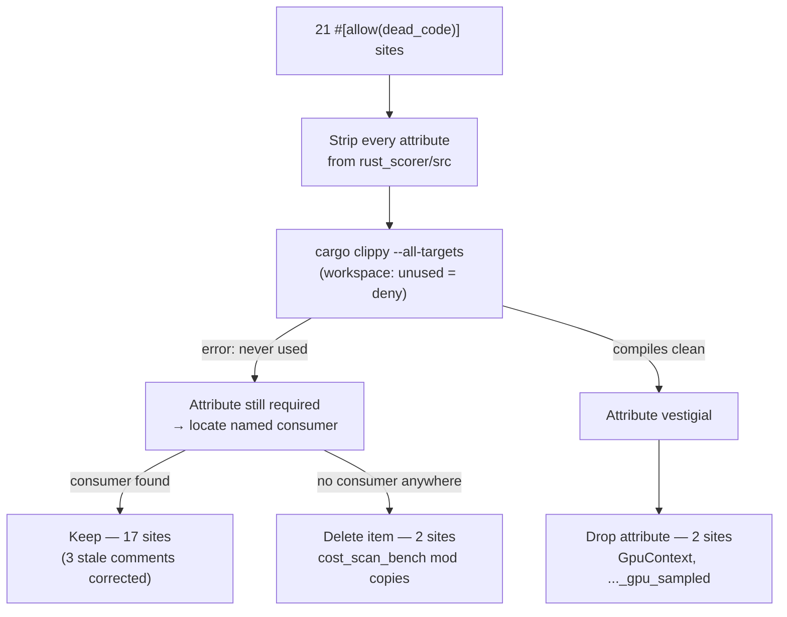

# Scorer-local dead-code audit (Issue #470)

## Summary

Scorer-only slice of the #466 plan. Confirmed `rust_scorer` uses **no**
superseded `neat-core` entry point, verified every `#[allow(dead_code)]` site
against the consumer its comment names, and cleared the vestigial code and
parameters the #428–#430 sweep left behind. No behaviour change — no test
expectation was edited to accommodate a removal. Closes #470.

Headline numbers:

| Audit item | Result |
| --- | --- |
| Superseded-API hits (`score_records`, `score_records_parallel`) across `src`, `tests`, `benches` | **0** |
| `#[allow(dead_code)]` sites before | 21 |
| `#[allow(dead_code)]` sites after | **17** (all consumers verified in this pass) |
| Sites deleted as genuinely dead | 2 |
| Sites whose attribute was dropped (item now reachable) | 2 |
| Vestigial parameters removed | 1 (across 2 entry points) |

## Task 1 — superseded `neat-core` API: 0 hits

```text
$ grep -rn "score_records" rust_scorer/src rust_scorer/tests rust_scorer/benches | wc -l
0
```

Scoring still runs through the fused packed path — `neat_core::loss::mse_sum_batch_packed`
(`rust_scorer/src/cost.rs`, with the `mae_` / `mape_` siblings alongside it),
driven by `neat_core::training_bin_stream::for_each_read_chunk`. Nothing to
migrate.

## Task 2 — `#[allow(dead_code)]` disposition list

Method (not a source grep — an actual compiler check): the workspace sets
`unused = "deny"`, so every attribute was **stripped from the tree** and
`cargo clippy --all-targets --all-features` was run. Any site that produced a
`never used` / `never read` / `never constructed` error still has no consumer
in at least one target and must keep the attribute; any site that produced no
error is reachable from ordinary code and the attribute is vestigial. The named
consumer of each surviving site was then confirmed by locating the call.

### Confirmed live — attribute retained (17)

| Site | Item | Verified consumer |
| --- | --- | --- |
| `src/multi_score.rs:77` | `training_pass_probe::reset` | `tests/single_pass_assertion.rs:73` |
| `src/multi_score.rs:83` | `training_pass_probe::count` | `tests/single_pass_assertion.rs:89` |
| `src/multi_score.rs:120` | `compile_probe::reset` | `tests/compile_once_assertion.rs:71` |
| `src/multi_score.rs:126` | `compile_probe::count` | `tests/compile_once_assertion.rs:87` |
| `src/multi_score.rs:310` | `enum EarlyExit` | `tests/early_exit_tdd.rs:110/166/221/266`, `benches/scoring.rs:1026` |
| `src/multi_score.rs:372` | `score_from_creature_dir` | `tests/{compile_once_assertion,single_pass_assertion,sample_rate_directory,early_exit_tdd,gpu_mae_parity,gpu_rmse_parity}.rs`, `benches/scoring.rs` |
| `src/multi_score.rs:464` | `score_from_creature_dir_with_early_exit` | `tests/early_exit_tdd.rs:101/153/214/248`, `benches/scoring.rs:1013` |
| `src/multi_score.rs:996` | `score_from_creature_dir_gpu` | `tests/gpu_{mae_parity,rmse_parity,pipelined_parity,pipelined_scratch_multi_bin,sample_rate_parity}.rs`, `src/bin/gpu_pipeline_alloc_bench.rs:159`, `benches/scoring.rs` |
| `src/stream_score.rs:157` | `accumulate_cost_sum_forward_only_fused` | `src/bin/cost_scan_bench.rs:116/128`, `benches/scoring.rs:254/834` |
| `src/gpu/forward_mse_batched.rs:644` | `BatchedRunner::kernel` | `tests/gpu_multi_score_parity.rs:128` |
| `src/gpu/mod.rs:134` | `GpuBackendLabel::as_str` | `tests/gpu_mae_parity.rs:120` |
| `src/gpu/mod.rs:216` | `ScoringPath::SingleCreature` | `src/gpu/mod.rs:562/830` (unit tests) |
| `src/gpu/mod.rs:503` | `resolve_backend` | all seven `tests/gpu_*.rs` files, `benches/scoring.rs:49` |
| `src/sampling.rs:79` | `SampleSpec::phase` | `src/sampling.rs:241` (unit test) |
| `src/sampling.rs:147` | `RecordSampler::full` | `src/sampling.rs:265/397`, `src/stream_io.rs:318/350/407` (unit tests) |
| `src/cost.rs:131` | `CostKind::from_cli` | doctest at `src/cost.rs:124-125` + `cost::tests` |
| `src/cost.rs:340` | `supported_list` | `src/cost.rs:41` (`Display for InvalidCostName`) |

Three of these had a **stale comment** naming a consumer that no longer
described reality; the comments were corrected in place (the item itself stayed):

- `GpuBackendLabel::as_str` — "consumed by callers once GPU kernels land" (they
  landed; the real consumer is `tests/gpu_mae_parity.rs`).
- `CostKind::from_cli` — "dispatch landing in #119-3"; the live consumers are
  the doctest and the `cost::tests` unit tests.
- `accumulate_cost_sum_forward_only_fused` — "benches/tests" narrowed to the two
  files that actually call it.

### Deleted — genuinely unused (2)

- `src/bin/cost_scan_bench.rs` — `#[path = "../env_tuning.rs"] mod env_tuning;`
  and `#[path = "../read_tuning.rs"] mod read_tuning;`. Both module copies were
  declared (mirroring `float_scan_bench`, which *does* use them) but nothing in
  the bench referenced a single item from either; stripping the attributes
  surfaced eight `never used` errors covering the whole of both modules. This
  bench drives the library entry point
  `rust_scorer::stream_score::accumulate_cost_sum_forward_only_fused`, which
  applies the crate's own read tuning internally.

### Attribute dropped — item now reachable from ordinary code (2)

- `src/gpu/mod.rs` — `struct GpuContext`. The Issue #80 comment said "nothing
  consumes `device`/`queue` yet"; both are now consumed by the batched and
  scratch kernels in `gpu::forward_mse_batched`, and `main.rs:327` holds the
  context. Doc comment updated to match.
- `src/multi_score.rs` — `score_from_creature_dir_gpu_sampled`. Its own comment
  already said "used by the CLI's sampled path" — `main.rs:354` calls it, so the
  binary's module tree reaches it and the attribute was pure noise.

### GPU sites — checked, not deleted (per the issue's "out of scope")

`gpu/**` is live code (#467 benchmarked GPU 45–50 % faster on shallow creatures;
issue #323 is closed). Every GPU allow site above was verified to have a real
consumer, so "investigate, not delete" did not need to be exercised.

## Task 3 — vestigial parameters

Every `fn` in `rust_scorer/src` was traced to all call sites in `src`, `tests`
and `benches`, looking for parameters that are never read or that receive the
same constant everywhere.

**Removed:**

- `creature: &CreatureExport` from
  `stream_score::accumulate_cost_sum_forward_only_fused` **and**
  `accumulate_cost_sum_forward_only_fused_sampled`. The `_sampled` variant had
  already been `_`-prefixed (never read); the full-rate wrapper existed only to
  thread the value into it. `TrainingDataConfig` already carries the
  input/output widths the fused reader needs, and the pre-compiled
  `CompiledNetwork` carries the topology, so the export was dead weight at every
  call site. Updated: `src/main.rs`, `src/bin/cost_scan_bench.rs` (×2),
  `benches/scoring.rs` (×2) and the doctest.

**Kept, with a comment stating why** (each is read, so removal would change the
public reporting seam rather than delete dead weight):

- `gpu_backend: GpuBackendLabel` on `main.rs::score_from_json` and on the CPU
  directory chain (`multi_score::score_from_creature_dir_cpu` and its wrappers).
  Always `CpuFallback` at every CPU call site, but it *is* read into
  `ScoreResult::gpu_backend` — the value serialised as the `gpuBackend` JSON
  field — and `score_from_creature_dir_gpu_impl` passes a real adapter label
  through the same parameter. Hard-coding it would fork the reporting path.
- `path: ScoringPath` on `gpu::auto_topology_fallback_note`. Every call site
  passes `CreatureDirectory`, so the guard cannot fire today; the parameter
  mirrors the sibling `auto_cost_fallback_note` (which *is* exercised with
  `SingleCreature`), and `main.rs` selects the note helper by mode rather than
  by path — a future single-creature kernel must not silently inherit the
  directory-topology note.
- `num_outputs` on `shallow_fixture::plan_synapses` / `shallow_creature_json`.
  Always `1` in-tree (the Enceladus shape) but genuinely read — it sets the
  `hidden → output` edge count.
- `forward_only: bool` and its companions on `cost::accumulate_cost_sum`.
  **Mirrors the `neat_core::loss::*_sum_batch_packed` signature** and is
  genuinely variable (`false` at `main.rs` for the recurrent branch).
- `num_creatures: u32` on `BatchedRunner::from_data` — derivable from
  `data.creatures.len()`, but it is the dispatch height every other runner field
  keys off. Its doc comment claimed "used by tests"; corrected to name the only
  in-tree caller, `BatchedRunner::new`.

Explicitly re-checked and found genuinely variable (no action): `inflight_chunks`,
`effective_directory_gpu_inflight::requested`, `SampleSpec::new::phase`,
`growth_cost`, `auto_should_use_gpu::path`, the fallback helpers' `mode`, every
`cost: CostKind`, and `env_tuning::parse_tuning_var::name`. `ScoringConfig::forward_only`
was excluded up front per the issue.

## Evidence

Backend/CLI change only — no web interface, so no Playwright screenshot. The
gate is the compiler plus the existing regression suites.



Verification commands (all run locally, stdin redirected from `/dev/null`):

- `cargo clippy --all-targets --all-features` — clean. This is the tripwire for
  a wrong deletion: `unused = "deny"` turns "removed something still live" or
  "dropped an attribute from something genuinely unreferenced" into a hard
  compile error.
- `./quality.sh < /dev/null` — green (fmt, cargo-deny, clippy, build, test,
  rustdoc, release build, shellcheck, codespell, bats).

## Test Plan

No new test file: the acceptance criteria are enforced by gates that already
exist, and adding a source-grepping "audit test" would assert on source text
rather than behaviour.

- **Wrong deletion of live code** → `unused = "deny"` + ordinary type-checking.
  `cargo clippy --all-targets --all-features` inside `./quality.sh`, mirrored by
  the PR CI workflow, fails the build. Exercised deliberately during the audit
  (the strip-and-compile pass above) rather than assumed.
- **Removal of the `env_tuning` / `read_tuning` module copies** →
  `rust_scorer/tests/cost_scan_bench_smoke.rs::cost_scan_bench_emits_one_row_per_supported_cost`
  drives the `cost_scan_bench` binary end-to-end against a synthetic creature
  and corpus and asserts one JSON row per supported `CostKind`. It passes
  unchanged.
- **Behaviour drift from the `creature` parameter removal** → the scoring
  regression suites pin real outputs and pass unchanged:
  `tests/scorer_smoke.rs`, `tests/cost_parity.rs`, `tests/directory_mode_tdd.rs`,
  `tests/sample_rate_tdd.rs`, `tests/sample_rate_directory.rs`,
  `tests/single_pass_assertion.rs`, `tests/compile_once_assertion.rs`,
  `tests/early_exit_tdd.rs`, plus the `prod_fixture`-backed Criterion path and
  the `tests/gpu_*.rs` GPU-vs-CPU parity set. **No test expectation was edited.**
- **Doctest** for `accumulate_cost_sum_forward_only_fused` updated to the new
  signature and re-checked by `RUSTDOCFLAGS="-D warnings" cargo doc` /
  `cargo test --doc` in `./quality.sh`.
