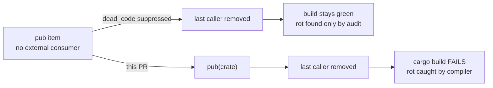

# Narrow 27 crate-internal `pub` items to `pub(crate)` (Issue #474)

## Summary

`rust_scorer` is not published, so `pub` on an item with no consumer outside the
crate widens the API surface for nothing — and, worse, it suppresses the
`dead_code` lint that would otherwise catch the item going stale. This PR
downgrades the 27 items identified by the dead-code audit to `pub(crate)`,
which re-arms `dead_code` on each of them. Closes #474.

Items narrowed:

| file | symbols |
| --- | --- |
| `scoring.rs` | `SEMANTIC_MAJOR_VERSION` |
| `read_tuning.rs` | `MAX_READ_BYTES`, `default_training_read_bytes` |
| `shallow_fixture.rs` | `ENCELADUS_SQUASHES`, `plan_synapses` |
| `prod_fixture.rs` | `MIN_INPUTS`, `EXPECTED_OUTPUTS`, `MIN_NEURONS`, `MAX_NEURONS`, `MIN_SYNAPSES`, `MAX_SYNAPSES`, `parse_production_creature`, `check_production_topology` |
| `gpu/forward_mse_batched.rs` | `MAX_NEURONS_ABSOLUTE`, `DEFAULT_SCRATCH_BUDGET_BYTES`, `NeuronGpu`, `CreatureMetaGpu`, `BatchedNetworkData`, `build_batched_network_data`, `BatchedRunner::from_data`, `DirectoryGpuRunners`, `DirectoryGpuRunners::kernel_label`, `scratch_workgroups_x_for` |
| `gpu/mod.rs` | `GpuBackendLabel::from_wgpu` |
| `stream_score.rs` | `accumulate_cost_sum_forward_only_fused_sampled` |
| `sampling.rs` | `SampleSpec::is_full`, `RecordSampler::is_full` |

`MAX_READ_BYTES` and friends are used **across** modules
(`read_tuning.rs` → `stream_score.rs`), so `pub(crate)` — not private — is the
right target.

### Follow-on doc-link fix (required, not scope creep)

Seven public doc comments linked to items this PR made private, which rustdoc
rejects under the repo's `RUSTDOCFLAGS=-D warnings` gate
(`public documentation for X links to private item Y`). Those seven intra-doc
links became plain code spans — no prose was reworded:

- `prod_fixture.rs` module docs → `parse_production_creature`,
  `check_production_topology`
- `shallow_fixture.rs::shallow_creature_json` → `ENCELADUS_SQUASHES`,
  `plan_synapses`
- `gpu/forward_mse_batched.rs` `TooManyNeurons` / `num_neurons` →
  `MAX_NEURONS_ABSOLUTE`
- `multi_score.rs::gpu_directory_compatible` → `MAX_NEURONS_ABSOLUTE`

### Not changed

The issue's exclusion list is honoured as-is — items that leak into a public
signature, items with a doctest-only external consumer, and items whose `pub`
currently acts as `dead_code` suppression for the lib target (because `main.rs`
declares its own separate `mod` tree) all keep `pub`.

## Evidence

This is a library-visibility change with no web interface, so there is no
screenshot. The compiler *is* the test: narrowing visibility either compiles or
it does not, and the value of the change is a lint that fires on future rot.

**Full gate green** — `./quality.sh < /dev/null` passed end to end against the
sibling `neat-core` at 0.5.0: shellcheck, cargo-deny, `fmt --check`,
`clippy --workspace --all-targets -D warnings`, build, the full test suite
(including all 24 doctests), `cargo doc` with `RUSTDOCFLAGS=-D warnings`, and
the release build. `Cargo.lock` is unchanged.

**`dead_code` is demonstrably re-armed.** Removing the single non-test caller of
`default_training_read_bytes` in a throwaway edit now fails the build, where
before the change `pub` would have silently absorbed it:

```text
error: function `default_training_read_bytes` is never used
  --> rust_scorer/src/read_tuning.rs:21:15
   |
21 | pub(crate) fn default_training_read_bytes(record_bytes: usize) -> usize {
   |
   = help: to override `-D unused` add `#[expect(dead_code)]` or `#[allow(dead_code)]`
```

Note the three `#[cfg(test)]` call sites did **not** keep it alive — exactly the
behaviour wanted, since a function reachable only from its own unit tests is
dead in the shipping binary. The edit was reverted immediately; it is not part
of this PR.



## Test Plan

No new tests were added, and no existing test was modified, commented out, or
removed. A visibility change has no runtime behaviour to assert, and a test that
inspected source text for `pub(crate)` would verify nothing useful. The
verification is the compiler plus the existing suite:

- `cargo clippy --workspace --all-targets -- -D warnings` — clean, proving no
  in-crate call site lost access and no item became dead.
- `cargo test --workspace` — every existing suite passes, including the 24
  doctests, confirming no doctest was an external consumer of a narrowed item.
- `cargo doc` with `RUSTDOCFLAGS=-D warnings` — clean, confirming the seven
  intra-doc links were the complete set of doc references to narrowed items.
- Release build under `RUSTFLAGS=-D warnings` — clean, confirming `dead_code`
  does not fire for any of the 27 in a non-test build.
- Manual negative check (above) confirming `dead_code` now *does* fire when a
  narrowed item loses its last non-test caller.
