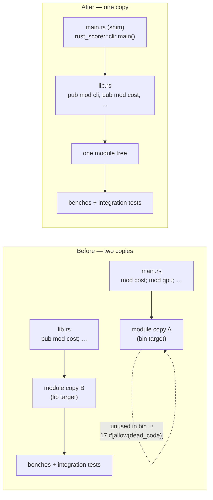

# dead-code: the binary links the library instead of recompiling it

## Summary

`rust_scorer/src/main.rs` declared its own `mod` tree, so the `rust_scorer`
**bin** target compiled a **second, independent copy** of every module. Anything
used only from the lib side was dead in the bin copy, which is why the crate
carried 17 `#[allow(dead_code)]` attributes and a dozen `pub` markers that could
not be tightened. Worse, the two copies could drift: a change to the library was
not necessarily what the shipped binary ran.

The CLI logic moved verbatim to `rust_scorer/src/cli.rs` (a module of the
library) and `main.rs` is now a nine-line shim over `rust_scorer::cli::main`. In
the same pass all 17 suppressions were deleted and ten `pub` items that existed
only to dodge `dead_code` were downgraded to `pub(crate)`, so the lint is armed
across the whole crate. No behaviour, JSON, or CLI-contract change.

Closes #475.



## Changes

- **`rust_scorer/src/cli.rs`** (renamed from `src/main.rs`) — the `mod …;` block
  is replaced by `use crate::{cost, gpu, multi_score, scoring, stream_score};`
  and `fn main` becomes the documented `pub fn main`. Everything else, including
  all 24 CLI unit tests, is unchanged; they now run in the lib test target.
- **`rust_scorer/src/main.rs`** — thin shim calling `rust_scorer::cli::main()`.
- **`rust_scorer/src/lib.rs`** — declares `pub mod cli;`; stale module-doc about
  the binary keeping its own tree corrected.
- **17 `#[allow(dead_code)]` attributes deleted** across `multi_score.rs` (8),
  `gpu/mod.rs` (3), `cost.rs` (2), `sampling.rs` (2), `stream_score.rs` (1) and
  `gpu/forward_mse_batched.rs` (1), along with the comments explaining them.
- **Ten `pub` → `pub(crate)`**: `MAX_SHALLOW_NON_INPUT_NEURONS`,
  `directory_gpu_topology`, `directory_pool_is_shallow`,
  `auto_should_use_gpu_directory`, `auto_topology_fallback_note`,
  `auto_cost_fallback_note`, `resolve_mode`, `DirectoryGpuProbe`,
  `gpu_directory_probe_for_dir`, `RecordSampler::keep_next`.
- Doc comments naming `main.rs` as the CLI call site now name `cli.rs`.
- `CHANGELOG.md` — entry under Unreleased/Changed.

### Three items on #474's list deliberately stayed `pub` (documented inline)

A bin target that links a lib is a **separate crate**, so `pub(crate)` items are
invisible to it — which is exactly why the CLI moved *into* the library rather
than just swapping `mod` for `use`. That reaches all but three:

| Item | Why it stays `pub` |
| --- | --- |
| `ScoringPath` | `SingleCreature` is constructed only by unit tests (Issue #81 settled that path as CPU-only). `dead_code` ignores `cfg(test)` construction, so `pub(crate)` would need a **new** `#[allow(dead_code)]` — the suppression this issue removes. |
| `parse_sample_rate` | Has its own doctest; doctests compile as external crates, so `pub(crate)` breaks `cargo test --doc` (#474's own doctest-only carve-out). |
| `RecordSampler` | Same — `RecordSampler::filter_in_place` is doctested externally. |

`auto_should_use_gpu` also stays `pub`: it is linked from public module docs, so
downgrading it trips `rustdoc::private_intra_doc_links` under `-D warnings`.

### "Also worth correcting" — verified, no change needed

The issue flagged seven `neat-core` paths referenced only in doc comments as
possibly stale. All seven were checked against the sibling `NEAT-AI-core` clone
and **every one still exists**: `batch_scoring` (`src/batch_scoring.rs`),
`synapse_type` (`src/synapse_type.rs`), `SynapseData`, `apply_squash`
(`src/squash.rs`), `apply_limit_range` (`src/range.rs`), `reset_state` and
`activate` (`src/network.rs:215`/`373`). They are accurate cross-references
describing what the WGSL kernels mirror on the CPU side, not dangling links, so
they were left alone rather than churned.

## Evidence

Backend/CLI change — no web interface, so no screenshot. Evidence is the build
gate plus the new parity tests.

**The suppressions are genuinely gone, not relocated.** `dead_code` is now armed
crate-wide and the full gate is clean:

```
$ grep -rnE '^[[:space:]]*#\[allow\(dead_code\)\]' rust_scorer/src/
(no matches — only two prose mentions remain, both explaining why an
 attribute is *not* there)

$ ./quality.sh < /dev/null
...
✅ All quality checks passed!
```

That gate runs `RUSTFLAGS="-D warnings"` over `cargo clippy --all-targets`,
`cargo build`, `cargo test --workspace`, `RUSTDOCFLAGS="-D warnings" cargo doc`
and a release build — so any item that lost its last caller now fails the build
instead of hiding behind an attribute. Re-arming immediately caught one real
finding (`ScoringPath::SingleCreature`, table above).

**No tests lost in the move.** The 24 CLI unit tests that lived in `main.rs`
moved with it and now run in the lib target:

```
Running unittests src/lib.rs   ... 182 passed; 0 failed
Running unittests src/main.rs  ...   0 passed; 0 failed   (shim has no tests)
Doc-tests rust_scorer          ...  24 passed; 0 failed
```

## Test Plan

New — `rust_scorer/tests/bin_lib_single_source.rs` (2 tests). These assert the
invariant behaviourally rather than by inspecting source: the JSON the **binary**
prints must equal, value for value, what the **library** entry point returns for
the same inputs. A future re-duplication that let the two drift shows up here as
a numeric mismatch.

- `binary_directory_scores_match_library_entry_point` — runs the compiled binary
  (`--gpu off`, directory mode) over a two-creature fixture and compares
  `error`, `score`, `recordCount` and `complexityPenalty` per creature against
  `rust_scorer::multi_score::score_from_creature_dir`.
- `binary_and_library_agree_for_non_default_cost` — same under `--cost MAE`, so
  the shared cost dispatch (not just the MSE default) is proven to come from one
  implementation, and checks the binary echoes `costName: "MAE"`.

Existing — unchanged and passing: 182 lib unit tests (including the 24 CLI tests
relocated from `main.rs`), 24 doctests, and every integration suite
(`scorer_smoke`, `directory_mode_tdd`, `cost_parity`, the GPU parity suites,
`single_pass_assertion`, `compile_once_assertion`, `sample_rate_*`).

## Security Self-Check

- Input validation: unchanged — the same clap parsing, `parse_sample_rate`
  range check and `assert_records_aligned` corpus guard run on the same inputs.
- Secrets: none staged; no hidden files touched.
- Injection surface: none added; no new SQL, shell, filesystem or HTTP calls.
- Error handling: unchanged — `run` still returns `Result<_, String>` and
  `cli::main` still exits `1` after an `Error: …` line on stderr.
- Dependencies: none added or changed (`Cargo.lock` diff is only the pre-existing
  `rust_scorer` version-bump drift, 1.1.37 → 1.1.38, matching `Cargo.toml`).
