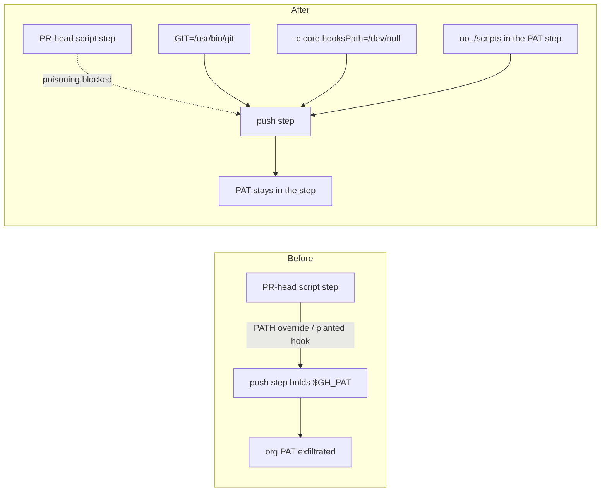

# Harden PAT-bearing push steps against in-job poisoning (Issue #497)

## Summary

`auto-format.yml` and `version-increment.yml` both execute scripts checked out
from the **PR head branch** before a step that holds the org-level
`ACTIONS_PUSH` PAT in its environment. Inside a single job the earlier,
attacker-editable step can poison the later one — append a `PATH` override to
`$GITHUB_ENV` so `git` resolves to a planted binary, or write a
`.git/hooks/pre-commit` that runs with `$GH_PAT` in scope — turning single-repo
write access into exfiltration of an organisation-scoped credential.

Both push steps are now hardened:

- **git pinned to an absolute path** (`GIT=/usr/bin/git`) — a `$GITHUB_ENV`
  `PATH` override cannot redirect the invocation.
- **`-c core.hooksPath=/dev/null` on every invocation** — planted repository
  hooks never execute with the PAT in scope.
- **No repository script runs beside the PAT.** `auto-format.yml` previously
  ran `./scripts/auto-format.sh --commit-message` *inside* the PAT-bearing
  step, handing PR-head code the credential directly. The message is now
  resolved in the earlier `detect` step and passed through a step output.

A new gate, `scripts/check-push-step-hardening.sh`, enforces all four rules on
every step that binds `GH_PAT` to `secrets.ACTIONS_PUSH`, so the pattern cannot
regress. It is wired into `quality.sh` and runs in CI via the `bats` suite.

This is defence in depth, not a closed window: the durable fix is scoping the
credential itself (a short-lived GitHub App installation token, or a
fine-grained PAT limited to this repository), which needs an organisation admin
to mint the App and store its secrets. That human-gated work is tracked in
Issue #498 (`needs-human` triage).

Closes #497.

## Evidence

Backend/CI-only change — no web interface to screenshot. Verified by the new
BATS suite and by running the shipped workflows through the new checker.



Checker output against the shipped workflows:

```text
OK   .github/workflows/auto-format.yml: pins git to an absolute path (GIT=/usr/bin/git)
OK   .github/workflows/auto-format.yml: no bare 'git' command word — all invocations use "$GIT"
OK   .github/workflows/auto-format.yml: every "$GIT" invocation disables repository hooks
OK   .github/workflows/auto-format.yml: executes no repository script with the PAT in scope
OK   .github/workflows/version-increment.yml: pins git to an absolute path (GIT=/usr/bin/git)
OK   .github/workflows/version-increment.yml: no bare 'git' command word — all invocations use "$GIT"
OK   .github/workflows/version-increment.yml: every "$GIT" invocation disables repository hooks
OK   .github/workflows/version-increment.yml: executes no repository script with the PAT in scope
```

Both workflows also still pass `actionlint`, `check-auto-format-workflow.sh`,
`check-bot-push-token.sh` and `check-run-block-safety.sh`.

## Test Plan

New suite `tests/scripts/push_step_hardening.bats` (8 tests) drives the real
checker against fixtures — each failing fixture reproduces one exfiltration
primitive from the issue and passes only after the corresponding rule holds:

- passes on a hardened PAT-bearing push step;
- fails when `git` is invoked bare (PATH-override reachable);
- fails when a `"$GIT"` invocation does not disable repository hooks;
- fails when the PAT-bearing step executes a repository script;
- fails when no step binds `GH_PAT` to `ACTIONS_PUSH` (absence of the marker is
  not treated as success);
- fails when the PAT-bearing step has no literal `run:` block;
- reports a missing workflow file as an error;
- shipped `auto-format.yml` / `version-increment.yml` validate cleanly (this
  test was red before the workflow changes and is green after).

The full `tests/scripts` BATS suite passes. `quality.sh` gains one step,
`./scripts/check-push-step-hardening.sh`.

### Pre-existing, unrelated gate failure

`scripts/check-neat-core-version.sh` fails locally because the sibling
`../NEAT-AI-core` clone has advanced to `0.8.1` while
`neat-core.expected-version` records the handled baseline `0.5.0`. That is the
Issue #252 breaking-bump gate doing its job and is unrelated to this change
(which touches no Rust); clearing it needs a deliberate upgrade PR, so it is
deliberately left untouched here.

## Security Self-Check

- **Input validation** — the new checker takes a single `--workflow PATH`
  argument and rejects unknown flags; a missing file is an explicit error.
- **Secrets** — no credentials added, staged or logged; the change *reduces*
  the reachability of an existing secret.
- **Injection surface** — the commit message reaches the push step as an
  environment variable (`COMMIT_MESSAGE`), never interpolated into the shell
  script body.
- **Error handling** — every check reports a specific failure and exits
  non-zero; no fault is reconciled as success.
