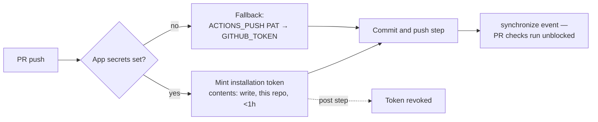

# Scope the bot-push credential to a short-lived repo-scoped token

## Summary

`auto-format.yml` and `version-increment.yml` pushed back to the PR head
branch with the **organisation-level** `ACTIONS_PUSH` PAT. That PAT is
long-lived and org-scoped, so anything that reached it stepped up from
single-repo write access to write access on every repository in the
organisation — the residual risk left open by the Issue #497 hardening.

Both jobs now mint their push credential per run with
`actions/create-github-app-token` (SHA-pinned `bcd2ba4…`, `# v3`): a GitHub App
installation token narrowed to `permission-contents: write` and scoped to
**this repository only**, expiring within the hour and revoked by the action's
post step. Pushes remain attributed to a trusted non-`GITHUB_TOKEN` identity,
so the Issue #435 behaviour (checks run on the resulting `synchronize` event
without an "Approve and run" gate) is preserved.

Creating the App and storing its secrets needs organisation-admin access, so
the change is written to degrade safely: a job-level `PUSH_APP_CONFIGURED`
flag (the `secrets` context is unavailable in a step-level `if:`) skips the
mint step until both secrets exist, and `GH_PAT` falls back to
`secrets.ACTIONS_PUSH || secrets.GITHUB_TOKEN`. The workflows therefore behave
exactly as before until an admin completes the handover documented in the
README.

Closes #498.

## Evidence

This is a CI/workflow change with no web interface to screenshot. Verification
is the BATS suite plus the repository's own workflow checkers.

`scripts/check-bot-push-token.sh` was rewritten from a single `grep` for
`secrets.ACTIONS_PUSH || secrets.GITHUB_TOKEN` into an indentation-aware
scanner (same approach as `check-push-step-hardening.sh`) enforcing four rules
per guarded workflow:

1. the push credential is minted with `actions/create-github-app-token`,
   SHA-pinned per the supply-chain policy (Issue #100);
2. the mint step requests `permission-contents: write`;
3. the mint step scopes the token with `repositories:` to a single repository
   and sets no `owner:` (which would widen it across the organisation);
4. every `GH_PAT` binding prefers the minted token and keeps the
   `ACTIONS_PUSH || GITHUB_TOKEN` fallback.

Local runs (all green):

- `bats tests/scripts/bot_push_token.bats` — 11/11 pass.
- `actionlint .github/workflows/auto-format.yml .github/workflows/version-increment.yml` — clean.
- `scripts/check-push-step-hardening.sh` — the Issue #497 hardening still
  holds on both push steps after the `GH_PAT` change.
- `scripts/check-workflow-action-versions.sh` — the new action is pinned and
  covered by an explicit `required:3` policy entry (v3 ships a Node 24 runtime
  and takes the non-deprecated `client-id` input).
- `./quality.sh` — full gate passes.

**Supply chain:** `actions/create-github-app-token` v3.2.0 was published
2026-05-12, well outside the 24 h quarantine window for external dependencies,
and is pinned to the tag's commit SHA rather than the mutable tag.

## Human action still required

An organisation admin must create the GitHub App and store two repository
secrets before the scoping takes effect:

| Secret                         | Value                     |
| ------------------------------ | ------------------------- |
| `ACTIONS_PUSH_APP_CLIENT_ID`   | The App's client ID       |
| `ACTIONS_PUSH_APP_PRIVATE_KEY` | The App's PEM private key |

Install the App on this repository only, with the `Contents: Read and write`
repository permission. A fine-grained PAT limited to this single repository,
stored as `ACTIONS_PUSH`, is the lower-effort alternative. Until then the
workflows run on the existing fallback path, unchanged.

## Test Plan

`tests/scripts/bot_push_token.bats` — rewritten around the Issue #498 policy:

- `passes when the push token is a repo-scoped app token with PAT fallback`
- `fails when the push relies on the org-level PAT alone` — **deliberately
  inverted**: this case previously asserted that a bare
  `ACTIONS_PUSH || GITHUB_TOKEN` chain passed. Issue #498 changes that business
  rule, so the test now asserts the opposite. No test was removed or commented
  out.
- `fails when workflow only uses GITHUB_TOKEN` — unchanged (Issue #435).
- `fails when the app token action is not SHA-pinned`
- `fails when the minted token is not narrowed to contents: write`
- `fails when the minted token is not scoped to a single repository`
- `fails when the mint step widens scope with an owner input`
- `fails when the push step ignores the minted token`
- `fails when the ACTIONS_PUSH fallback is dropped`
- `reports a missing workflow file instead of passing silently` — the checker
  fails loud rather than treating an absent workflow as a pass.
- `shipped auto-format and version-increment workflows validate cleanly`

## Files changed

- `.github/workflows/auto-format.yml`, `.github/workflows/version-increment.yml`
  — mint step + `GH_PAT` preference chain + `PUSH_APP_CONFIGURED` job env.
- `scripts/check-bot-push-token.sh` — new four-rule policy checker.
- `scripts/check-workflow-action-versions.sh` — `required:3` policy entry.
- `tests/scripts/bot_push_token.bats` — coverage for every rule.
- `README.md` — new "Bot-push credential" section with the admin handover
  steps; the Issue #497 section now points at the landed fix.
