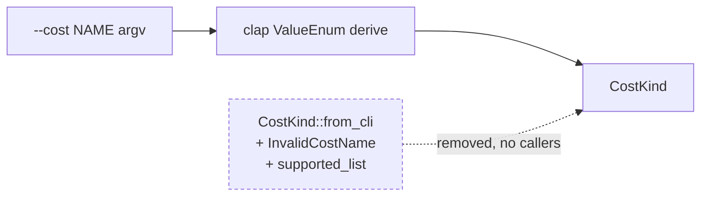

# PR Summary — Issue #502

## Summary

Removed the dead test-only export `CostKind::from_cli` and its dedicated error
type `InvalidCostName` from `rust_scorer/src/cost.rs`, along with the now-unused
`supported_list()` helper that existed only to build that error's `Display`
text. Closes #502.

Since the Issue #475 restructure (PR #479) the `--cost` flag is parsed
exclusively by clap's `ValueEnum` derive (`#[arg(long, value_enum, …)]` in
`cli.rs`). `from_cli` duplicated that parser and had no consumer anywhere
outside `cost.rs`'s own tests — confirmed with `git grep` across `src`,
`src/bin`, `tests` and `benches`; the only remaining mentions are historical
`docs/archive/pr-summaries/*` files, which are left untouched.

## Evidence

Backend/CLI-only change — no web interface to screenshot.

- `cargo test -p rust_scorer --lib cost::` → **18 passed, 0 failed**.
- `./quality.sh` → `✅ All quality checks passed!` (fmt, cargo-deny, clippy
  `-D warnings`, check, build, test, rustdoc with `RUSTDOCFLAGS=-D warnings`,
  release build). The rustdoc gate is what proves no doc link still points at
  the removed items.

Behaviour is unchanged: nothing on a production path called the removed code,
and the CLI contract is still enforced end-to-end by
`tests/scorer_smoke.rs::scorer_binary_rejects_unknown_cost` (non-zero exit,
stderr echoes the bad value and lists the supported set) and
`scorer_binary_help_lists_cost_flag_and_values`.

## Test Plan

**Migrated (documented business-logic change — these tests exercised the removed
helper, so they now call `CostKind::from_str`, the parser clap uses in
production). No coverage was dropped:**

| Before | After |
| --- | --- |
| `from_cli_accepts_every_built_in_cost_name` | `value_enum_accepts_every_built_in_cost_name` |
| `from_cli_rejects_unknown_cost_name` | `value_enum_rejects_unknown_cost_name` |
| `from_cli_rejects_case_mismatch` | `value_enum_rejects_case_mismatch` |
| `from_cli_rejects_empty_string` | `value_enum_rejects_empty_string` |
| `from_cli_accepts_rmse` | `value_enum_accepts_rmse` |
| `from_cli_ignores_env_var_override` | `value_enum_ignores_env_var_override` |
| `cost_kind_stays_in_sync_with_upstream_built_in_cost_names` | unchanged name; parses via `from_str` |

The upstream-parity guarantee (every TypeScript `BUILT_IN_COST_NAMES` entry
parses and renders back byte-for-byte) is therefore still pinned — and now
against the parser production actually runs, rather than a parallel one.

**Removed (explicitly documented):**

- `from_cli_returns_typed_invalid_cost_name` (Issue #289, C-GOOD-ERR) — it
  asserted only on `InvalidCostName`'s field equality and `Box<dyn Error>`
  downcast, so it cannot outlive the type it tested. `from_cli`'s two doctests
  went with the function for the same reason.
- One assertion narrowed: `value_enum_rejects_unknown_cost_name` checks the
  rejection echoes the bad value but no longer asserts the full supported-set
  listing, because clap's `ValueEnum::from_str` error is terse. That listing is
  the CLI's user-facing contract and is asserted where it actually surfaces —
  the `scorer_binary_rejects_unknown_cost` integration test against the built
  binary.

**Unchanged and still passing:** `clap_value_enum_round_trips_every_variant`,
`default_is_mse`, the `gpu_supported` / `gpu_error_code` / `finalise_mean`
tests, and every `accumulate_cost_sum` dispatch and parity test.
