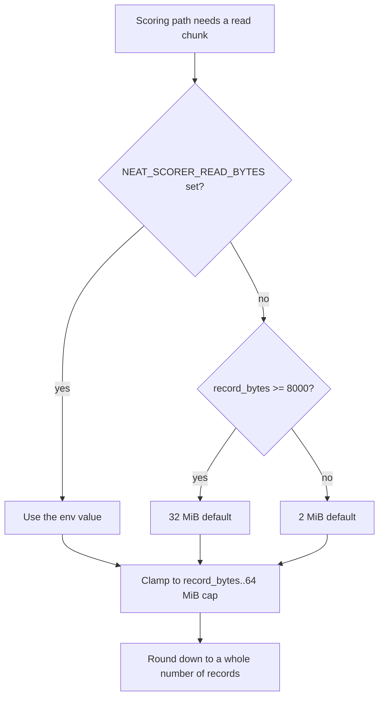

# README and performance-baseline now match the shipped adaptive read default

## Summary

`README.md` documented a **fixed 2 MiB** `NEAT_SCORER_READ_BYTES` default and
told production hosts to `export NEAT_SCORER_READ_BYTES=33554432`, while
`docs/performance-baseline.md` recorded "the global default stays 2 MiB and no
auto-tuner ships". Both contradicted the shipped code and `AGENTS.md`:
`rust_scorer/src/read_tuning.rs` defaults corpora with records ≥ 8000 B
(production ≈ 9848 B) to **32 MiB** reads when the env var is unset. Closes #504.

Changes:

- **README** — the section is now "Large-record hosts: adaptive
  `NEAT_SCORER_READ_BYTES` default", stating the record-size adaptive default
  (2 MiB / 32 MiB by threshold), that the env var still overrides, and that any
  value clamps to the 64 MiB `MAX_READ_BYTES` cap and rounds down to whole
  records. `read_tuning.rs` is linked as the constants' home; the #307 sweep
  table is kept as supporting evidence under a "Why 32 MiB" sub-heading. The
  Issue #204 malformed-value section notes that the default quoted in the
  warning is the adaptive one.
- **`docs/performance-baseline.md`** — the dated "Decision (Issue #307)" text is
  left **unedited** per that document's own convention; a supersession banner is
  appended beneath the heading (mirroring the Issue #211 banner in
  `docs/gpu-scoring-design.md`).
- **New gate** — `scripts/check-read-bytes-docs.sh` parses
  `LARGE_RECORD_BYTES_THRESHOLD`, `LARGE_RECORD_DEFAULT_READ_BYTES`,
  `DEFAULT_READ_BYTES` and `MAX_READ_BYTES` from `read_tuning.rs` and fails if
  either document omits them, revives the superseded "left at 2 MiB" advice, or
  overwrites (rather than appends to) the historical baseline decision. Run from
  `quality.sh`; enforced in CI through the existing `bats tests/scripts` step.

## Evidence

Documentation/CLI change — no web interface to screenshot. The gate script is
the evidence that the docs now agree with the code:

```text
📚 Validating read-chunk docs match read_tuning.rs constants (Issue #504)...
OK   README documents the large-record threshold (LARGE_RECORD_BYTES_THRESHOLD): 8000
OK   README documents the adaptive large-record default (LARGE_RECORD_DEFAULT_READ_BYTES): 32 MiB
OK   README documents the small-record default (DEFAULT_READ_BYTES): 2 MiB
OK   README documents the clamp cap (MAX_READ_BYTES): 64 MiB
OK   README documents the constants' home (read_tuning.rs): read_tuning
OK   README documents the env override: NEAT_SCORER_READ_BYTES
OK   performance-baseline keeps its historical 2 MiB decision text
OK   performance-baseline decision carries a supersession note pointing at read_tuning
README and performance-baseline agree with the shipped read_tuning constants.
```

Behaviour the README now describes (added as a Mermaid flowchart in the README):



`./quality.sh < /dev/null` passes end-to-end (shellcheck, all validators, the
full bats suite, cargo fmt/clippy/build/test/doc/release): **"✅ All quality
checks passed!"**.

## Test Plan

New `tests/scripts/read_bytes_docs.bats` (12 tests, TDD — written first and
failing until the docs were fixed) exercises the validator against synthetic
fixtures plus the real tree:

- passes on documents aligned with the shipped constants;
- fails when the README omits the 8000 B threshold, the 32 MiB adaptive default,
  or the 64 MiB cap;
- fails when the README does not name `read_tuning` as the constants' home;
- fails when the README revives the superseded "left at 2 MiB" advice;
- fails when the README section is missing entirely;
- fails when the baseline decision carries no supersession note, or when its
  historical 2 MiB text was overwritten instead of annotated;
- reports missing files and unknown flags loudly (exit 1 / usage exit 2);
- **the real repository documents satisfy the check** — this test failed before
  the doc fix and passes after it.

No production code changed, so the existing Rust suite is unaffected and was
re-run unchanged by `quality.sh`.
