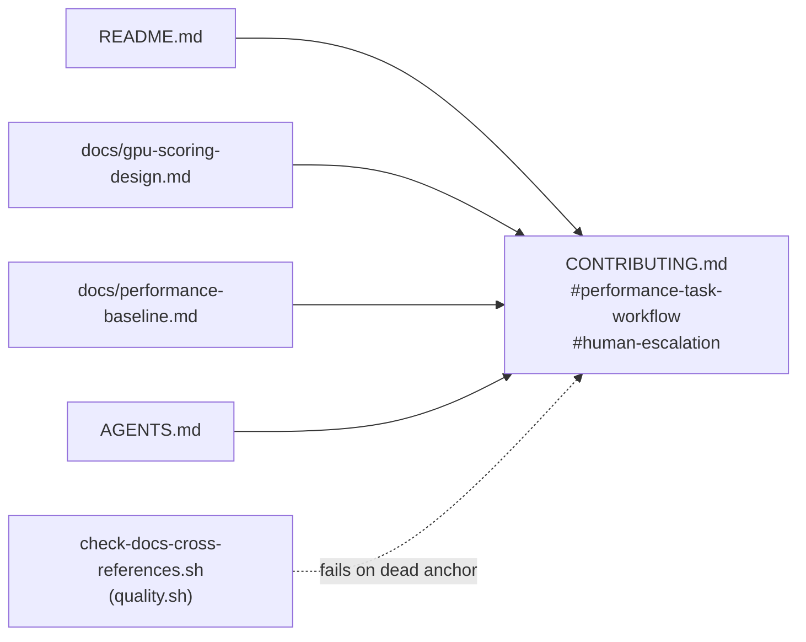

# PR summary — Issue #505

## Summary

Four documents cited `AGENTS.md` sections that do not exist — `AGENTS.md` is a
flat bullet list with no "Performance Task Workflow" and no "Human Escalation"
heading — so an agent following any of those citations found nothing and could
conclude the rule did not apply. Both rules are now written down **once**, in
`CONTRIBUTING.md`, and every citation points at that single home. Closes #505.

Rules given a home in `CONTRIBUTING.md`:

- **Performance Task Workflow** (`#performance-task-workflow`) — benchmark
  first, re-run the same benches, compare against the issue's acceptance bar at
  the documented corpus size (`BENCH_SCORING_BYTES=200000000`); before/after
  Criterion evidence is mandatory and PRs without it are rejected; a change that
  misses its bar raises **no PR** — post the numbers on the issue, label
  `negative-result`, close `not planned`.
- **Human escalation** (`#human-escalation`) — the automation worker holds no
  `workflow` OAuth scope, so anything under `.github/workflows/` needs a
  maintainer; the `needs-human` label and its explanation comment always travel
  together.

Citations repointed:

| File | Was | Now |
|---|---|---|
| `README.md` (How to bench) | ``Per `AGENTS.md`, … rejected`` | `CONTRIBUTING.md#performance-task-workflow` |
| `README.md` (PGO → CI) | ``see `AGENTS.md` "Human Escalation"`` | `CONTRIBUTING.md#human-escalation` |
| `docs/gpu-scoring-design.md` | `../AGENTS.md#performance-task-workflow` | `../CONTRIBUTING.md#performance-task-workflow` |
| `docs/performance-baseline.md` (intro + closing checklist) | `../AGENTS.md` | `../CONTRIBUTING.md#performance-task-workflow` |

`AGENTS.md` gains one bullet pointing at the canonical home so agents that look
there first are routed correctly rather than restating the rules.

## Evidence

This is a documentation + shell-gate change; there is no web interface to
screenshot.

New guard `scripts/check-docs-cross-references.sh` (run from `quality.sh`)
enforces the fix and prevents the regression class: it checks the canonical
sections still exist, resolves every `](target.md#anchor)` citation against the
target's real headings (GitHub slug rules, including the double-hyphen em-dash
case), and rejects any document that re-attributes those rules to `AGENTS.md`.
Frozen `docs/pr-summary-*.md` archives are skipped — rewriting them would
falsify the historical record.



Regression linkage — the new gate run against the **pre-fix** tree
(`git archive HEAD` of the parent commit) reports 8 `FAIL` lines covering all
four dead references:

```text
FAIL CONTRIBUTING.md has no '#performance-task-workflow' section — it is the single home other docs cite
FAIL CONTRIBUTING.md has no '#human-escalation' section — it is the single home other docs cite
FAIL docs/gpu-scoring-design.md: dead anchor '#performance-task-workflow' — ../AGENTS.md has no such heading
FAIL README.md: cites AGENTS.md as the home of a rule that lives in CONTRIBUTING.md: 1218:Per `AGENTS.md`, performance PRs without before/after Criterion evidence are
FAIL README.md: cites AGENTS.md as the home of a rule that lives in CONTRIBUTING.md: 1350:`workflow` OAuth scope — see `AGENTS.md` "Human Escalation"). Run the
FAIL docs/gpu-scoring-design.md: cites AGENTS.md as the home of a rule that lives in CONTRIBUTING.md: 276:[Performance Task Workflow](../AGENTS.md#performance-task-workflow): no PR,
FAIL docs/performance-baseline.md: cites AGENTS.md as the home of a rule that lives in CONTRIBUTING.md: 5:[Performance Task Workflow](../AGENTS.md). The bench source lives at
FAIL docs/performance-baseline.md: cites AGENTS.md as the home of a rule that lives in CONTRIBUTING.md: 1121:evidence are rejected per `AGENTS.md`.
```

After the fix:

```text
$ ./scripts/check-docs-cross-references.sh
OK   CONTRIBUTING.md defines the canonical '#performance-task-workflow' section
OK   CONTRIBUTING.md defines the canonical '#human-escalation' section
OK   README.md -> CONTRIBUTING.md#performance-task-workflow
OK   README.md -> CONTRIBUTING.md#human-escalation
OK   docs/gpu-scoring-design.md -> ../CONTRIBUTING.md#performance-task-workflow
OK   docs/performance-baseline.md -> ../CONTRIBUTING.md#performance-task-workflow
All 10 cross-document anchor citations resolve; canonical sections present.
```

The gate also caught a *pre-existing* latent bug in the first draft of the slug
algorithm (collapsing runs of spaces) against the real
`performance-baseline.md#hot-spots--9-may-2026-issue-79` link, which is why
spaces are mapped one-for-one.

## Test Plan

New `tests/scripts/docs_cross_references.bats` — 14 tests, all exercising the
real script against synthetic fixture trees:

- passes when every citation resolves (including the em-dash double-hyphen slug)
- fails on a dead anchor, and on a link whose target file does not exist
- fails when `CONTRIBUTING.md` loses either canonical section
- fails when a document re-attributes the Performance Task Workflow, "Human
  Escalation", or the before/after evidence rule to `AGENTS.md`
- allows `AGENTS.md` to *point at* the canonical `CONTRIBUTING.md` home
- ignores `#` lines inside fenced code blocks
- skips frozen `docs/pr-summary-*.md` archives
- reports a missing root, rejects an unknown flag (exit 2)
- asserts the real repository documents satisfy the check

## Quality gate

`./quality.sh < /dev/null` — 478 bats tests pass. One pre-existing
environmental failure remains, unrelated to this change: `cargo_metadata.bats`
test 86 (`cargo metadata exposes the repository field for rust_scorer`) fails
because `cargo` is not installed on this runner (`command not found`, exit 127);
no Rust source is touched by this PR and CI exercises the cargo steps for real.
