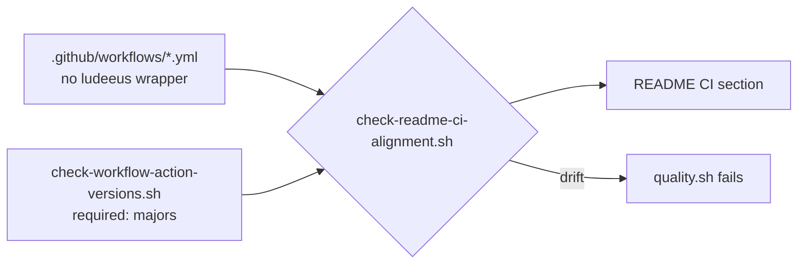

# Realign the README CI section with the workflows it describes (Issue #506)

## Summary

Two claims in the README's CI section had drifted from the workflows they
document, in the exact section a security reviewer reads to learn which
third-party code executes in CI. Closes #506.

1. **ShellCheck wrapper.** The README said `ci.yml`'s `shell-checks` job
   "invokes `ludeeus/action-shellcheck@2.0.0`". PR #184 replaced that wrapper
   with the `shellcheck` binary pre-installed on the `ubuntu-latest` runner
   (`.github/workflows/ci.yml`), and no workflow references the wrapper any
   more — so the README claimed a removed action was still in the supply chain.
   The paragraph now describes the direct `koalaman/shellcheck` binary
   invocation and states that no third-party wrapper enters the supply chain.
   The single-home/dedup invariant (`scripts/check-shellcheck-dedup.sh`) is
   unchanged.
2. **Node 20 exception list.** The README named
   `actions/dependency-review-action@v4` as a tracked Node 20 exception, while
   `scripts/check-workflow-action-versions.sh` requires major **5** and both
   `dependency-review.yml` and `security.yml` pin `v5.0.0` (Node 24). The
   README even contradicted itself, documenting the standalone workflow as
   running `@v5`. `rustsec/audit-check@v2` is now named as the single remaining
   exception, matching the validator.

To stop the same drift recurring, `scripts/check-readme-ci-alignment.sh`
(already the README ↔ CI validator, Issue #212) gained two guards derived from
the source of truth rather than from a hard-coded copy of the prose:

- The README may not name `ludeeus/action-shellcheck` unless a workflow under
  `.github/workflows/` actually invokes it.
- Every human-readable `owner/action@vN` reference in the README must be at or
  above the major that `check-workflow-action-versions.sh` requires for that
  action. SHA pins (`@5f6978fa…`) are deliberately not parsed as versions.

Docs-only change: no workflow files, Rust sources or CI behaviour were touched.

## Evidence

No UI or performance surface — this is a documentation correction plus a shell
validator. Evidence is the validator itself, which fails on the pre-fix README
and passes on the corrected one:

```text
$ ./scripts/check-readme-ci-alignment.sh   # before the README fix
FAIL README names ludeeus/action-shellcheck, but no workflow invokes that wrapper (Issue #506)
FAIL README names actions/dependency-review-action@v4 but
     actions/dependency-review-action requires major >= 5 (Issue #506)
README CI documentation has drifted from the workflows it describes.

$ ./scripts/check-readme-ci-alignment.sh   # after
README 'matches CI' block matches the CI quality job.
```

`./quality.sh` passes end to end (exit 0, "✅ All quality checks passed!"),
including the 16-test `readme_ci_alignment.bats` suite.



## Test Plan

Added to `tests/scripts/readme_ci_alignment.bats` (all exercise the real
validator against synthetic README/workflow/validator fixtures):

- `fails when the README names a wrapper action no workflow invokes` —
  regression test for claim 1; fails against the pre-fix README wording.
- `allows the wrapper in the README while a workflow still uses it` — the guard
  is derived from the workflows, not a blanket ban on the string.
- `fails when the README understates a required action major` — regression test
  for claim 2 (`@v4` against a `required:5` floor).
- `passes when the README names the required action major` — `@v5` plus the
  genuine `rustsec/audit-check@v2` exception.
- `ignores SHA-pinned uses: references when checking majors` — guards against
  reading `@5f6978fa…` as "major 5".
- `reports an error when the workflows directory is missing` and
  `reports an error when the action-version validator is missing` — the checks
  fail loud rather than silently skipping when an input is absent.

The pre-existing `the real repository README satisfies the alignment check`
test now covers both new invariants against the committed README; it failed
before the README edits and passes after them. No existing test was removed,
weakened or commented out.
