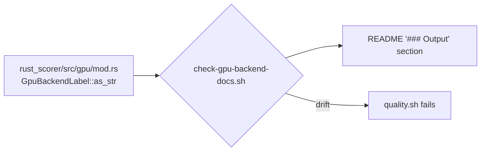

# README Output section describes the shipped `gpuBackend` semantics (Issue #507)

## Summary

The README "Output" section still described `gpuBackend` as reporting which
`wgpu` backend the scorer **would run on** — `"cpu-fallback"` "until GPU
kernels land". GPU kernels landed long ago (`forward_mse_batched` in #82/#83,
`forward_mse_scratch` in #182, `--gpu auto` the default since #83), and the
README's own "GPU mode" section already documents the current semantics, so the
source-of-truth document described one JSON field two contradictory ways and
told consumers GPU support had not shipped. Closes #507.

The paragraph now states that the field reports the backend that **actually
ran** the scoring kernel — `"metal"`, `"vulkan"`, `"dx12"` or `"gl"` when a GPU
hosted the run, `"cpu-fallback"` when the CPU pipeline ran — and keeps the
cross-link to "GPU mode" as the single detailed home for the routing rules.

To stop the same drift recurring, new `scripts/check-gpu-backend-docs.sh` (run
from `quality.sh`) derives the label set from `GpuBackendLabel::as_str` in
`rust_scorer/src/gpu/mod.rs` rather than hard-coding a copy of the prose, and
fails the gate when the Output section loses the "actually ran" semantics, omits
a shipped label, drops the cross-link, or revives the superseded wording.

Docs-only behaviour change: no Rust sources or CI workflows were touched
(`Cargo.lock` picked up the pending `rust_scorer` version sync from the
version-increment workflow during the build).

## Evidence

No UI or performance surface — this is a documentation correction plus a shell
validator. The evidence is the validator, which fails against the pre-fix README
and passes against the corrected one:

```text
$ ./scripts/check-gpu-backend-docs.sh   # before the README fix
FAIL README 'Output' section must state that gpuBackend reports the backend that actually ran the scoring kernel (Issue #507)
FAIL README 'Output' section does not name the "metal" gpuBackend label shipped in rust_scorer/src/gpu/mod.rs (Issue #507)
FAIL README 'Output' section revives superseded wording: 'until GPU kernels land' — GPU kernels shipped in Issues #82/#83/#182 (Issue #507)
gpuBackend documentation has drifted from rust_scorer/src/gpu/mod.rs.

$ ./scripts/check-gpu-backend-docs.sh   # after
README 'Output' section agrees with the shipped GpuBackendLabel values.
```

`./quality.sh` passes end to end (exit 0, "✅ All quality checks passed!"),
including the new 11-test `gpu_backend_docs.bats` suite.



## Test Plan

New `tests/scripts/gpu_backend_docs.bats` (11 tests, TDD — written first; the
real-README test failed before the README edit and passes after it). Each test
runs the real validator against synthetic README/source fixtures in a temp
directory:

- `passes when the Output section documents the shipped semantics` — happy path.
- `fails on the stale 'until GPU kernels land' wording` — regression test for
  the exact pre-fix README sentence.
- `fails when the Output section omits a shipped backend label` — `"gl"` missing.
- `fails when the Output section drops the runtime semantics` — a label list
  without the "actually ran" statement is not enough.
- `fails when the cross-link to the GPU mode section is lost`.
- `a new backend label added to the source fails until the README names it` —
  proves the guard is derived from the source, not hard-coded.
- `fails loud when the Output section is missing`, `fails loud when no labels
  can be read from the source`, `fails loud when a file is missing` — no silent
  skips when an input is absent.
- `rejects unknown arguments with a usage error`.
- `the real repository README satisfies the gpuBackend check`.

No existing test was removed, weakened or commented out.
