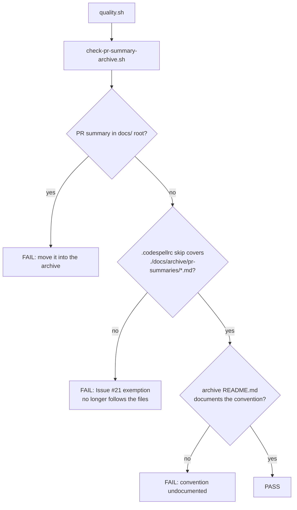

# PR summary — Issue #508

## Summary

The PR-summary archive — the project's durable cross-machine memory — was split
across two homes with no documented convention: 40 summaries at
`docs/pr-summary-*.md` (PRs 1–105) and 110 under `docs/archive/pr-summaries/`
(PRs 117+). An agent mining prior learnings could sweep one location and
silently miss the other, and a new summary could land in either place. A
related drift: `.codespellrc` skipped only `./docs/pr-summary-*.md`, so the
Issue #21 typo-fixture exemption did not cover the 110 archived summaries even
though the same rationale applies. Closes #508.

The change, in the order the issue prescribes:

1. **Audited the 40 root summaries first** for durable learnings — successes
   **and** negative results — not yet reflected in the living docs, and folded
   every gap in. Capture was the precondition for relocation; nothing was
   dropped.
2. **Moved** the 40 files into `docs/archive/pr-summaries/` (`git mv`, so the
   history follows), leaving one archive of 155 summaries (including this one).
3. **Updated `.codespellrc`** so `skip` names `./docs/archive/pr-summaries/*.md`
   instead of the old root glob.
4. **Recorded the convention** in a new `docs/archive/pr-summaries/README.md`
   and in the `CONTRIBUTING.md` pull-request workflow: PR summaries live under
   `docs/archive/pr-summaries/`, one file per PR.

Learnings recovered in step 1 and where they landed:

| Learning | Folded into |
|----------|-------------|
| #38 record-aligned zero-copy deltas (−27.3 % fused, −16.6 % dir N=50) + its bit-equivalence regression recipe | `docs/performance-baseline.md` |
| #41 flat-Rayon measured wins (−14.8 % / −11.4 % / −28.0 % / −10.2 %) | `docs/performance-baseline.md` |
| #42 `CompiledNetwork::clone` 35×/98×/221× vs `compile_creature`, and why the win shrinks as N grows | `docs/performance-baseline.md` |
| #82 GPU crossover is corpus-size dependent (16 MiB: +17 % at N=50, slower at N=10) | `docs/performance-baseline.md` |
| #42 `compileTimeSecs` — emitted by the CLI but undocumented | `README.md` "Output" |
| #18 `actions/checkout` rejects an out-of-workspace `path:`; hence the in-workspace clone + symlink | `README.md` "Local layout" |
| #103 `unsafe` preconditions must be `assert!`, never `debug_assert!` | `CONTRIBUTING.md` "Coding standards" |
| #48 living-doc diagrams are Mermaid, not ASCII art | `CONTRIBUTING.md` "Coding standards" |

Everything else in the 40 summaries — the GPU arc including the **#81
single-creature GPU negative result**, Criterion baselines, flamegraph hot
spots, read-chunk tuning, PGO, and the CI/supply-chain work — was already
reflected in `README.md`, `AGENTS.md`, `CONTRIBUTING.md`,
`docs/gpu-scoring-design.md`, `docs/performance-baseline.md` or `CHANGELOG.md`.

## Evidence

This is a docs/tooling change with no web interface, so there is no screenshot.
The evidence is the new gate and the passing local quality run.

`scripts/check-pr-summary-archive.sh` (run from `quality.sh`) makes the
convention self-enforcing — it fails loudly on any of the three regressions
this issue describes:



Guard output on the shipped tree:

```text
✅ single PR-summary archive at docs/archive/pr-summaries/, documented and codespell-skipped
```

That the codespell skip genuinely matters is verifiable: running codespell over
the archive **without** the skip reports the typo fixtures quoted by the moved
summaries (`docs/archive/pr-summaries/pr-summary-22.md:17: sentance ==>
sentence`), while the full `./scripts/spell-check.sh` run reports
`no typos found`.

`./quality.sh < /dev/null` passes end to end (shellcheck, all doc gates,
codespell, 506 bats tests, clippy, tests, rustdoc, release build).

## Test Plan

- **Added** `tests/scripts/pr_summary_archive.bats` (9 tests) exercising
  `scripts/check-pr-summary-archive.sh` against synthetic doc trees — written
  first and confirmed red before the script existed:
  - passes on a single documented archive with a matching codespell skip;
  - fails on a summary left in the `docs/` root, and reports **every** stray,
    not just the first;
  - fails when the codespell skip no longer covers the archive;
  - fails when the convention doc is missing, and when the archive directory is
    absent entirely;
  - fails loudly on a missing root; usage error on an unknown flag;
  - asserts the **shipped** tree passes the guard (the regression test for this
    issue — it fails against the pre-fix split layout).
- **Unchanged, still passing:** the full `tests/scripts` bats suite (506 tests),
  including `docs_cross_references.bats`, `docs_private_repo_refs.bats` and
  `diagrams_mermaid.bats`. No existing test was removed or disabled.
