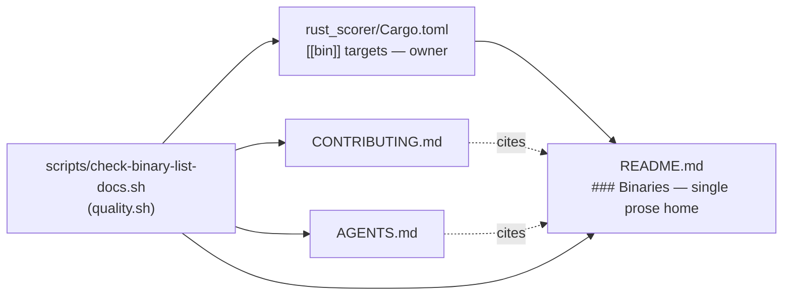

# PR Summary — Issue #509

## Summary

`rust_scorer/Cargo.toml` declares four `[[bin]]` targets (`rust_scorer`,
`float_scan_bench`, `cost_scan_bench`, `gpu_pipeline_alloc_bench`), but
`CONTRIBUTING.md` named three and `AGENTS.md` named two — each document kept its
own copy of a list the manifest already owns, so every new binary re-opened the
same drift. Applied the issue's preferred link-don't-restate fix: the README
gained a `### Binaries` heading (making it a citable single home) and both
satellite documents now point at it instead of carrying a list. A new gate keeps
it that way. Closes #509.

Changes:

- **README.md** — the orphaned "Binaries:" sentence now sits under its own
  `### Binaries` heading, with a note that this is the single documented home and
  which gate enforces it.
- **CONTRIBUTING.md** — the repository-layout paragraph cites
  `rust_scorer/Cargo.toml` and the README `Binaries` section rather than listing
  binaries.
- **AGENTS.md** — same treatment for the "Workspace member" bullet.
- **`scripts/check-binary-list-docs.sh`** (new, run from `quality.sh`) — parses
  the manifest's `[[bin]]` names and fails when the README omits one, when
  `CONTRIBUTING.md` / `AGENTS.md` name a binary other than the workspace member,
  or when either drops its citation of the list's home.
- **CHANGELOG.md** — `[Unreleased] → Changed` entry.

## Evidence

CLI/docs change — no web interface to screenshot. Evidence is the gate output
and the test suite.



Gate against the real tree:

```text
OK   README 'Binaries' section names rust_scorer
OK   README 'Binaries' section names float_scan_bench
OK   README 'Binaries' section names cost_scan_bench
OK   README 'Binaries' section names gpu_pipeline_alloc_bench
OK   CONTRIBUTING.md cites the binary list home instead of copying it
OK   AGENTS.md cites the binary list home instead of copying it
Binary list is single-homed: README 'Binaries' matches Cargo.toml; CONTRIBUTING.md and AGENTS.md cite it.
```

`./quality.sh < /dev/null` passes end to end (shellcheck, cargo-deny, fmt,
clippy, build, test, rustdoc, release build), including the pre-existing
cross-reference gate — the new `./README.md#binaries` citations resolve.

## Test Plan

New BATS suite `tests/scripts/binary_list_docs.bats` (12 tests, all passing)
drives the validator against synthetic fixtures so the real docs are never
mutated:

- passes when the README lists every binary and both satellites cite it;
- fails when the README omits a manifest binary;
- fails when a **new** manifest binary is not yet named in the README (the drift
  this issue is about, caught at the source);
- **regression:** fails on the exact pre-fix wording of `CONTRIBUTING.md` ("the
  `rust_scorer`, `float_scan_bench`, and `cost_scan_bench` binaries") and of
  `AGENTS.md` ("CLI + `float_scan_bench`");
- fails when either satellite drops its citation of the list's home;
- fails loud on a missing `### Binaries` section, a manifest with no `[[bin]]`
  targets, or a missing file; rejects unknown arguments with exit 2;
- runs the validator against the real repository documents and expects a pass.
