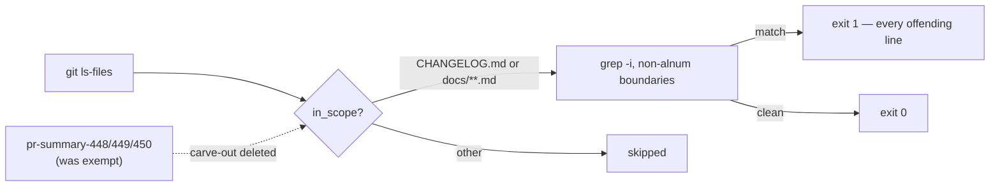

## Summary

The four archived PR summaries added by the private-repo-reference audit itself
still named the **private** production-data and cluster-data repositories —
full owner/repo slugs, `raw.githubusercontent.com` paths and lower-case
identifier spellings. `scripts/check-docs-private-repo-refs.sh` carved three of
them out of `in_scope()`, so the guard permanently exempted the files that
reintroduced the references and the archive never converged on being
self-contained. Closes #510.

All four are now worded at concept level, the carve-out is deleted, and the
match is case-insensitive so the lower-case identifier spellings the old
case-sensitive pattern missed are caught as well. Documentation and guard-script
change only — no runtime behaviour changed.

### What changed

- **`docs/archive/pr-summaries/pr-summary-448.md`** — the private slug and the
  `raw.githubusercontent.com` path became "the private cluster-data repository"
  and "the private cluster-data repository's `raw.githubusercontent.com` path".
- **`docs/archive/pr-summaries/pr-summary-449.md`** — the repo names became
  "private cluster-data and production-data repo names"; the per-mention
  rewording bullets now describe the *category* of each mention (creature
  qualifier, scale qualifier, invocation path) rather than quoting the name.
- **`docs/archive/pr-summaries/pr-summary-450.md`** — the before/after table
  elides the private name as **…** and labels each row by the role the name
  played, so the mapping stays readable without reproducing it.
- **`docs/archive/pr-summaries/pr-summary-452.md`** — the three lower-case
  identifiers (two private-repo-prefixed test names — a scale case and a
  record-size case — plus a private-repo-prefixed fixture filename) are now
  described by that role rather than quoted, keeping only the post-rename
  identifiers.
- **`scripts/check-docs-private-repo-refs.sh`** — deleted the three-file
  exemption from `in_scope()`; `PRIVATE_PATTERN` gained
  `(^|[^[:alnum:]])…([^[:alnum:]]|$)` boundaries and the grep gained `-i`, so
  `_`- and `-`-separated lower-case spellings match while unrelated words that
  merely share the letters do not.

## Evidence

Documentation and shell-guard change — no web interface to screenshot. Verified
by the guard's own bats suite and the full local gate:

- `bats tests/scripts/docs_private_repo_refs.bats < /dev/null` → **12/12
  passing**. Test 12 (`the shipped CHANGELOG and docs pass the guard`) **failed**
  against the un-reworded archive once the carve-out was removed and passes
  after the rewording, so it is a genuine regression test for this issue.
- `./quality.sh < /dev/null` → `✅ All quality checks passed!` (shellcheck, all
  guard scripts, bats, `fmt --check`, clippy, build, full test suite, rustdoc,
  release build).
- A case-insensitive grep for the private names over `docs/`, `CHANGELOG.md` and
  `README.md` returns **no matches**.

## Test Plan

`tests/scripts/docs_private_repo_refs.bats` — three cases added, one inverted
(12 total):

- **added** — catches a lower-case private name inside an identifier;
- **added** — catches a lower-case private name in a fixture filename;
- **added** — does not match unrelated words that merely contain the letters;
- **inverted (documented business-logic change)** — `allows the remediation PR
  summaries that document the audit itself` became `flags the remediation PR
  summaries too — no carve-out (Issue #510)`, asserting exit 1 and the offending
  path. The carve-out it asserted is exactly what this issue removes, so the
  test had to follow the new contract; no test was commented out or deleted.

The remaining eight cases (pass on concept-level wording, fail on each private
name, report every offending file, ignore files outside scope, fail loud on a
missing root, usage error on an unknown argument, shipped-tree regression gate)
are unchanged and still pass.
