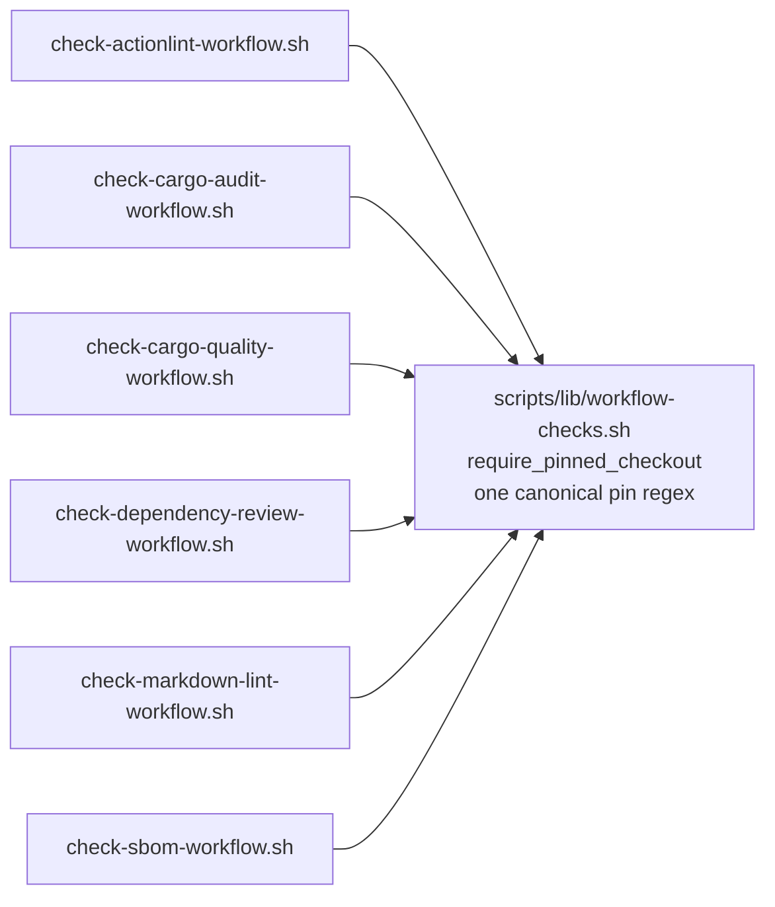

# PR Summary — Issue #511

## Summary

The `actions/checkout` pin-acceptance rule ("a numeric major `vN` or a 40-char
SHA; branch refs disallowed") was re-implemented as an inline `checkout_line`
grep block in six workflow validators, and the copies had drifted into three
generations of the regex: the canonical `(v[0-9]+|[0-9a-f]{40})\b`, the
pre-#136 narrow `v?[0-9]+` (cargo-quality, markdown-lint) and a hybrid with no
word-boundary anchor (actionlint). The drift was a latent CI breakage — the two
stale gates accept today's checkout pin only by accident (it starts with `93`),
so the next Dependabot bump to a SHA starting with a hex letter (6 of 16 first
characters) would have failed them spuriously on an unrelated PR.

This extracts the rule into one helper, `require_pinned_checkout`, in a new
`scripts/lib/workflow-checks.sh`, sourced by all six validators. It is a plain
call, not a parameterised super-helper: every site enforces the identical rule,
so the helper takes no per-caller flags. Two behaviours were tightened while
unifying, both in the strict direction:

- **All checkout steps must be pinned**, not just one. The canonical `grep -q`
  form passed when *any* line matched; `sbom.yml` checks out two repositories,
  so its inverted `grep -qv` branch was the only site already getting this
  right. The helper now matches the strict reading everywhere.
- **The `\b` anchor is enforced everywhere**, so a 41-character hex ref is no
  longer accepted on its first 40 characters (the actionlint hybrid's gap).

Failure modes are loud (Issue #3234): a missing library aborts the validator
with exit 2 rather than an unnoticed `source` failure, and the helper refuses to
run — again with exit 2 — when its argument or the caller's `ok`/`fail`
contract is missing, so a broken call can never be reported as a pass.

Closes #511.

## Evidence

Backend/shell-only change — no web interface to screenshot. Verification is the
BATS suites plus the full local gate.

`./quality.sh < /dev/null` passes end to end (exit 0, 539 BATS tests, 0
failures), including shellcheck over the new library and every validator.

## Test Plan

- **Added** `tests/scripts/workflow_checks_lib.bats` — 14 tests calling
  `require_pinned_checkout` directly against synthetic workflow YAML: accepts
  `vN`, a digit-leading SHA, a hex-letter-leading SHA and a SHA with a trailing
  `# vN` comment; rejects a branch ref, a truncated SHA, a 41-char hex ref and a
  tag that merely starts with a digit; reports a missing checkout step; requires
  *every* checkout step to be pinned; and exits 2 on a missing argument, an
  unreadable workflow, or a caller that has not defined `ok`/`fail`.
- **Added** regression tests to the previously stale validators — a
  hex-letter-leading 40-char SHA is now accepted by
  `tests/scripts/cargo_quality_workflow.bats` and
  `tests/scripts/markdown_lint_workflow.bats` (both fail against the pre-#136
  regex), and an over-long hex ref is rejected by
  `tests/scripts/actionlint_workflow.bats` (fails against the unanchored
  hybrid).
- **Added** `tests/scripts/sbom_workflow.bats` coverage for one pinned plus one
  unpinned checkout step, locking in the strict multi-checkout reading.
- **Unchanged and still passing**: every existing checkout test in the six
  validator suites. No test was removed or commented out.
