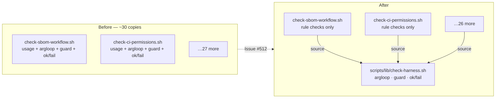

# PR Summary — Issue #512

## Summary

Every `scripts/check-*.sh` validator inlined the same ~50-line CLI harness: a
`usage()` heredoc, a `--FLAG PATH` / `-h` argument loop with `exit 2` on an
unknown flag, default-path resolution via `SCRIPT_DIR`, the "file not found"
guard, and the `EXIT_CODE`/`fail()`/`ok()` accumulate-and-report protocol. The
copies had already drifted — `fail()` existed in three different signatures
(`$WORKFLOW` interpolated, subject as `$1`, no subject at all).

That contract now lives once in **`scripts/lib/check-harness.sh`**, sourced by
**28 validators**. The per-script rule checks — the part that genuinely differs
— stay exactly where they were. The mirrored duplication in the test suite is
gone too: the two harness-contract tests re-stated in 30 `.bats` files now come
from **`tests/scripts/test_helper.bash`**.

Net effect across 64 files: **1,052 lines removed, 765 added** — and most of the
additions are the new harness, its 12 tests, and the CONTRIBUTING section.

Closes #512.

## What the harness owns

| Helper | Replaces |
| --- | --- |
| `parse_check_args <flag> <default> "$@"` | the copy-pasted `while`/`case` loop plus `SCRIPT_DIR` default resolution |
| `check_unknown_arg` / `check_flag_value` | `echo "Unknown argument…"; usage >&2; exit 2` and the missing-value guards |
| `check_require_file` / `check_require_dir` | `if [[ ! -f … ]]; then echo "… not found: …"; exit 2; fi` |
| `check_repo_path` | `"$SCRIPT_DIR/../<path>"` |
| `ok` / `fail` / `EXIT_CODE` | the three divergent report-protocol copies |
| `check_subject` | the per-script `FAIL $WORKFLOW:` prefix |



### Deviation from the suggested fix

The issue suggested `ok`/`fail` take the subject as an argument. Two of the
three existing signatures do *not* have a single subject (`check-rust-lints.sh`
and `check-neat-core-composite-action.sh` name a different file in each
message), so forcing an argument would have changed their output and churned
244 call sites. Instead the subject is a harness variable set by
`check_subject` — one call per script, or `local CHECK_SUBJECT="$wf"` inside the
per-file loop of the three multi-file validators. That absorbs all three
variants with **byte-identical output** and no call-site churn.

No real per-caller branching emerged during extraction, so the issue stands as
fixed rather than closed-as-not-applicable.

## Evidence

This is a shell/CLI change with no web interface, so there is no screenshot.
Evidence is behavioural:

**1. Output is byte-identical before and after.** Each converted validator was
run from a `git worktree` at the pre-change commit and from the working tree,
with the repo root normalised; every one matched exactly (stdout, stderr and
exit code):

```text
$ for f in <all 28 converted validators>; do
    diff <(cd /tmp/base512 && ./scripts/$f.sh 2>&1 …) <(./scripts/$f.sh 2>&1 …)
  done
COMPARE_DONE          # no diffs
```

**2. The full BATS suite passes** — 533 tests, including the 12 new harness
tests:

```text
$ bats tests/scripts < /dev/null
1..533
exit=0
```

**3. The full local gate passes:**

```text
$ ./quality.sh < /dev/null
✅ All quality checks passed!
```

**4. CI's ShellCheck invocation is clean** (simulated locally with the exact
workflow flags — `SHELLCHECK_OPTS="-s bash" shellcheck --severity=warning`
over every `*.sh`): `CI_SHELLCHECK_OK`.

## Test Plan

### Added

- `tests/scripts/check_harness.bats` — 12 tests driving the harness end-to-end
  through throwaway validator scripts (behaviour, not source inspection):
  - default target resolves relative to the repo root;
  - an explicit flag overrides the default;
  - `--help` prints usage, exits 0;
  - an unknown flag names the argument, prints usage, exits 2;
  - a flag with no value fails with a message instead of an unbound-variable
    error under `set -u`;
  - a missing target exits 2 with a not-found message;
  - a satisfied rule prints `OK` on stdout and exits 0;
  - a violated rule prints `FAIL` on **stderr** and exits 1;
  - failures accumulate rather than aborting on the first;
  - an empty subject drops the prefix;
  - `check_require_dir` guards a missing directory;
  - an empty default leaves the target unset for caller-side resolution.
- `tests/scripts/test_helper.bash` — `assert_missing_target_rejected` and
  `assert_unknown_flag_rejected`, the two contract assertions that were
  re-stated verbatim in 30 suites.

### Modified

- 30 `.bats` files now `load 'test_helper'` and call the shared assertions
  instead of restating the two harness-contract tests. **No test was removed,
  disabled, or weakened** — the same script is invoked with the same arguments
  and the same assertions run; suites with stricter expectations keep their own
  extra checks (`run` exports `$status`/`$output` to the caller).

### Unchanged and still passing

All existing per-script rule tests (521 of the 533) pass untouched, which is
what pins the refactor: they exercise each validator's real behaviour against
fixture workflows.

## Files touched

- **New:** `scripts/lib/check-harness.sh`, `tests/scripts/check_harness.bats`,
  `tests/scripts/test_helper.bash`.
- **Converted (28):** `check-actionlint-workflow`, `check-auto-format-workflow`,
  `check-bot-push-token`, `check-cargo-audit-workflow`,
  `check-cargo-quality-workflow`, `check-ci-job-graph`, `check-ci-permissions`,
  `check-ci-push-trigger`, `check-codeowners`,
  `check-dependency-review-workflow`, `check-gitleaks-workflow`,
  `check-markdown-lint-workflow`, `check-milestone-branch-filter`,
  `check-neat-core-composite-action`, `check-persist-credentials`,
  `check-prebuilt-tool-install`, `check-push-step-hardening`,
  `check-run-block-safety`, `check-rust-lints`, `check-rust-toolchain`,
  `check-sbom-workflow`, `check-security-policy`, `check-semgrep-workflow`,
  `check-shellcheck-dedup`, `check-workflow-action-versions`,
  `check-workflow-concurrency`, `check-workflow-paths`,
  `check-workflow-timeouts`.
- **`quality.sh`** — runs `shellcheck -x` so the `# shellcheck source=` directive
  is followed and the harness is analysed in context. CI's own step uses
  `--severity=warning` and passes both with and without `-x`; no workflow change
  is needed (the worker has no `workflow` OAuth scope — see
  [Human escalation](../../../CONTRIBUTING.md#human-escalation)).
- **`CONTRIBUTING.md`** — new "Guard-script harness" subsection under
  [Local gate](../../../CONTRIBUTING.md#local-gate) with a Mermaid diagram and a
  worked template for writing a new validator.
- **`Cargo.lock`** — incidental `rust_scorer` version resync (1.1.48 → 1.1.49)
  produced by running the gate; no dependency change.

## Security self-check

- **Input validation** — `parse_check_args` rejects unknown flags (`exit 2`) and
  guards missing flag values, which previously tripped an unbound-variable error
  under `set -u`. Targets are validated with `check_require_file` /
  `check_require_dir` before use.
- **Injection surface** — no new shell interpolation of untrusted input; the
  harness quotes every expansion and adds no `eval`.
- **Secrets** — none staged; no hidden files outside the allowlist.
- **Error handling** — failures stay loud: `fail` writes to stderr and sets
  `EXIT_CODE=1`, guards exit 2, and no error path is swallowed.
