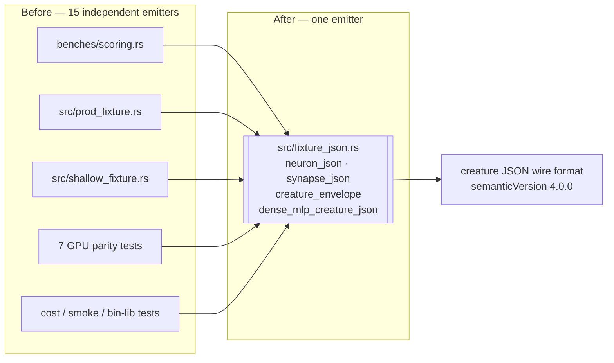

## Summary

The creature JSON wire format — the envelope
`{"input":…,"output":…,"forwardOnly":true,"semanticVersion":"4.0.0","neurons":[…],"synapses":[…]}`
plus the per-neuron and per-synapse literal shapes — was hand-encoded with
`format!` across benches, binaries, integration tests and **both** fixture
modules in `src/`. A schema change upstream (a `semanticVersion` bump, a
renamed field, a new mandatory key) meant the same edit in every one of them,
with no authoritative emitter to change. Closes #513.

New module `rust_scorer/src/fixture_json.rs` is now that emitter:

| Function | Emits |
| --- | --- |
| `neuron_json(kind, uuid, bias, squash)` | `{"type":…,"uuid":…,"bias":…,"squash":…}` |
| `synapse_json(from, to, weight)` | `{"fromUUID":…,"toUUID":…,"weight":…}` |
| `typed_synapse_json(from, to, weight, ty)` | the above plus the optional aggregate-input `"type"` field (`condition`/`negative`/`positive`) |
| `creature_envelope(inputs, outputs, neurons, synapses)` | the forward-only envelope, stamping `semanticVersion` |
| `dense_mlp_creature_json(inputs, outputs, hidden, squash)` | the whole `inputs → hidden → outputs` builder that was byte-identical across the GPU parity tests |

Only the **emission** moved. Callers keep their own loops, shapes and weight
formulas — those differ between fixtures on purpose (each parity test needs
distinct magnitudes) and are correct to keep local. No caller-specific switches
were needed; the one shared parameter (`hidden_squash`) is a plain value.

### Scope notes

- Two files the issue listed — `src/bin/cost_scan_bench.rs` and
  `src/bin/float_scan_bench.rs` — contain **no** inline creature JSON (both read
  the creature from a CLI path). Nothing to extract there, so the real count is
  fifteen sites, not seventeen.
- Two files the issue did **not** list carry the same duplicated emission and
  were converted so the emitter is genuinely authoritative:
  `src/gpu/mod.rs` (`scratch_creature_json`) and
  `tests/gpu_preflight_tdd.rs` (`write_creature`).
- Left alone deliberately: the pretty-printed hand-authored reference creatures
  in `src/cost.rs`, `tests/gpu_multi_score_parity.rs` (the Issue #312
  mixed-aggregate literal) and the small identity literals in
  `tests/{compile_once,single_pass}_assertion.rs`, `tests/directory_mode_tdd.rs`,
  `tests/early_exit_tdd.rs`, `tests/sample_rate_*.rs`. Those read as documents,
  not builders, and were outside the issue's scope.

`CONTRIBUTING.md` gains a coding-standards bullet pointing future contributors
at the module so the duplication does not grow back.

## Evidence

This is a library/test refactor with no web interface, so no screenshot applies.
The verification is behavioural: every existing test still passes unchanged,
which is the real evidence — the emitter produces the same bytes the fifteen
hand-written literals did.

Local gate (`./quality.sh < /dev/null`): **passed cleanly** — shellcheck,
cargo-deny, `fmt --check`, clippy `-D warnings`, check, build, test, rustdoc
with `RUSTDOCFLAGS=-D warnings`, release build.

Net diff: **+182 / −501** lines across 21 files.

## Test Plan

Nine new unit tests in `rust_scorer/src/fixture_json.rs`, all calling the real
functions and asserting on emitted bytes or on the parsed creature:

- `neuron_json_emits_the_wire_shape` — happy path, exact byte output.
- `neuron_json_keeps_the_fractional_form_for_integral_bias` — edge case: `f64`'s
  `Display` renders `0.0` as `0`; the emitter preserves `0.0` so the bytes match
  the literals it replaces.
- `synapse_json_emits_the_wire_shape` — happy path, exact byte output.
- `typed_synapse_json_appends_the_aggregate_input_type` — the optional `"type"`
  field, and that `None` collapses to the plain three-field shape.
- `creature_envelope_parses_and_round_trips_its_parts` — the envelope loads via
  `neat_core::creature::parse_creature_json` with the expected
  input/output/`forwardOnly`/neuron/synapse values.
- `a_non_finite_weight_fails_loudly_at_parse` — **error path**: JSON has no
  `NaN` literal, so a corrupt weight is rejected at parse rather than silently
  substituted.
- `dense_mlp_creature_json_has_the_expected_topology` — neuron and synapse
  counts for a fully-connected 8→4→2 shape.
- `dense_mlp_creature_json_honours_the_hidden_squash` — the squash parameter
  reaches every hidden neuron.
- `dense_mlp_creature_json_with_no_hidden_layer_still_parses` — edge case:
  `hidden == 0`.

Unchanged and still passing (the regression evidence — no existing test was
modified, commented out, or removed): the full suite, including the GPU parity
tests whose fixtures now come from the shared builder
(`gpu_rmse_parity`, `gpu_pipelined_parity`, `gpu_sample_rate_parity`,
`gpu_mae_parity`, `gpu_pipelined_scratch_multi_bin`, `gpu_bind_group_reuse`,
`gpu_multi_score_parity`, `gpu_preflight_tdd`), plus `cost_parity`,
`cost_scan_bench_smoke`, `bin_lib_single_source`, and the `prod_fixture` /
`shallow_fixture` unit tests.

### Pre-PR security self-check

- **Input validation** — the new functions take typed values (`&str`, `f64`,
  `usize`) from in-repo test code only; no external input reaches them.
- **Secrets** — no credentials, tokens, or hidden files staged.
- **Injection surface** — no new SQL, shell, filesystem, or HTTP calls.
- **Error handling** — a non-finite weight fails loud at parse (tested) rather
  than being coerced to a plausible-looking substitute.
- **Dependencies** — none added.
