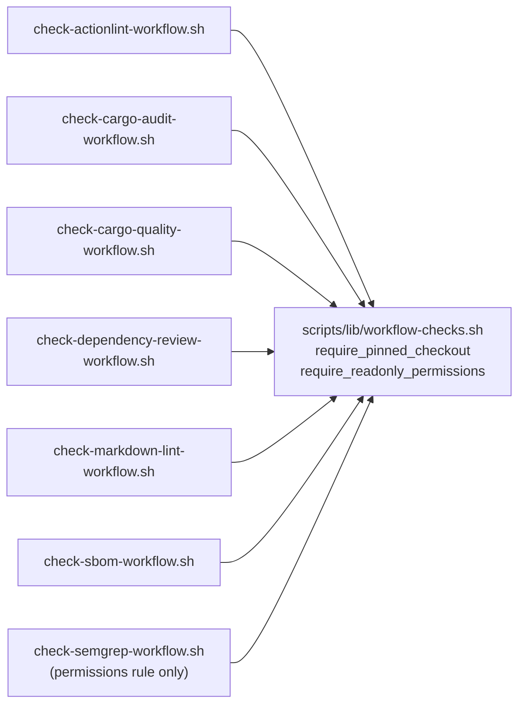

# Unify the least-privilege permissions rule in one helper (Issue #514)

## Summary

The least-privilege permissions check — "the workflow declares a bare top-level
`permissions:` key and grants `contents: read`" — was a byte-identical six-line
`grep` pair in seven workflow validators. Every future change to the acceptance
rule (recognising an inline one-liner form, tolerating an extra narrow scope,
tightening the second grep so an unrelated indented `contents: read` cannot
satisfy it) would have needed seven identical edits, or the validators would
silently enforce different policies.

Extracted `require_readonly_permissions <workflow>` into the existing shared
`scripts/lib/workflow-checks.sh` — the library Issue #511 created for the
`actions/checkout` pin rule — and replaced all seven copies with a single call.
Semantics and the `OK`/`FAIL` message text are unchanged, so the per-validator
BATS suites pass untouched. `check-semgrep-workflow.sh` was the only one of the
seven not already sourcing the library; it now does.

Closes #514.

## Evidence

Backend/CLI change with no web interface, so no screenshot. Evidence is the
BATS suites: 10 new tests against the helper, plus the seven validators' own
suites (94 tests) passing unchanged, and a clean `./quality.sh`.

The helper keeps the two independent greps the inline copies used, and now
documents that looseness in one place rather than seven — tightening it is a
single edit.

## Test Plan

Ten tests added to `tests/scripts/workflow_checks_lib.bats`, each sourcing the
library, defining the `ok`/`fail` contract and calling the helper against
synthetic workflow YAML:

- accepts a bare top-level block granting `contents: read`
- rejects a job-level-only block (top-level key required)
- fails when no `permissions:` block is declared
- rejects the blanket `permissions: write-all` shorthand
- fails when the block declares no `contents: read` scope
- tolerates trailing whitespace after the bare key
- reports exactly one `OK` line per call
- fails loudly (exit 2) with no workflow argument, on an unreadable workflow,
  and when the caller has not defined `ok`/`fail`

The pre-existing `require_pinned_checkout` tests were kept as-is; their
`run_helper` now delegates to a shared `run_lib` used by both helpers.

Regression coverage for the seven call sites is the existing per-validator
"fails when the permissions block is missing" test in each of
`actionlint_workflow.bats`, `cargo_audit_workflow.bats`,
`cargo_quality_workflow.bats`, `dependency_review_workflow.bats`,
`markdown_lint_workflow.bats`, `sbom_workflow.bats` and
`semgrep_workflow.bats` — all pass without modification, which is the proof
that semantics did not change.

`./quality.sh` passes cleanly (shellcheck, cargo-deny, fmt, clippy, build,
test, rustdoc, release build).
