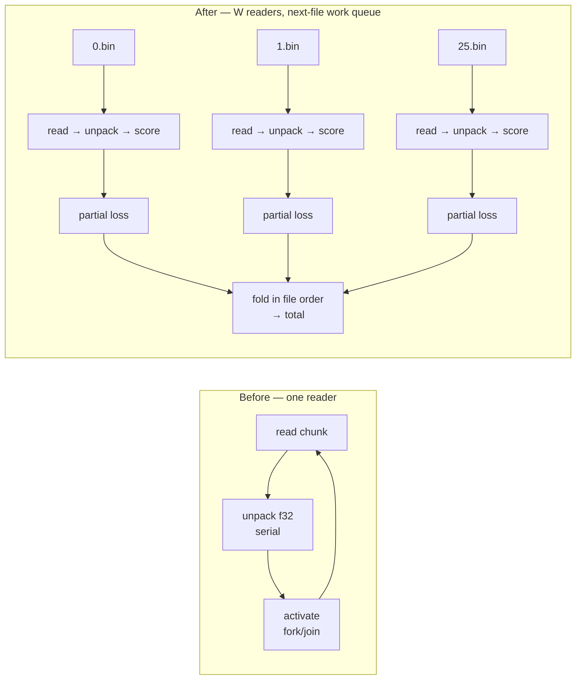

# Parallel training-data file reads (Issue #529)

## Summary

The forward-only fused scoring path read the whole corpus through **one**
sequential reader: `for_each_read_chunk` fed chunks to already-parallel Rayon
activation workers, so the `f32` unpack and the per-chunk fork/join barrier sat
on the critical path while every worker waited. Record order does not matter —
the accumulator is a plain sum — and production splits ~80 GB across 26 `.bin`
files, so those files are now read, unpacked and scored **concurrently**.

One reader per CPU by default, capped at the file count;
`NEAT_SCORER_FILE_THREADS=1` restores the single sequential reader. The two
parallel axes share one CPU budget (each reader gets
`NEAT_SCORER_ACTIVATION_THREADS / readers` activation workers, at least one) and
one read-buffer budget, so neither threads nor memory grow with the file count.

**Scores are unchanged.** Each reader seeds its sampler with its file's global
record offset, so the deterministic `--sample-rate` stride selects exactly the
records a single sweep would; per-file partial losses are folded back in **file
order**, so the total does not depend on which reader picked up which file.

Falls back to the sequential sweep for a single-file corpus and for a corpus
whose files are not each a whole number of records (a record spliced across a
file boundary can only be reassembled by one continuous stream — `corpus_guard`
rejects such a corpus at the CLI anyway).

Closes #529.



## Evidence

Backend/CLI change — no web interface to screenshot. Evidence is Criterion
before/after plus the parity tests below.

**Host:** Apple M4, 10 cores, 24 GB, local NVMe. **Corpus:**
`BENCH_SCORING_BYTES=200000000` split across `BENCH_FUSED_FILES=26` files.
**Bench:** `fused_multi_file/file_workers/W` (new group), Criterion, 10 samples,
16 s measurement. Baselines were recorded **before** the implementation landed,
against the unchanged sequential accumulator.

Small records — 8 in / 2 out (40 B/record, 5 M records):

| Readers | Median | 95 % CI | vs baseline |
|---|---|---|---|
| **before** (sequential reader) | **178.28 ms** | [169.64, 192.91] | — |
| 2 | 163.13 ms | [158.28, 169.67] | −8.5 % |
| 4 | 111.78 ms | [108.23, 115.19] | −37.3 % |
| 8 | 80.59 ms | [76.91, 84.64] | −54.8 % |
| **auto (10)** | **77.06 ms** | [76.24, 78.78] | **−56.8 %** (2.3×) |

Production-width records — 2461 in / 1 out, 19 hidden (9848 B/record, 20 301
records):

| Readers | Median | 95 % CI | vs baseline |
|---|---|---|---|
| **before** (sequential reader) | **109.77 ms** | [106.33, 112.41] | — |
| 2 | 123.79 ms | [114.80, 132.61] | +12.8 % |
| 4 | 83.50 ms | [81.79, 84.92] | −23.9 % |
| 8 | 63.38 ms | [62.11, 64.28] | −42.3 % |
| **auto (10)** | **60.00 ms** | [58.73, 60.91] | **−45.3 %** (1.8×) |

Both clear the issue's ≥ 10 % bar by a wide margin. At 2 readers the
production-width case is *slower* than the baseline — each reader's share of the
read budget shrinks while only two cores unpack — which is why the default
resolves to one reader per CPU rather than a small fixed number. Scaling is
sub-linear past 8 readers: 26 equal files over 10 readers leaves a full extra
file in the tail. Reproduce:

```bash
BENCH_SCORING_BYTES=200000000 ./scripts/run-benches.sh -- fused_multi_file
BENCH_SCORING_BYTES=200000000 BENCH_SCORING_INPUTS=2461 \
  BENCH_SCORING_OUTPUTS=1 BENCH_SCORING_HIDDEN=19 \
  ./scripts/run-benches.sh -- fused_multi_file
```

Full write-up:
[`docs/performance-baseline.md`](../../performance-baseline.md) →
"Parallel file reads — 5 August 2026 (Issue #529)".

### Numerical parity

Most parity tests run on an **exactly-representable** corpus (identity
activation over small integer inputs, targets offset by `0`, `±0.5` or `1`), so
regrouping records into different partial sums is invisible and any difference
can only mean a *different record set was scored*. Those tests assert
**bit-identical** totals at every reader count, including under `--sample-rate`.

On a corpus whose per-record errors are not exactly representable the total
moves in the last bits, because `neat-core` sums each batch through an 8-way
SIMD path and the readers group records into different batches. That is not new
— the shipped `NEAT_SCORER_READ_BYTES` knob regroups identically — and the
measured relative difference is below `1e-6`, two orders tighter than the
CPU-vs-GPU parity bars this repo already ships.

## Test Plan

New `rust_scorer/tests/parallel_file_reads_tdd.rs` (10 tests):

- `parallel_readers_match_the_sequential_loss_and_record_count` — 26 shards,
  reader counts 2/3/8/26/64/auto, bit-identical totals.
- `parallel_readers_are_deterministic_across_repeated_runs` — repeated runs are
  bit-identical (the fold happens in file order, not completion order).
- `uneven_file_sizes_still_match_the_sequential_sweep` — one dominant shard plus
  a long tail exercises the dynamic next-file work queue.
- `empty_shards_are_skipped_without_shifting_records`.
- `sub_sampling_keeps_the_same_records_at_every_reader_count` — rates
  0.25/0.5/0.1 with phase offsets.
- `misaligned_corpus_falls_back_to_the_sequential_reader` — a record spliced
  across a file boundary (two misalignments cancelling out) still returns the
  sequential answer exactly.
- `single_file_corpus_never_splits`.
- `worker_counts_share_one_cpu_budget` — readers × activation workers cannot
  oversubscribe.
- `varied_corpus_stays_within_tolerance_and_matches_the_read_buffer_knob` — the
  `1e-6` bar on realistic data.
- `cli_score_is_unchanged_by_the_file_thread_knob` — end-to-end through the
  shipped binary: identical `error`/`recordCount`, and `fileReadWorkers` is
  reported (and absent for a sequential read).

Unit tests added in `src/stream_score.rs` (`record_aligned_file_starts` offsets
/ misaligned / unreadable shard, `resolve_file_read_workers` clamping,
`per_reader_read_buf_len` budget sharing and record alignment) and in
`src/sampling.rs` (`seeked_samplers_partition_the_sequential_kept_set` — a
seeked sampler keeps exactly the sequential kept set at every split point).

`./quality.sh` passes clean (fmt, cargo-deny, clippy `-D warnings`, build, test,
rustdoc, release build).

## Security self-check

- No new external input surface: `NEAT_SCORER_FILE_THREADS` is parsed through
  the existing `parse_tuning_var` helper (malformed values warn and fall back)
  and clamped to `[1, min(files, 64)]`.
- No new dependencies, no secrets, no shell/SQL/HTTP surface.
- File metadata errors are **not** swallowed: an unreadable shard makes the
  parallel path decline, and the sequential reader then surfaces the real I/O
  error with its file-index diagnostic. A trailing partial record inside a file
  fails loud, naming the file.
