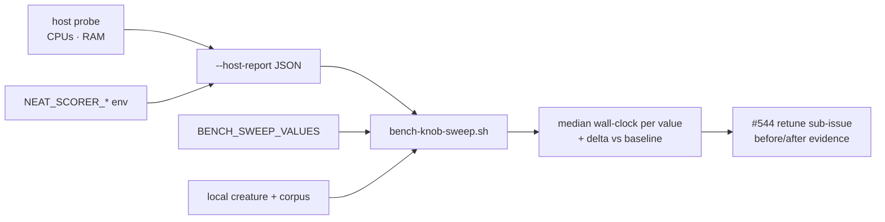

# Host knob report and fleet knob-sweep harness (Issue #545)

## Summary

Adds the measurement rig the rest of the #544 self-tune chain cites, so each
retune sub-issue can produce before/after numbers instead of inventing its own
harness. **Measurement only — no shipped default changed.** Closes #545.

1. **Knob report.** `rust_scorer --host-report` prints the detected host
   (logical CPUs, physical RAM) and every resolved knob —
   `default_worker_count`, `max_worker_count`, `max_read_bytes`,
   `default_training_read_bytes`, `gpu_scratch_bytes` — as one JSON object, each
   tagged `default` or `env`. `source` is `env` only when an override was parsed
   **and honoured**: a malformed value is rejected by the shipped resolver, so
   it keeps reporting `default` (and still warns on stderr) rather than claiming
   an override that never applied. The report is resolved before GPU mode
   resolution, so it never creates a `wgpu` adapter and returns identical JSON
   on a GPU-less host, under `--gpu off` and under `--gpu on`.
   `--record-bytes <BYTES>` selects the record width the record-size-adaptive
   read knob is resolved for (default: the 9848 B production width); zero is
   rejected, not clamped.
2. **Sweep harness.** `scripts/bench-knob-sweep.sh` runs the production scoring
   path at a caller-supplied list of values for one `NEAT_SCORER_*` knob and
   reports the median wall-clock per value, in the same table shape as
   `scripts/bench-shallow-gpu.sh`. It opens with the host's `--host-report` JSON
   so a pasted sweep carries the machine it was measured on. With
   `BENCH_SWEEP_CREATURE` / `BENCH_SWEEP_DATA` unset it **skips cleanly**
   (exit 0, Issue #448 convention); once supplied it is **fail-loud** — an
   unreadable input, a knob name outside the `NEAT_SCORER_*` allowlist, a
   non-numeric value, a failed host report or a non-zero scoring run all exit
   non-zero.
3. **Fleet baseline.** `docs/performance-baseline.md` gains a "#544 fleet knob
   baseline" section with the report output, the single-knob-neutral baseline
   and two example sweeps for the Apple mid tier (M4, 10 cores, 24 GB), plus the
   harness's measured noise floor.



## Evidence

Backend/CLI change — no web interface to screenshot. Evidence is the report
output, the harness run and the tests.

`./target/release/rust_scorer --host-report` on an Apple M4 (10 cores, 24 GB):

```json
{
  "schema": "neat-scorer-host-report/1",
  "logical_cpus": 10,
  "physical_ram_bytes": 25769803776,
  "record_bytes": 9848,
  "knobs": {
    "default_worker_count": { "value": 10, "source": "default", "env_var": "NEAT_SCORER_ACTIVATION_THREADS" },
    "max_worker_count": { "value": 256, "source": "default", "env_var": null },
    "max_read_bytes": { "value": 67108864, "source": "default", "env_var": null },
    "default_training_read_bytes": { "value": 33552136, "source": "default", "env_var": "NEAT_SCORER_READ_BYTES" },
    "gpu_scratch_bytes": { "value": 536870912, "source": "default", "env_var": "NEAT_SCORER_GPU_SCRATCH_BYTES" }
  }
}
```

Every line matches the shipped policy for this tier: one worker per logical CPU
under the 256 ceiling (≥ 8 GiB RAM), the 64 MiB mid-host read ceiling, the
32 MiB large-record default rounded to a whole record multiple
(`33552136 = 3407 × 9848`), and the 512 MiB scratch budget for the 16–64 GiB
band. At `--record-bytes 40` the read default drops to `2097120`.

Harness run (synthetic shallow pool at production record width — 50 creatures,
20 000 records over 4 shards, 9848 B/record; this repo ships no production
creature, Issue #448), median of 5 under `--gpu off`:

| `NEAT_SCORER_READ_BYTES` | Wall (s) | vs baseline |
|---|---|---|
| `default` (→ 33 552 136) | 1.55 | baseline |
| `2097152` | 1.52 | +1.9 % |
| `8388608` | 1.54 | +0.6 % |
| `33554432` (→ same 33 552 136) | 1.67 | −7.7 % |

| `NEAT_SCORER_ACTIVATION_THREADS` | Wall (s) | vs baseline |
|---|---|---|
| `default` (→ 10) | 1.97 | baseline |
| `4` | 1.79 | +9.1 % |
| `10` | 1.68 | +14.7 % |
| `20` | 1.63 | +17.3 % |

`default` and `33554432` resolve to the *same* chunk size, so their 7.7 % gap is
the harness's noise floor on this fixture, not a knob effect — recorded
explicitly in the baseline doc so a retune does not cite a sub-noise win.

**x86 Linux tier not captured.** No x86 Linux fleet host is reachable from the
unattended worker, so that tier's row is marked outstanding and tracked in
stSoftwareAU/NEAT-AI-scorer#551 (measurement only; needs a human with fleet
access). The report *code path* is still exercised on the GPU-less Linux CI
runner by `rust_scorer/tests/host_report.rs` on every PR.

## Test Plan

New — `rust_scorer/tests/host_report.rs` (integration, runs the built binary):

- `host_report_runs_without_positional_args_and_emits_one_json_object` — exit 0,
  stdout parses as exactly one JSON object, every knob key present with a
  `default`/`env` source.
- `host_report_runs_with_gpu_off_without_initialising_an_adapter` and
  `host_report_never_aborts_even_under_gpu_on` — the GPU-less-runner cases from
  the issue's failure-detection plan.
- `env_override_flips_the_matching_knob_source_to_env` — read-bytes, GPU scratch
  and activation-threads overrides each flip only their own entry, and the
  reported value is the resolved (clamped, record-aligned) one.
- `malformed_env_override_still_reports_the_default_source` — an ignored value
  is not reported as an override, and still warns on stderr.
- `record_bytes_flag_drives_the_read_default`, `zero_record_bytes_is_rejected`,
  `report_output_is_stable_across_runs`.

New — `rust_scorer/src/host_report.rs` unit tests: source classification for
unset/blank/honoured/malformed/zero values, and the serialised shape.

New — `rust_scorer/src/cli.rs` unit tests: `--host-report` parses with no
positional args and resolves a report; the report is identical under
`--gpu auto|on|off`; `--record-bytes` validation.

New — `tests/scripts/bench_knob_sweep.bats` (15 cases): clean skip with either
input unset, fail-loud on unreadable inputs / rejected knob name / non-numeric
value / invalid GPU mode / failed host report / non-zero scorer exit, the knob
reaching the scorer environment at each value (and unset for `default`), the
requested repetition count, and the median + delta table.

`./quality.sh` passes clean (shellcheck, cargo-deny, fmt, clippy `-D warnings`,
check, build, 226 unit + all integration tests, rustdoc, release build);
`markdownlint-cli2` reports 0 errors.
