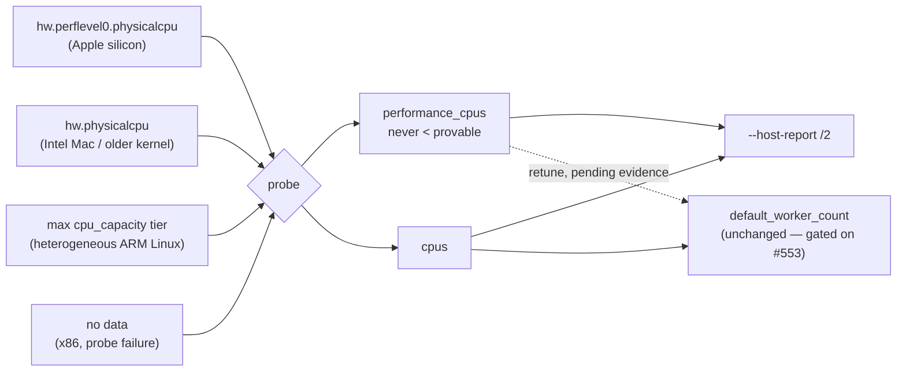

# Sense performance cores in `HostResources` (Issue #546)

## Summary

`HostResources` now carries a **performance-core count** beside the logical CPU
count, `--host-report` reports it, and policy tests can pin a fleet tier's P/E
split. The worker **retune** the issue also asks for is **not** in this PR: it
is a performance change, and the only host reachable from the unattended worker
was saturated with unrelated production scoring for the whole A/B, so no arm
cleared any bar. Closes #546.

What landed:

- `HostResources::performance_cpus`, probed with the fallback chain the issue
  specifies — macOS `hw.perflevel0.physicalcpu` → `hw.physicalcpu` → logical
  count; heterogeneous ARM Linux highest-`cpu_capacity` tier → logical count;
  logical count on every other platform and on any probe failure. **Never
  fewer than it can prove**, so x86 boxes and Intel Macs are bit-for-bit
  unchanged.
- `HostResources::synthetic_with_performance_cpus(cpus, performance_cpus, ram)`
  so policy tests reproduce a tier exactly (`synthetic` keeps its signature and
  means "no split known").
- `--host-report` gains `performance_cpus`; schema bumped to
  `neat-scorer-host-report/2`.
- `max_worker_count` untouched, as the issue asks.

What deliberately did **not** land, and why: `default_worker_count` still keys
off `HostResources::cpus`. Per the
[Performance Task Workflow](../../../CONTRIBUTING.md#performance-task-workflow)
this project ships a performance change only with before/after evidence that
clears its bar. The evidence could not be obtained (below), so the retune is
tracked in **#553** with the exact commands to run on quiescent fleet hardware.
`shipped_worker_default_is_unchanged_by_the_performance_core_split` fails if a
retune lands without it.



## Evidence

Backend/CLI change — no web interface to screenshot.

**Probe verified against the kernel** on the tier the issue was raised against
(Apple M4 Pro, 8P + 4E, 12 logical, 24 GB):

| Source | Value |
|---|---|
| `sysctl -n hw.perflevel0.physicalcpu` | 8 |
| `sysctl -n hw.perflevel1.physicalcpu` | 4 |
| `sysctl -n hw.logicalcpu` | 12 |
| `rust_scorer --host-report` → `logical_cpus` | 12 |
| `rust_scorer --host-report` → `performance_cpus` | **8** |

```json
{
  "schema": "neat-scorer-host-report/2",
  "logical_cpus": 12,
  "performance_cpus": 8,
  "physical_ram_bytes": 25769803776,
  "record_bytes": 9848,
  "knobs": {
    "default_worker_count": { "value": 12, "source": "default", "env_var": "NEAT_SCORER_ACTIVATION_THREADS" }
  }
}
```

**Worker-count A/B — inconclusive.** Three interleaved rounds of
`workers ∈ {12 (today), 10, 8 (P-cores)}` with both knobs pinned together,
Criterion, 30 samples, 20 s measurement, `BENCH_SCORING_BYTES=200000000` at
production record width (2461 in / 1 out / 19 hidden):

| Workers | `fused_multi_file/auto` per round (ms) | `score_from_json_fused/forward_only` per round (ms) |
|---|---|---|
| 12 (shipped default) | 42.70 · 52.12 · 74.89 | 102.86 · 105.20 · 148.31 |
| 10 | 50.97 · 55.28 · 82.45 | 88.63 · 55.18 · 163.49 |
| 8 (P-cores) | 40.50 · 70.47 · 38.48 | 97.50 · 131.19 · 59.99 |

The host ran unrelated production scoring throughout: the 1-minute load average
climbed 16.6 → 29.6 on a 12-core machine. Same-arm spread reaches 1.8×
(`8` workers, multi-file) and 3.0× (`10` workers, forward-only); every arm
degrades monotonically with wall-clock time, which is the competing load rather
than the knob; and the medians disagree about the winner (`8` on multi-file,
`10` on forward-only). The #545 harness noise floor recorded in
`docs/performance-baseline.md` is ~10 % — an order of magnitude tighter than
this host could deliver. M4 (4P+6E), M2 Ultra (16P+8E) and the x86 Linux
no-regression control are not reachable from the unattended worker at all
(the same constraint as the outstanding x86 row from #545/#551).

Full table, host conditions and reproduce commands are appended to
[`docs/performance-baseline.md`](../../performance-baseline.md) under
"Performance-core probe — 10 August 2026 (Issue #546)".

## Test Plan

`./quality.sh < /dev/null` passes clean (shellcheck, guard scripts, codespell,
bats, cargo-deny, fmt, clippy `-D warnings`, check, build, test, rustdoc,
release build).

Added in `rust_scorer/src/host_resources.rs`:

- `probe_reports_performance_cores_within_the_logical_count` — the real probe
  returns `1..=cpus`.
- `failed_performance_probe_falls_back_to_every_logical_cpu` — `None` and a
  zero answer both resolve to the logical count, so the fallback chain can
  never yield **fewer** workers than before this change.
- `performance_probe_result_is_clamped_into_the_logical_range` — a probe over
  the logical count cannot inflate the default.
- `shipped_worker_default_is_unchanged_by_the_performance_core_split` — over
  the fleet tiers (12L/8P, 10L/4P, 24L/16P and a no-split host), the P/E split
  moves no host's worker default. This is the gate on an evidence-free retune.
- `a_host_with_no_performance_core_data_never_loses_workers` — an
  unclassifiable host keeps exactly its pre-change default.
- `worker_default_still_clamps_to_the_host_ceiling_on_a_split_host` — the
  low-RAM ceiling still wins on a heterogeneous host.
- `synthetic_without_a_split_treats_every_cpu_as_a_performance_core` and
  `synthetic_clamps_a_pinned_performance_core_split` — constructor contract.

Added in `rust_scorer/tests/host_report.rs`:

- `worker_override_still_clamps_into_the_host_range` — an honoured
  `NEAT_SCORER_ACTIVATION_THREADS` still resolves inside
  `[1, max_worker_count]` (`999999` → the ceiling, `0` → 1), closing the
  issue's override-clamp acceptance criterion, which previously had no
  integration coverage.
- `assert_report_shape` now requires `performance_cpus` in `1..=logical_cpus`
  on every report, so the GPU-less Linux CI runner exercises the fallback path
  on each PR.

Existing `--host-report` override and clamp tests are unmodified and green.
