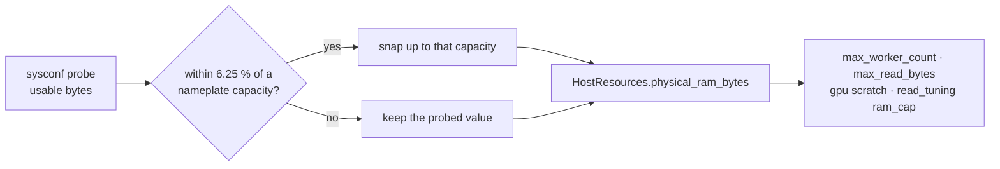

# Snap probed RAM to nameplate so x86 Linux hosts stop dropping a tier (Issue #547)

## Summary

Every RAM tier in `host_resources.rs` and `read_tuning.rs` is a strict `<`
comparison against an exact power-of-two byte count, but the probe
(`sysconf(_SC_PHYS_PAGES) * sysconf(_SC_PAGESIZE)`) reports **usable** memory.
On x86 Linux, firmware and kernel reservations put a nominally 16 GB box a few
hundred MiB below `16 * GIB`, so it silently dropped a whole tier — and a
nominally 8 GB box was treated as a low-RAM host, capped at 16 workers with an
8 MiB read buffer. Apple Silicon was unaffected: `hw.memsize` already reports
the nameplate figure exactly.

`host_resources::snap_to_nameplate_bytes` rounds a reading up to the nearest
nameplate capacity when it sits within **6.25 %** of it. It is applied **once**,
at the single point `HostResources` is constructed
(`synthetic_with_performance_cpus`, which `probe()` and `synthetic()` both
funnel through), so `max_worker_count`, `max_read_bytes`,
`default_gpu_scratch_bytes` and `read_tuning`'s `ram_cap` all inherit the
correction and no call site can bypass it. A reading further below a capacity
than the tolerance band is left exactly as probed, and `None` (probe
unavailable) is untouched. Closes #547.

| Nameplate | Probe reports | Tier before | Tier after |
|---|---|---|---|
| 8 GB x86 | ≈ 7.6 GiB | `< 8 GiB` — 16-worker cap, 8 MiB reads, 128 MiB scratch | 8 GiB — 256-worker cap, 16 MiB reads, 256 MiB scratch |
| 16 GB x86 | ≈ 15.4 / 15.5 GiB | `< 16 GiB` — 16 MiB reads, 256 MiB scratch | 16 GiB — 32 MiB reads, 512 MiB scratch |
| 24 GB Apple Silicon | 24.0 GiB exactly | 24 GiB | unchanged |
| 7 GiB (genuinely small) | 7.0 GiB | `< 8 GiB` | unchanged — 12.5 % short, outside the band |

The tolerance is `capacity / 16`. Observed shortfalls are 3.75 % (15.4 of
16 GiB) and 5.0 % (7.6 of 8 GiB), so 6.25 % covers them with headroom while a
genuinely smaller machine keeps its low-RAM defaults.

## Evidence



Backend/CLI change — no web interface to screenshot.

### The tests fail without the fix

Reverting only the snap call inside
`HostResources::synthetic_with_performance_cpus` (implementation removed, tests
untouched) turns exactly the three new tier tests red and leaves every
pre-existing test — including Issue #546's — green:

```text
test read_tuning::tests::ram_cap_uses_snapped_ram ... FAILED
test host_resources::tests::snaps_7_6_gib_to_8_gib_tier ... FAILED
test host_resources::tests::snaps_15_4_and_15_5_gib_to_16_gib_tier ... FAILED
test result: FAILED. 22 passed; 3 failed
```

With the fix in place, `./quality.sh` passes cleanly (`✅ All quality checks
passed!`) on the branch rebased onto the milestone head: 235 lib tests,
integration tests, doctests, clippy, rustdoc and release build.

### Apple Silicon is unchanged

`./target/release/rust_scorer --host-report` on this M4 Pro (10 logical / 4 P
cores, 24 GB) reports `physical_ram_bytes: 25769803776` — 24.0 GiB exactly, the
same figure as the baseline in
[`docs/performance-baseline.md`](../../performance-baseline.md), with every knob
unmoved (`max_worker_count 256`, `max_read_bytes 67108864`,
`default_training_read_bytes 33552136`, `gpu_scratch_bytes 536870912`).

### Timings for the tier correction

No x86 Linux host is reachable from this run, so the correction was measured on
this M4 Pro as the knob change it actually produces: the read-chunk size, swept
with `NEAT_SCORER_READ_BYTES` over the before/after values for each host class.
Criterion `score_from_json_fused` (single-file fused CPU path),
`BENCH_SCORING_BYTES=200000000`, production-width records
(`BENCH_SCORING_INPUTS=2461 BENCH_SCORING_OUTPUTS=1`, 9848 B/record), 10 samples:

| Host class | Read chunk | Median | Throughput | vs before |
|---|---|---:|---:|---:|
| 8 GB x86 — **before** | 8 MiB | 56.477 ms | 3.298 GiB/s | baseline |
| 8 GB x86 — **after** | 16 MiB | 56.014 ms | 3.325 GiB/s | −0.8 % (within noise) |
| 16 GB x86 — **before** | 16 MiB | 56.014 ms | 3.325 GiB/s | baseline |
| 16 GB x86 — **after** | 32 MiB | 49.275 ms | 3.780 GiB/s | **−12.0 %** |

The 16 GB-class correction recovers a real ~12 %; the 8 GB-class one is
throughput-neutral on this host and its value is escaping the 16-worker
low-RAM cap rather than the read size.

### The corrected tier does not create memory pressure

Read-buffer memory is bounded by `max_read_bytes`, and **that ceiling does not
move**: both the `< 8 GiB` tier and the 8 GiB tier resolve to the same 64 MiB
`LEGACY_MAX` (only ≥ 64 GiB hosts get 256 MiB). On the multi-file path,
`stream_score::per_reader_read_buf_len` divides that single 64 MiB budget across
the concurrent readers, so W readers never hold more than one reader at the
host's maximum chunk — the snap changes the per-chunk *default*, not the total.
On the single-file path an 8 GB box holds one 16 MiB buffer instead of one
8 MiB buffer: +8 MiB, 0.1 % of the machine. The other tier move on an 8 GB box
is the GPU scratch budget (128 → 256 MiB), which is only requested when a GPU
run is actually hosted.

## Test Plan

New in `rust_scorer/src/host_resources.rs`:

- `snaps_7_6_gib_to_8_gib_tier` — the 8 GB x86 reading (7.6 GiB, page-aligned)
  snaps to `8 * GIB` and takes the 256-worker / 256 MiB-scratch tier.
- `snaps_15_4_and_15_5_gib_to_16_gib_tier` — both 16 GB x86 readings snap to
  `16 * GIB` and take the 512 MiB scratch tier.
- `exact_24_gib_and_64_gib_unchanged` — exact readings pass through with their
  tiers unmoved.
- `apple_silicon_reported_values_are_unchanged` — snapping is a no-op for every
  shipped Apple configuration (8/16/18/24/32/36/48/64/96/128/192/512 GiB).
- `none_probe_unchanged` — `None` stays `None` and keeps the unknown-RAM
  defaults.
- `genuinely_small_host_is_not_snapped_up_a_tier` — 7 GiB and 3 GiB keep their
  low-RAM caps.
- `snapping_never_lowers_a_reading` — the result is never below the input.
- Doctest on `snap_to_nameplate_bytes` covering snap / exact / no-snap.

New in `rust_scorer/src/read_tuning.rs`:

- `ram_cap_uses_snapped_ram` — a 15.5 GiB host resolves the same read default
  **and** the same worker ceiling as an exact 16 GiB host, so cross-module drift
  fires if one call site bypasses the central snap.
- `low_ram_read_cap_still_applies_below_the_nameplate_band` — 7 GiB keeps the
  8 MiB cap.

Unmodified: every pre-existing `host_resources.rs` and `read_tuning.rs` test
using exact synthetic values still passes as written.

## Docs

- README — new **Nameplate RAM snapping (Issue #547)** section (before/after
  tier table, tolerance rationale, Mermaid flow), a pointer from the
  large-record read-chunk section, and a note on the `--host-report`
  `physical_ram_bytes` field now being the snapped figure.
- `AGENTS.md` — self-tuning bullet records the snap.
- Rustdoc — module header, `physical_ram_bytes` field, and the
  `host_report.rs` field doc.
