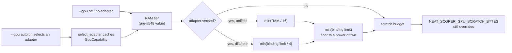

# GPU capability sensing + scratch-budget clamps (Issue #548)

## Summary

`HostResources` sensed only CPUs and RAM, so the `forward_mse_scratch` GPU
scratch budget was inferred entirely from system RAM — a poor proxy, and one
that could ask a device for a buffer larger than it can bind. This adds GPU
sensing and bounds the budget by what the adapter actually reports.
Closes #548.

- **Sense.** New `host_resources::GpuCapability` — backend label, whether
  adapter memory is **unified** with system RAM or **discrete** VRAM,
  `max_storage_buffer_binding_size` and `max_compute_workgroups_per_dimension` —
  carried on `HostResources::gpu: Option<GpuCapability>` and cached once per
  process in its own `OnceLock`.
- **No startup regression.** Sensing rides the adapter `gpu::select_adapter`
  already creates; nothing else in the process can create one. `--gpu off`, a
  GPU-less host, and any knob resolved before an adapter exists all sense
  nothing and keep the pre-#548 RAM-only tiering, byte for byte.
- **Clamp (the part that ships).** With an adapter sensed the budget is only
  ever *tightened*: `min` against the adapter's binding limit (the scratch
  activations are one binding, so exceeding it is a validation error, not a slow
  run), against `RAM/16` on unified-memory hosts, and against `binding limit / 4`
  on discrete cards — then floored to a power of two, because
  `BatchedRunner::ensure_scratch_buf` rounds its allocation up to one. The
  scratch grid `G_x` is now clamped to `max_compute_workgroups_per_dimension`
  too.
- **Retune: negative result.** Spending the sensed capability on a *bigger*
  budget is slower — see Evidence — so no fleet tier's budget moves.
  `NEAT_SCORER_GPU_SCRATCH_BYTES` still overrides, and the RAM-only mid-host
  special case in `gpu/forward_mse_batched.rs` is retired (it re-stated the tier
  the host policy already returned).

## Evidence

Backend/CLI change — no web interface to screenshot. Evidence is the benchmark
A/B, the GPU integration suite on real Metal hardware, and the policy tests.

**Host:** Apple M4 Pro (12 logical / 8 P-cores, 16 GPU cores), 24 GB, Metal.
The host was contended during the capture (two production `rust_scorer` runs,
load average ≈ 30), so absolute medians drift up to 20 % between sessions —
every comparison is therefore an **interleaved A/B**, alternating budgets so
drift hits both sides equally.

**Shipped 512 MiB budget vs a doubled 1 GiB budget** — Criterion
`shallow_gpu_vs_cpu/gpu/50` (synthetic Enceladus-shaped scratch pool, 32 MiB
corpus), median of 10 samples per run:

| Pair | 512 MiB (shipped) | 1024 MiB | Change |
|---|---|---|---|
| 1 | **428.3 ms** | 453.0 ms | +5.8 % slower |
| 2 | **427.1 ms** | 449.5 ms | +5.2 % slower |
| 3 | **420.0 ms** | 461.7 ms | +9.9 % slower |
| 4 | **420.0 ms** | 461.1 ms | +9.8 % slower |
| **Median** | **423.6 ms** | **457.0 ms** | **+7.9 % slower** |

A single-session extension points the same way: 512 MiB 460.6 ms → 1 GiB
508.6 ms (+10.4 %) → 2 GiB 529.7 ms (+15.0 %) → 512 MiB again 450.0 ms. The
budget bounds the scratch grid, and a wider grid means proportionally more
activation scratch live in the same unified DRAM the corpus streams through; the
extra parallelism does not pay for that traffic. Full write-up, including what
this adapter reports (`IntegratedGpu`, 4 GiB − 4 binding limit, 65 535
workgroups/dimension — Apple silicon reports the same limit on every tier, and
`wgpu` exposes no GPU core count), is in
[`docs/performance-baseline.md`](../../performance-baseline.md#gpu-capability-sensing--10-august-2026-issue-548).

Per the [Performance Task Workflow](../../../CONTRIBUTING.md#performance-task-workflow)
the retune is therefore recorded as a **negative result** rather than shipped;
the sensing and clamps ship because they are correctness work (a budget above
the binding limit is a wgpu validation error / the Metal SIGSEGV class
`gpu_pipelined_scratch_multi_bin.rs` guards), not a performance claim. Only the
M4 Pro tier is reachable from this worker — since no shipped default moves, the
M2 Ultra / M4 / M1 tiers cannot regress.

**Real-hardware suite** — the whole GPU integration suite ran against Metal
locally (it self-skips in CI), all green: `gpu_capability_sensing`,
`gpu_off_no_capability_sensing`, `gpu_preflight_tdd` (5),
`gpu_pipelined_scratch_multi_bin` (2), `gpu_multi_score_parity` (12),
`gpu_pipelined_parity`, `gpu_bind_group_reuse` (3), `gpu_mae_parity`,
`gpu_rmse_parity`, `gpu_sample_rate_parity` (2). `./quality.sh` passes.

## Test Plan

Policy tests in `rust_scorer/src/host_resources.rs` (`HostResources::with_gpu`
pins a synthetic adapter, so each case is deterministic without owning one):

- `synthetic_can_pin_a_gpu_capability` — `with_gpu` pins the capability and
  disturbs no other sensed field.
- `a_host_with_no_sensed_adapter_keeps_the_pre_548_scratch_budget` — every RAM
  tier, plus unknown RAM, matches the pre-#548 answer exactly.
- `sensed_budget_never_exceeds_the_adapter_binding_limit` — a 128 MiB and a
  16 MiB device cap the budget however much RAM the host has; swept across RAM
  tiers × adapters.
- `a_sensed_adapter_never_raises_the_budget` — the negative-result guard: no
  adapter/RAM combination can exceed the no-adapter budget.
- `sensing_an_apple_adapter_keeps_every_fleet_tier_on_its_ram_budget` — the
  8/16/24/32/64 GiB fleet tiers keep 256/512/512/512/1024 MiB.
- `unified_memory_hosts_stay_bounded_by_system_ram`,
  `a_unified_host_with_unknown_ram_keeps_the_historical_budget`,
  `a_discrete_adapter_is_bounded_by_its_own_binding_limit`.
- `every_sensed_budget_is_a_usable_power_of_two`, `floor_power_of_two_rounds_down`,
  `probing_a_host_creates_no_adapter`.

Kernel-grid tests in `rust_scorer/src/gpu/forward_mse_batched.rs`:

- `scratch_workgroups_x_is_bounded_by_the_device_grid_limit` and
  `scratch_workgroups_x_still_dispatches_when_the_grid_limit_is_absent` (new);
  the two existing `scratch_workgroups_x_*` cases now pass the real fleet limit.

`rust_scorer/src/gpu/mod.rs`:

- `only_a_discrete_adapter_counts_as_non_unified_memory` — unified/discrete
  classification, with unclassified adapters taking the conservative answer.

Integration tests (one test per file — the sensing cache is a process-wide
`OnceLock`, so a sibling test selecting an adapter would mask the leak):

- `rust_scorer/tests/gpu_off_no_capability_sensing.rs` — `--gpu off` reports
  `cpu-fallback`, senses **no** adapter, and resolves the RAM-derived budget.
  This is the `--gpu off` adapter-leak canary, and it runs on GPU-less CI too.
- `rust_scorer/tests/gpu_capability_sensing.rs` — on a real adapter (self-skips
  without one): selecting one senses the backend and both limits, the host
  snapshot carries them, and the resolved budget is a power of two within the
  adapter's binding limit and the unified RAM share.
