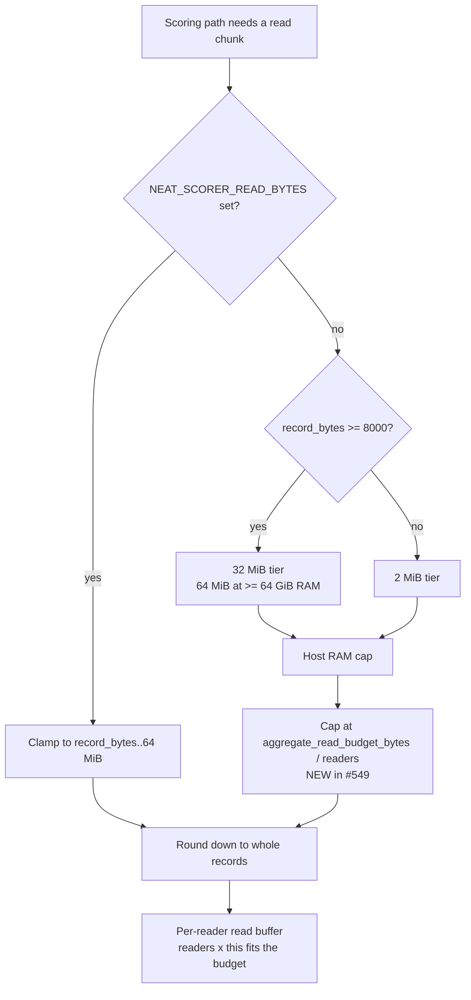

# Read-chunk defaults: reader-count aware, dead ceiling removed (Issue #549)

## Summary

`rust_scorer/src/read_tuning.rs` now sizes the read chunk from the **concurrent
reader count** as well as the record width and host RAM, and the unreachable
`≥ 64 GiB → 256 MiB` tier in `host_resources::max_read_bytes` is gone. Closes
#549.

**The issue's premise needed correcting first.** #549 says the aggregate
`readers × chunk` footprint "is a budget the current per-knob tiering never
accounts for", quoting 10 × 32 MiB = 320 MiB on a 10-core 16 GB M4. The *product
of the two knobs* is indeed 320 MiB, but the resident buffer never was: Issue
#529 added `stream_score::per_reader_read_buf_len`, which divides one total
budget across the readers **after** `read_tuning` has chosen. The real defect was
that the budget being divided was `max_read_bytes` — the *override clamp* — so:

- the chunk `read_tuning` chose was silently overridden by a second-stage
  division it knew nothing about, and
- every diagnostic (`--host-report`, the `readBufLen` JSON field) printed that
  unsplit figure — up to **6× wider** than any reader actually held.

That is also why the 256 MiB ceiling *looked* dead and was not: no default could
select it, but on a ≥ 64 GiB host it was the aggregate budget the reader split
consumed.

What ships:

| Change | Effect |
|---|---|
| `default_training_read_bytes_for_readers(record_bytes, host, readers)` | chunk = min(record-size tier, RAM tier, per-reader share of the aggregate budget), never below one whole record |
| `read_tuning::aggregate_read_budget_bytes(host)` | named total: **64 MiB**, **256 MiB** at ≥ 64 GiB RAM, never above **RAM / 16** |
| `stream_score::per_reader_read_buf_len` | divides that same named budget instead of the override clamp (same value on every host) |
| `host_resources::max_read_bytes` | flat **64 MiB** on every host — no tier left for a default to be unable to reach |
| `--host-report` | adds `file_read_workers` + `aggregate_read_budget_bytes`, schema **`neat-scorer-host-report/3`** |
| `readBufLen` JSON field | now the **per-reader** buffer, i.e. what the readers hold |

**No tier's chunk was retuned** — see Evidence. Unchanged: the small-record
2 MiB path, the `NEAT_SCORER_READ_BYTES` override, its `[record_bytes, 64 MiB]`
clamp, whole-record alignment, and the single-reader continuous sweep
(`multi_score`, single-file and non-record-aligned corpora).

## Evidence

Backend/CLI change — no web interface, so no screenshot. Full detail, including
the reproduction recipe, is appended to
[`docs/performance-baseline.md`](../../performance-baseline.md#read-chunk-defaults-vs-the-reader-count--10-august-2026-issue-549).

**Host:** Apple M4 Pro (12 logical / 8 P-cores), 24 GB, local NVMe. **Corpus:**
199,993,184 B (20,308 records × 9848 B) across **26** `.bin` shards, production
creature width (2461 in / 1 out / 19 hidden), forward-only fused, `--gpu off`,
shipped reader count (12).

### Before/after A/B at the shipped default — no regression

15 interleaved rounds of the release binary from the merge base and from this
branch (alternating every round, so host drift hits both equally):

| Build | Median `timeTaken` | Min | Mean |
|---|---:|---:|---:|
| before (merge base) | **28.26 ms** | 26.11 ms | 31.69 ms |
| after (this branch) | **28.30 ms** | 25.28 ms | 30.51 ms |
| delta | **+0.13 %** | | |

`error`, `score` and `recordCount` are bit-identical between the builds
(`3.8862606350444184` / `-2.8867303150444186` / `20308`).

### The reporting fix, measured

`--host-report --record-bytes 9848` on the same host, before → after:

| Knob | Before | After |
|---|---:|---:|
| `default_training_read_bytes` (per reader) | 33,552,136 | **5,583,816** |
| `file_read_workers` | *absent* | **12** |
| `aggregate_read_budget_bytes` | *absent* | **67,108,864** |
| Buffer each reader really allocated | 5,583,816 | 5,583,816 |

### Why the retune half is a recorded negative result

Three noise probes on the shipped path, on a host running unrelated production
scoring (1-min load 5–33 on 12 cores):

1. **Identical configurations, 2× apart.** A Criterion sweep of
   `NEAT_SCORER_READ_BYTES` ∈ {8, 16, 25.6, 32} MiB on
   `fused_multi_file/file_workers/auto` at `BENCH_FUSED_FILES=26`,
   `BENCH_SCORING_BYTES=200000000` gave 54.7 / 98.9 / 107.8 / 64.0 ms — yet all
   four arms resolve to the **same** 5,583,816-byte buffer (12 readers share the
   64 MiB budget, so every value ≥ 5.6 MiB clamps alike). The entire spread is
   host load.
2. **Same-arm drift of 51 %.** In a 30-round interleaved CLI sweep the default
   arm's first-half median was 82.50 ms and its second-half median 54.57 ms.
3. **A signal inside that drift.** In a quieter 15-round window, 12–48 MiB
   aggregate ranked 4–7 % ahead of the shipped 64 MiB (28.1 / 28.6 / 27.8 ms vs
   30.1 ms), 6 MiB clearly worse (32.6 ms), and two identically-resolving arms
   agreed to 0.4 %. Probe 2 shows this host is not quiet long enough to trust
   that gap — and the corpus here is page-cache **warm** while production streams
   ~80 GB cold, where smaller chunks trade syscalls for locality.

So a tighter budget is plausible but unproven; shrinking it would be a
performance change with no evidence of gain, which
[CONTRIBUTING](../../../CONTRIBUTING.md#performance-task-workflow) does not
allow. Every tier keeps its shipped value, and the M2 Ultra / M4 / M1-class /
x86 Linux tiers are not reachable from this unattended worker at all (same
constraint as Issue #553).

## Test Plan

New tests — all call the real resolvers with synthetic hosts and assert on
returned values:

- `read_tuning::tests::no_unreachable_ceiling` — over the fleet tiers plus a
  15 × 10 synthetic RAM/CPU grid, every distinct `max_read_bytes` value must be
  selectable by a built-in default. Reintroducing the `≥ 64 GiB → 256 MiB`
  branch fails it.
- `read_tuning::tests::aggregate_footprint_bounded` — `readers × chunk` fits
  `aggregate_read_budget_bytes`, and that budget fits RAM / 16, across the fleet
  tiers and the synthetic grid, at 40 B and 9848 B records.
- `read_tuning::tests::the_16_gib_m4_regression_input_is_now_bounded` — the exact
  input from the issue: asserts the unbounded 10 × 32 MiB overshoots the budget,
  and that the shipped default is the tight fit under it.
- `read_tuning::tests::aggregate_budget_tiers_are_reachable_and_ram_bounded` —
  both budget tiers are consumed by a real host's default; a sub-1 GiB host is
  bounded by its RAM share.
- `read_tuning::tests::a_single_reader_keeps_the_full_record_size_tier`,
  `more_readers_never_widen_the_chunk`,
  `unknown_ram_keeps_the_mid_range_budget_at_any_reader_count`,
  `one_whole_record_survives_an_absurd_reader_count`,
  `env_override_and_record_alignment_are_unchanged_by_the_reader_bound`,
  `shipped_reader_count_matches_the_fused_path_resolver`.
- `stream_score::tests::shipped_per_reader_buffer_is_unchanged_by_the_reader_aware_default`
  — golden table of the resident per-reader buffer for all eight fleet tiers
  (8 GB M1 → 192 GB M2 Ultra). This is the regression gate on an unevidenced
  retune: moving any tier fails it.
- `stream_score::tests::per_reader_read_buf_shares_one_budget_on_every_fleet_host`
  — the reader split respects the named budget off whatever host runs the suite.
- `host_report::tests::reported_read_chunk_footprint_fits_this_host` and
  `tests/host_report.rs::reported_read_chunk_aggregate_footprint_is_bounded` —
  end-to-end on the real host: the reported `file_read_workers × chunk` fits the
  reported budget, which fits RAM / 16.

Modified tests (behaviour change documented, none removed):

- `host_resources::tests::large_mac_raises_the_scratch_ceiling_and_keeps_the_flat_read_ceiling`
  (renamed from `large_mac_raises_read_and_scratch_ceilings`) and
  `exact_24_gib_and_64_gib_unchanged` — expect a 64 MiB read ceiling instead of
  256 MiB, plus new `read_ceiling_no_longer_tiers_on_ram`.
- `read_tuning::tests` tier tests now pass an explicit `SINGLE_READER`, which is
  the reader count those record-size / RAM tier assertions always described.
- `stream_score::tests::per_reader_read_buf_shares_one_total_budget` compares
  against `aggregate_read_budget_bytes` rather than the override clamp (same
  value below 64 GiB RAM).
- `tests/host_report.rs::KNOB_KEYS` gains the two new knobs.

Gate: `./quality.sh` passes clean (shellcheck, cargo-deny, `fmt --check`,
clippy `-D warnings`, build, 263 lib tests + integration suites + 30 doctests,
rustdoc `-D warnings`, release build). `.codespellrc` gains one curated
ignore-list word (`retuned`, the #544 vocabulary codespell reads as "returned").
