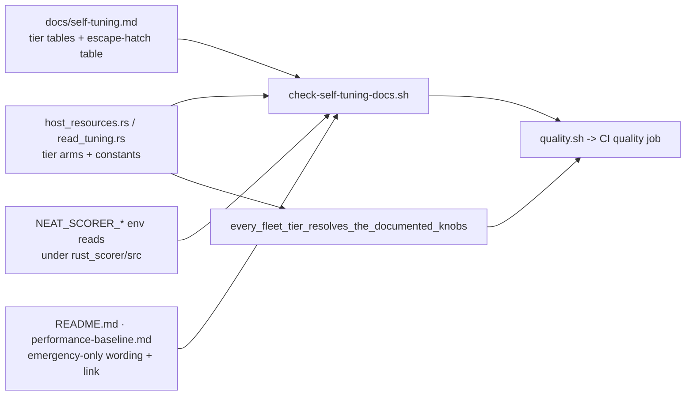

# rust_scorer: self-tuning reference, fleet tier table and #544 roll-up (Issue #550)

## Summary

Adds `docs/self-tuning.md` — the single home for the policy #544 settled but
never wrote down: **the scorer self-tunes from detected hardware, and the
`NEAT_SCORER_*` variables are emergency escape hatches, not per-host
configuration.** The document carries the full detection → tier → knob mapping,
the fallback behaviour when a probe is unavailable, the fleet tier table with
the values each machine family actually resolves, and a per-knob roll-up of
every #544 sub-issue including the two `negative-result` retunes. `README.md`
and `docs/performance-baseline.md` now present the env vars as emergency-only
rather than as ordinary tuning knobs, and both link to the reference.

Two guards stop the tables drifting from the code:

- `scripts/check-self-tuning-docs.sh` (wired into `quality.sh`, and therefore
  CI) reads the tier `match` arms and constants out of `host_resources.rs` and
  `read_tuning.rs` and fails on any row that disagrees, on any `NEAT_SCORER_*`
  environment read under `rust_scorer/src` with no entry in the escape-hatch
  table, and on `README.md` / `docs/performance-baseline.md` losing the
  emergency-only wording or the link.
- `host_resources::tests::every_fleet_tier_resolves_the_documented_knobs` pins
  every published fleet-tier row to the resolvers themselves.

Docs-only for shipped behaviour: no scorer code path changed — the Rust change
is test-only.

Closes #550.

## Evidence

No web interface to screenshot; this is a documentation and CI-guard change.

**The fleet tier table is derived, not asserted.** Every row is computed by the
shipped resolvers in the new Rust test, and this host's live `--host-report`
matches its row (Apple M4, 10 logical CPUs, 24 GB):

| Knob | `--host-report` on this host | `docs/self-tuning.md` row |
|---|---:|---:|
| `default_worker_count` / `file_read_workers` | 10 | 10 |
| `default_training_read_bytes` (per reader) | 6 706 488 | 6 706 488 B |
| `aggregate_read_budget_bytes` | 67 108 864 | 64 MiB |
| `gpu_scratch_bytes` | 536 870 912 | 512 MiB |

**Guard behaviour** — what fails CI, and when:

Local gate: `./quality.sh < /dev/null` passes (shellcheck, all doc guards,
codespell, bats, cargo-deny, fmt, clippy, build, test, rustdoc, release build).

## Test Plan

New — `tests/scripts/self_tuning_docs.bats` (16 cases, synthetic source and doc
fixtures in a temp dir, so the real documents are never mutated):

- passes on documents aligned with the fixture constants;
- fails when a documented worker-ceiling or GPU-scratch tier drifts from the
  code, and when the code gains a tier the doc does not have;
- fails when `MAX_READ_BYTES`, the record-size threshold, or the nameplate
  tolerance divisor is bumped in code but not in the doc;
- **negative control:** a fabricated `NEAT_SCORER_FABRICATED_KNOB` env read
  added to the sources fails the gate — a new knob cannot ship undocumented;
- **guard self-check:** an inventory that matches no knob at all fails loudly
  instead of passing vacuously;
- fails when `README.md` or `docs/performance-baseline.md` drops the
  emergency-only wording, or when the README loses its link to the reference;
- errors on a missing document, a removed section, and an unknown flag;
- asserts the real repository documents satisfy the check.

New — `rust_scorer/src/host_resources.rs`:

- `every_fleet_tier_resolves_the_documented_knobs` — all 11 published fleet
  rows, checking worker default and ceiling, read ceiling, aggregate read
  budget, the per-reader production-width chunk (and that `readers × chunk`
  fits the budget), and the no-adapter GPU scratch budget;
- `sensing_an_apple_adapter_leaves_every_fleet_tier_row_intact` — a sensed
  unified-memory adapter must not move the single documented scratch column.

Unchanged suites still pass, including `scripts/check-read-bytes-docs.sh` and
`scripts/check-docs-cross-references.sh` over the reworded README sections.
