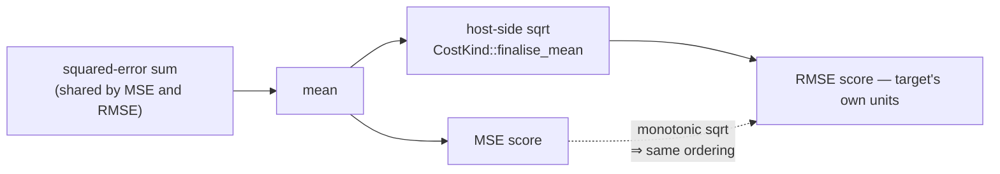

# PR Summary — Issue #556

## Summary

The README cost table described `RMSE` as ranking "identically to MSE", which
reads as though `RMSE` is redundant next to `MSE`. Verified against
`rust_scorer/src/cost.rs` (`CostKind::finalise_mean`): `RMSE` reuses the MSE
squared-error sum and applies one host-side `sqrt` at finalisation, so `sqrt`
being monotonic makes the creature *ordering* match `MSE` while the *reported
score* genuinely differs — it is in the target's own units, which is exactly why
`RMSE` exists.

Both README surfaces (the cost-table row and the Issue #337 paragraph beneath
it) now state that narrower truth, and the `CostKind::Rmse` rustdoc is aligned
with the same framing. New `scripts/check-rmse-docs.sh` — invoked from
`quality.sh` alongside the other doc guards — fails the gate if either surface
collapses ordering and reported magnitude back into an identical-ranking claim.

Documentation only: `--cost RMSE` stays selectable and its computation is
unchanged. Closes #556.

## Evidence

Backend/CLI documentation change — no web interface to screenshot.

Guard script against the real repository documents:

```text
$ ./scripts/check-rmse-docs.sh
OK   README RMSE table row: does not claim RMSE ranks identically to MSE
OK   README RMSE table row: states the ordering fact (same creature ordering as MSE)
OK   README RMSE table row: states that the reported score differs from MSE's
OK   README RMSE table row: states that the reported score is in the target's own units
OK   README cost-selector prose: does not claim RMSE ranks identically to MSE
OK   README cost-selector prose: states the ordering fact
OK   README cost-selector prose: states why the ordering holds (sqrt is monotonic)
OK   README cost-selector prose: states that the reported score is in the target's own units
OK   CostKind::Rmse rustdoc: does not claim RMSE ranks identically to MSE
OK   CostKind::Rmse rustdoc: states the ordering fact
OK   CostKind::Rmse rustdoc: states that the reported score is in the target's own units
```

`./quality.sh` passes end to end (shellcheck, cargo-deny, fmt, clippy, build,
test, doctests, rustdoc with `-D warnings`, release build, 575 bats tests):
`✅ All quality checks passed!`

What the wording now distinguishes:



## Test Plan

- Added `tests/scripts/rmse_docs.bats` (13 tests) covering
  `scripts/check-rmse-docs.sh` against synthetic README / `cost.rs` fixtures:
  - passes on documents that separate ordering from reported magnitude;
  - fails when the table row or the prose revives the "ranks identically to
    MSE" framing (the exact regression this issue reports);
  - fails when the row drops the ordering fact, the differing reported score,
    or the target-units fact;
  - fails when the prose stops explaining *why* the ordering holds
    (`sqrt` is monotonic);
  - fails when the `CostKind::Rmse` rustdoc claims identical ranking or drops
    the differing-magnitude fact;
  - error paths: missing cost-selector section, missing file (exit 2), unknown
    flag (exit 2, usage), flag without a value (exit 2);
  - a final test runs the guard against the real repository documents.
- `quality.sh` now invokes `./scripts/check-rmse-docs.sh`, so CI enforces the
  wording on every PR.
- Existing `rust_scorer/src/cost.rs` unit tests and doctests are unchanged and
  still pass — no behaviour was touched.
