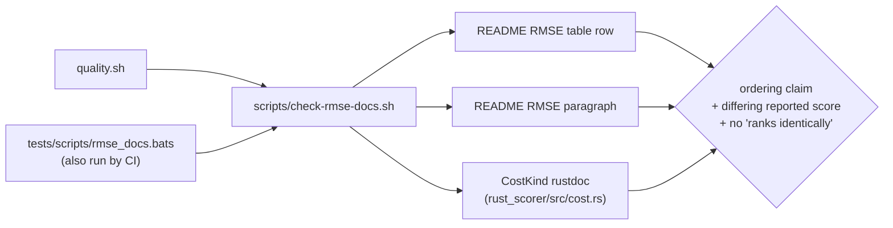

# PR Summary — Issue #556

## Summary

The README cost table described `RMSE` as "ranks identically to MSE, reports
same-unit magnitudes", and the paragraph beneath the table repeated the claim
("therefore ranks creatures identically to `MSE`"). Read plainly, that says
`RMSE` is a redundant alias of `MSE` — which is not what the code does.
Verified against `rust_scorer/src/cost.rs` (`CostKind::finalise_mean`,
`cost.rs:163`): `RMSE` reuses the MSE squared-error sum and applies one
host-side `sqrt` at finalisation. Because `sqrt` is monotonic, creature
*ordering* matches `MSE`; the *reported score* genuinely differs, in the
target's own units — which is exactly why `RMSE` is selectable.

Both surfaces now state those two facts separately, and a new gate keeps the
old wording out. Documentation only: `--cost RMSE` and its computation are
unchanged. Closes #556.

## Evidence

Backend/CLI documentation change — no web interface to screenshot. Evidence is
the new gate plus the full local quality run.

Before (`README.md` line 298 / the paragraph at 312):

```text
| `RMSE` | Root Mean Squared Error (`sqrt(mean(squared error))`) — ranks
identically to MSE, reports same-unit magnitudes | … |

… It therefore ranks creatures identically to `MSE` while reporting
interpretable, same-unit magnitudes …
```

After:

```text
| `RMSE` | Root Mean Squared Error (`sqrt(mean(squared error))`) — same
creature ordering as MSE (`sqrt` is monotonic); only the reported score
differs, in the target's own units | … |

… Because `sqrt` is monotonic over the non-negative mean, `RMSE` gives the
same creature ordering as `MSE` — selection and evolution see the same winners
— but the reported score genuinely differs: it comes back in the target's own
units instead of squared units …
```

The gate follows the repo's existing docs-drift idiom (`check-read-bytes-docs.sh`,
`check-gpu-backend-docs.sh`) and checks three surfaces:



Gate output against the committed tree:

```text
$ ./scripts/check-rmse-docs.sh
OK   README RMSE table row states the ordering claim
OK   README RMSE table row states that only the reported score differs
OK   README RMSE table row states that the score is in the target's units
OK   README RMSE paragraph states the ordering claim
OK   README RMSE paragraph states that only the reported score differs
OK   README RMSE paragraph states that the score is in the target's units
README and CostKind rustdoc describe RMSE as same-ordering, different-magnitude.
```

`./quality.sh < /dev/null` → `✅ All quality checks passed!` (shellcheck,
cargo-deny, `fmt --check`, clippy, build, test, doctests, rustdoc, release
build, and the full `tests/scripts` bats suite).

## Test Plan

New BATS suite `tests/scripts/rmse_docs.bats` (11 tests, all green; test 11
was **red before the README edit** and is the regression test for this issue):

- passes when both the table row and the paragraph carry the ordering and the
  differing-magnitude claims;
- fails on the `ranks identically to MSE` table cell (the exact wording from
  the issue);
- fails on the `ranks creatures identically` paragraph wording;
- fails when the row drops the ordering claim;
- fails when the paragraph drops the differing-magnitude claim;
- fails when the `CostKind` rustdoc revives the identical-ranking claim;
- fails loud on a missing cost section, a missing `RMSE` row, or a missing
  file; rejects unknown arguments with exit 2;
- asserts the **real** repository README satisfies the check.

No Rust behaviour changed, so the existing `cost.rs` unit tests (including
`CostKind::Rmse.finalise_mean(8.0, 2) == 2.0`) and doctests continue to pass
unmodified.

## Security Self-Check

Documentation and a read-only validator script; no new input surface, no
secrets staged, no network or filesystem writes outside the repo tree.
