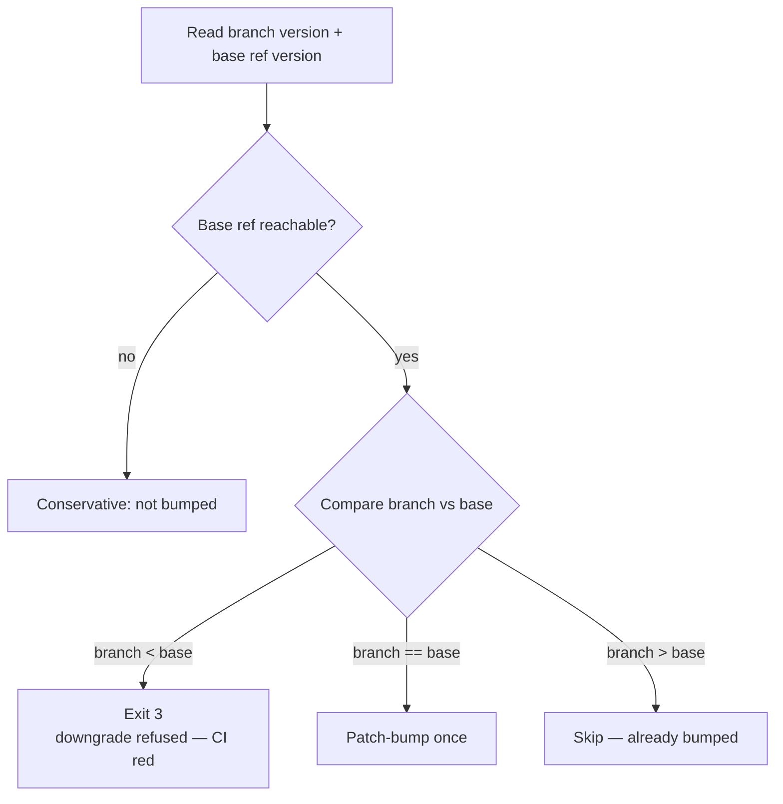

# Refuse `rust_scorer` version downgrades vs the base ref (Issue #567)

## Summary

`scripts/version-increment.sh` treated **any** `current != base` as "already
bumped", so a branch whose `rust_scorer` version was *below* `origin/Develop` —
the shape a badly resolved merge conflict produces — was silently skipped and
shipped a **downgrade** to the downstream consumers that pin and rebuild
`rust_scorer` by version.

The script now compares the two versions instead of merely testing them for
inequality:

- **Behind → fail loud.** Both `--already-bumped` and `--run` exit **3** with
  `Error: version downgrade refused — branch version X is behind base Y …`.
  `--run` writes nothing, so the manifest is left as the author committed it.
- **Equal → auto-patch-bump**, exactly as before.
- **Ahead → accepted**, with no second bump forced.
- Comparison is **numeric per component** (`0.10.0` is ahead of `0.9.9`, which a
  string compare gets wrong), and a pre-release suffix sorts below the bare
  release of the same triple (`0.5.4-rc1` < `0.5.4`), matching semver.
- A version that is not semver `X.Y.Z` exits **2** with a clear message rather
  than being mistaken for a bump.

No workflow YAML change is required, and none is included (the worker holds no
`workflow` OAuth scope — see the CONTRIBUTING [Human
escalation](../../../CONTRIBUTING.md#human-escalation) contract). The existing
wiring already fails CI on a downgrade: the guard job's `--already-bumped` exits
non-zero, so `should_bump=true` and the `bump` job runs `--run`, which exits 3
and fails the job before anything is committed or pushed. That guard → bump
sequence is pinned by a test.

Closes #567.

## Evidence

Backend/CLI change — no web interface to screenshot. Evidence is the BATS suite
(`bats tests/scripts/version_increment.bats`), 20/20 passing, with the six new
downgrade cases failing before the change and passing after:

```text
ok  9 already-bumped? refuses a patch downgrade against the base ref
ok 10 already-bumped? refuses a minor downgrade against the base ref
ok 11 already-bumped? accepts an ahead version (no re-bump forced)
ok 12 already-bumped? compares components numerically, not as strings
ok 13 already-bumped? treats a pre-release of the base version as behind it
ok 14 run refuses a downgrade and leaves the manifest untouched
ok 15 run accepts an ahead version without forcing another bump
ok 16 run still bumps when the branch version equals the base
ok 17 a non-semver branch version fails loud rather than being called a bump
ok 18 the workflow guard/bump sequence fails CI on a downgrade
```

Decision flow now applied by both `--already-bumped` and `--run`:



## Test Plan

Added to `tests/scripts/version_increment.bats` (all exercise the real script
against temporary git repositories, asserting exit codes, messages and manifest
side-effects):

- `already-bumped? refuses a patch downgrade against the base ref` — 0.5.3 vs
  0.5.4 → exit 3, message names both versions.
- `already-bumped? refuses a minor downgrade against the base ref` — 0.4.9 vs
  0.5.4 → exit 3.
- `already-bumped? accepts an ahead version (no re-bump forced)` — 0.6.0 → exit 0.
- `already-bumped? compares components numerically, not as strings` — 0.10.0 vs
  0.5.4 → exit 0 (a lexical compare would call this a downgrade).
- `already-bumped? treats a pre-release of the base version as behind it` —
  0.5.4-rc1 vs 0.5.4 → exit 3.
- `run refuses a downgrade and leaves the manifest untouched` — exit 3 and the
  manifest still reads 0.5.3.
- `run accepts an ahead version without forcing another bump` — skip, 0.10.0
  preserved.
- `run still bumps when the branch version equals the base` — 0.5.4 → 0.5.5.
- `a non-semver branch version fails loud rather than being called a bump` —
  exit 2, "semver" in the message.
- `the workflow guard/bump sequence fails CI on a downgrade` — replays the
  workflow's guard (`--already-bumped`) → bump (`--run`) ordering and asserts
  both steps end non-zero.

Existing tests are unchanged and still pass; the only behavioural change to a
previously documented path is that a *behind* version, which used to be reported
as "already bumped", is now refused.

Docs updated: the no-downgrade rule is documented in the CONTRIBUTING
[Pull request workflow](../../../CONTRIBUTING.md#pull-request-workflow) section,
the script's own `--help` now lists the exit codes, and `CHANGELOG.md` carries
an `[Unreleased]` entry.
