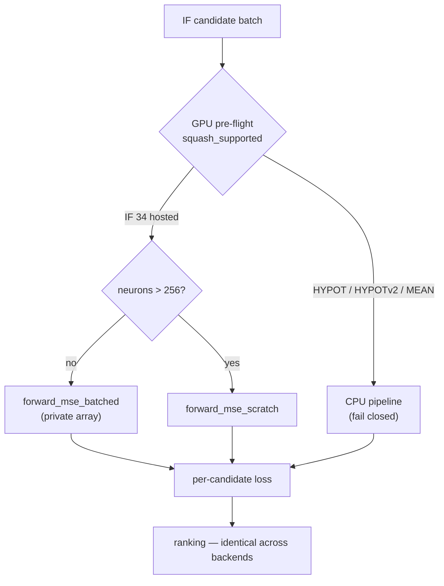

# Lock CPU/GPU scorer parity for IF-heavy decision-tree creatures (Issue #574)

## Summary

`NEAT-AI-Forests` will generate tree-shaped `IF` creatures at scale and trust
this scorer as the final judge, so the branch semantics and GPU routing had to
become a locked contract first. This PR adds the canonical decision-tree
fixtures, the CPU/GPU parity suite that pins them, the synapse-role
upload/decoding assertion, and a tree-heavy batching benchmark. No scoring
behaviour, CLI contract or routing decision changed. Closes #574.

What landed:

- **`rust_scorer/src/if_tree_fixture.rs`** — canonical `IF` decision-tree
  fixtures built through the existing `fixture_json` wire-format emitter: a
  depth-1 stump, nested trees of any depth, a mixed point-wise + `IF` creature,
  a large creature carrying an appended depth-1 `IF` correction graft (plus its
  ungrafted twin), a corpus builder whose targets are an oracle tree's own
  predictions, and a branch-boundary corpus that pins every split **on**, one
  ULP below and one ULP above its threshold. Each fixture is paired with
  `tree_reference_output`, an **independent** evaluator written from the
  decision semantics rather than from the scorer's activation code — the
  emitted synapse order makes it bit-exact against the CPU pipeline.
- **`rust_scorer/tests/if_tree_parity.rs`** — the parity suite (see Test Plan).
- **`build_batched_network_data_preserves_if_tree_synapse_roles`** in
  `rust_scorer/src/gpu/forward_mse_batched.rs` — proves the
  `Condition` / `Negative` / `Positive` roles survive creature JSON →
  `compile_creature` → the `SynapseGpu` buffer **on the right edges** (the
  pre-existing test only proved the `u8 → u32` widening was lossless).
- **`if_tree_batch_bench`** binary — scores a batch of `IF` candidates against
  one generated corpus and reports candidates/second and records/second.
- Documentation: a README "IF decision-tree parity contract" section (with the
  routing diagram below), the bench's README section and `Binaries` entry, an
  `AGENTS.md` contract sentence, a `docs/performance-baseline.md` baseline, and
  a CHANGELOG entry.

### The contract this pins

- An `IF` neuron buckets each weighted input by synapse role and emits
  `positive + bias` only when the condition sum is **strictly** greater than
  zero — so `condition == 0` takes the **negative** branch — identically on the
  CPU pipeline and both GPU kernels.
- An `IF` neuron is never collapsed into an ordinary point-wise squash; an
  aggregate the kernels do not host still fails pre-flight and falls **closed**
  to CPU.
- **Documented tolerance:** CPU activations are asserted bit-exactly (`==` on
  `f32`) against the independent reference; cross-backend per-creature losses
  within `1e-3` relative error (the repository's existing CPU↔GPU tolerance
  from Issues #82/#312); candidate **ordering** must match exactly.

## Evidence

This is a backend/CLI-adjacent change with no web interface, so there is no
screenshot to capture — the evidence is the test suite and the bench output
below.

**Routing the contract covers** (also rendered in the README):



**Test run** (`cargo test --workspace --all-features -- --test-threads=2`):
all suites green — 285 lib unit tests, 32 doctests and every integration suite,
including the 16 new `if_tree_parity` tests and the 2 new bench smoke tests.

**Benchmark** — `if_tree_batch_bench`, aarch64 Linux container, 7 logical CPUs,
7 GiB RAM, release build, **no GPU adapter** (`gpuBackend: cpu-fallback`):

```bash
./target/release/if_tree_batch_bench --candidates 64 --records 200000 --depth 3 --runs 3 --gpu off
```

| Metric | Value |
|---|---|
| candidates | 64 (8 of them large grafted creatures, 288 hidden) |
| records | 200 000 (8 inputs, 1 output) |
| median wall-clock | 622.8 ms (626.1 / 622.8 / 616.5 ms) |
| **candidates/second** | **102.8** |
| **records/second** | **321 146** |
| candidate-record evaluations/second | 20.55 M |

Recorded in `docs/performance-baseline.md`. This is a **new** bench, not a
performance A/B, so there is no before/after pair to compare — nothing was
optimised.

**GPU coverage caveat (acceptance criterion "both kernels covered or the
unsupported path documented").** The container this ran in has no GPU adapter
(`/dev/dri` absent; `resolve_backend(Auto)` reports `cpu-fallback`), so the
cross-backend assertions **skipped here** and printed their skip notes, exactly
as the pre-existing GPU parity suites do on CPU-only CI:

```text
skipping stump: no compatible adapter
skipping nested-tree: no compatible adapter
skipping mixed-neural-if: no compatible adapter
skipping grafted-large: no compatible adapter
skipping boundary: no compatible adapter
skipping candidate-ordering: no compatible adapter
```

Every CPU-side assertion — the bit-exact reference parity, the boundary
semantics, the leaf-constant invariant, the fail-closed routing checks and the
synapse-role upload assertion — ran and passed on this host. The kernel each
GPU fixture must route to is asserted in the test itself
(`KernelKind::Private` for the trees, `KernelKind::Scratch` for the grafted
large creature), so a GPU host running this suite validates both kernels
without any further configuration.

**Local gate.** `./quality.sh` passes every stage it can run here; two stages
are unavailable in this container and are covered by CI:

- `codespell` is not installed and there is no `pip`/`pipx` to install it —
  the CI `spell-check` job runs it.
- `bats` is not installed — the shell-helper suites run in CI. No shell script
  was changed by this PR.

Everything after those stages was run individually and is green: `cargo deny
check` (advisories/bans/licenses/sources ok), `cargo fmt --all`, `cargo clippy
--workspace --all-targets --all-features -D warnings`, `cargo check`, the full
test suite, `RUSTDOCFLAGS=-D warnings cargo doc`, the release build, and
`markdownlint-cli2` over the changed Markdown.

## Test Plan

New — `rust_scorer/tests/if_tree_parity.rs` (16 tests):

CPU semantics (run everywhere):

- `cpu_tree_activation_matches_reference_at_every_depth` — depths 1–3, 512
  records each, activation compared **bit-exactly** with the reference.
- `cpu_tree_prediction_is_always_one_of_the_leaf_constants` — the invariant a
  point-wise reinterpretation of `IF` cannot satisfy.
- `pointwise_reinterpretation_would_change_the_answer` — proves the fixture is
  discriminating (a point-wise reading disagrees on > 200/256 records), so the
  invariant above cannot pass by coincidence.
- `cpu_branch_boundary_at_condition_zero_takes_the_negative_branch` — the
  `condition == 0` rule plus the ULP either side of it.
- `cpu_boundary_corpus_matches_reference_for_a_nested_tree` — the whole
  boundary corpus for a depth-3 tree.
- `cpu_mixed_neural_and_if_creature_still_branches_exactly` — point-wise
  neurons feeding an `IF` condition, both branches exercised.
- `cpu_if_graft_changes_the_large_creature_prediction` — the appended graft is
  live, not inert.

Fail-closed routing:

- `if_tree_directory_is_reported_gpu_compatible`.
- `unsupported_aggregate_fails_closed_to_cpu` — `HYPOT` still returns
  `GpuPrepareError::UnsupportedSquash`.
- `cpu_fallback_directory_scoring_matches_the_reference_losses` — CPU-fallback
  directory scoring reproduces losses computed independently from the reference.

Cross-backend (skip without an adapter):

- `gpu_matches_cpu_for_a_depth_1_stump`, `..._for_a_nested_tree`,
  `..._for_mixed_neural_and_if_neurons` (private kernel).
- `gpu_matches_cpu_for_a_large_creature_with_an_if_graft` (scratch kernel).
- `gpu_matches_cpu_on_branch_boundary_records`.
- `gpu_candidate_ordering_matches_cpu` — 12 candidates × 4096 records through
  the directory path on both backends; per-candidate losses within `1e-3`
  relative and the ranking identical.

New — `rust_scorer/tests/if_tree_batch_bench_smoke.rs` (2 tests): the bench's
JSON contract (`candidatesPerSec` / `recordsPerSec` /
`candidateRecordEvaluationsPerSec`, grafted-candidate count, winning candidate)
and its fail-loud exit on an empty batch.

New — `rust_scorer/src/if_tree_fixture.rs` unit tests (11) and
`build_batched_network_data_preserves_if_tree_synapse_roles` in
`rust_scorer/src/gpu/forward_mse_batched.rs` (1).

No existing test was modified or removed.

## Security self-check

- Input validation: the bench validates `--candidates` / `--records` /
  `--runs` before doing any work and exits non-zero on a zero value; all other
  inputs are `clap`-typed.
- Secrets: none staged; no hidden files touched.
- Injection surface: no new SQL, shell, or HTTP calls. File paths are built
  with `PathBuf::join` under the process's own temp directory.
- Error handling: the bench returns typed `Result` errors and exits non-zero;
  no failure is swallowed and no fixture cleanup failure can mask a bench
  result.
- Dependencies: none added.
