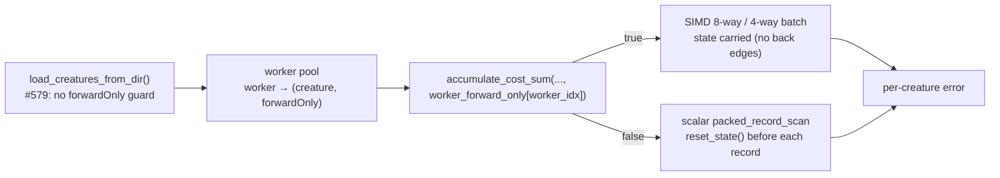

# PR Summary — Issue #579

## Summary

Directory mode now scores `forwardOnly: false` (recurrent) creatures instead of
refusing to load them. Closes #579.

The guard in `load_creatures_from_dir` was a correctness stopgap for a hard-coded
boolean: the per-chunk hot loop passed a literal `true` to
`cost::accumulate_cost_sum`, so without the guard a recurrent creature would have
been scored with network state leaking across records — silently wrong. The flag
is now threaded per worker, and the guard is gone.

- **`rust_scorer/src/multi_score.rs`**
  - Deleted the load-time `forwardOnly=false` rejection.
  - Built `worker_forward_only` alongside the existing `worker_creature_idx`, so
    the `par_iter` closure indexes the owning creature's flag with the
    `worker_idx` it already carries. The empty-chunk cost-dispatch probe now uses
    worker 0's flag rather than a literal `true`.
  - Both result builders (CPU and GPU) report the creature's **own**
    `forwardOnly`, not the batch's former precondition.
  - Module docs gained a "Recurrent creatures" section; the
    `gpu_directory_compatible` doc no longer cites `forwardOnly=false` as a load
    failure.
- **Docs** — README directory-mode bullet, a new
  [Recurrent creatures in directory mode](../../../README.md#recurrent-creatures-in-directory-mode-issue-579)
  section with a Mermaid dispatch diagram, the cost-dispatch note, and a
  `CHANGELOG.md` entry.

Everything downstream was already flag-driven, so nothing else needed to change:

- `cost::accumulate_cost_sum` forwards `forward_only` to
  `neat_core::loss::*_sum_batch_packed` for all eight costs.
- With `forward_only = false` the upstream `packed_record_scan` calls
  `CompiledNetwork::reset_state()` before every record, so records stay
  **independent** — which is what keeps partitioning a chunk across Rayon workers
  valid for a recurrent creature. No restructuring of the worker-split machinery.
- **The GPU path needs no change** (issue item 3, confirmed by reading the code):
  `forward_mse_batched.wgsl` and `forward_mse_scratch.wgsl` zero every non-input
  activation per `(creature, record)` thread, so a GPU thread never carries state
  between records; `gpu_directory_probe_for_dir` and `gpu_directory_compatible`
  classify neuron counts and squashes only, never `forwardOnly`.

**Expected cost:** recurrent creatures lose the upstream 8-way/4-way SIMD batch
kernels (both gated on `forward_only`) and fall to the scalar `packed_record_scan`
— several times slower **for those creatures only**. Forward-only creatures in the
same batch are untouched, and `reset_state()` is O(num_neurons) stores per record.
This is a capability change, not a performance change, so no before/after
benchmark applies.

## Evidence

Backend/CLI change — there is no web interface to screenshot. The evidence is the
test suite plus the dispatch change itself.

Full local gate results:

- `cargo clippy --workspace --all-targets --all-features -- -D warnings …` — clean.
- `cargo check`, `cargo build`, `RUSTDOCFLAGS=-D warnings cargo doc`,
  `cargo build --release` — all clean.
- `cargo test --workspace --all-features -- --test-threads=2` — every suite
  passes (285 unit tests, 32 doc-tests, and every integration suite including the
  three new recurrent tests).
- `markdownlint-cli2` — 0 issues.
- **`./quality.sh` cannot complete in this container**: its codespell preflight
  exits before the Rust steps with `spell-check: codespell is not installed.`, and
  the image has no `pip`/`ensurepip` to install it (`/usr/bin/python3: No module
  named pip`). Every other gate step was run individually, in `quality.sh`'s own
  order, with the results above. The codespell CI job still gates the PR.

Answering the issue's open question 4 ("is there any test proving
`rust_scorer <creatures_dir>` and `rust_scorer <creature.json>` produce identical
errors for the same creature?"): there is now —
`recurrent_directory_tdd::directory_mode_recurrent_score_matches_single_creature_mode`
compares the two paths' `error` and `score` **bit-for-bit**.

## Test Plan

Added — `rust_scorer/tests/recurrent_directory_tdd.rs` (new file; all fixtures use
exact binary fractions so every partial sum is exact in `f64`, making the
comparisons independent of how a chunk is partitioned across workers):

- `directory_mode_scores_forward_only_false` — a directory holding a creature with
  a genuine back edge exits 0, emits JSON, reports `forwardOnly: false`, scores
  every record, and produces the **reset-semantics** error (`0.1171875`, the
  analytic value for `output = 0.5 × input`). A leaked activation gives a
  different number, so this is the regression test for the hard-coded `true`.
- `directory_mode_recurrent_score_matches_single_creature_mode` — directory mode
  and single-creature mode agree bit-for-bit on `error` and `score`.
- `directory_mode_mixes_forward_only_and_recurrent_creatures` — a **mixed** batch:
  the recurrent creature keeps reset semantics, the forward-only creature beside
  it is unaffected, each entry reports its own `forwardOnly`, and both match their
  single-creature runs.

Added — `rust_scorer/tests/cost_parity.rs`:

- `recurrent_chunk_dispatch_matches_per_record_dispatch_for_every_cost` — for all
  eight costs, handing a whole chunk to `accumulate_cost_sum` with
  `forward_only = false` (what directory mode does) is bit-identical to the
  one-record-at-a-time loop the single-creature path runs. Nine records, so the
  fixture crosses the SIMD-batch boundary the forward-only paths use.
- `recurrent_flag_changes_the_chunk_sum_on_a_back_edge` — the flag is load-bearing:
  on a creature with a back edge, skipping the reset changes the sum, and the
  reset value matches the analytic expectation.

Modified — `rust_scorer/tests/directory_mode_tdd.rs`:

- `directory_mode_rejects_forward_only_false` → `directory_mode_accepts_forward_only_false`.
  **This is a deliberate business-logic change**: the old test pinned the exact
  behaviour the issue asks to remove, so it could not be kept as-is. The
  replacement holds the load-time contract (exit 0, real JSON, the creature's own
  flag echoed back) and its doc comment records the swap.

## Out of scope

The issue also lists three items beyond its "Proposed work", left untouched here
and unchanged by this PR:

- **One bad creature aborts the whole batch** — a per-creature `{"error": …}` entry
  is a contract change the TypeScript caller must sign off on first.
- **No CLI early-exit / streaming flag** — `score_from_creature_dir_with_early_exit`
  remains a library-only API.
- **`--gpu auto` declines the GPU for deep ScratchOnly and Mixed pools** — that
  routing is Issue #317/#467 policy backed by fleet benchmarks, and revisiting it
  needs its own before/after evidence.
