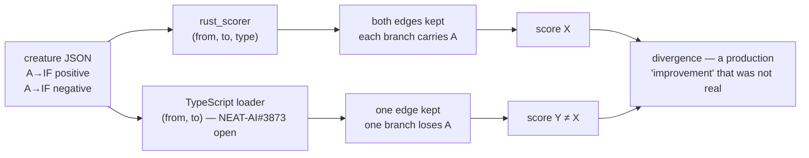

# PR Summary — Issue #581

## Summary

`NEAT-AI-core#577` landed in **neat-core 0.10.6**: synapses are now keyed by the
`(fromUUID, toUUID, type)` **triple**, so one source may feed an `IF` neuron
through more than one role. The contribution that must apply *whichever way the
node branches* no longer needs an `IDENTITY` relay neuron existing purely to be
a second distinct source.

`rust_scorer` is the engine that would **disagree first** if that relaxation
were mishandled — it resolves every synapse independently and sums each role's
bucket, whereas a loader keyed by `(from, to)` alone keeps one edge per ordered
pair and silently drops the rest. That divergence already produced a production
"improvement" that was not real (NEAT-AI-core#556: `rust_scorer` 0.356183
against `Creature.scoreDir` 0.353147). This engine's behaviour is the correct
one — this PR **pins** it rather than assuming it, so the parity guard lands
with the rule change rather than after the first creature that needs it.

No production scorer code changed: nothing in the scoring path keys synapses by
`(from, to)`. Verified by reading the path — `scoring.rs:252`
(`for synapse in &creature.synapses`) and `scoring.rs:316`
(`synapse_count: creature.synapses.len()`). The only `(from, to)` keying in the
repository is a **test-only** regression guard in `shallow_fixture.rs:204`,
whose targets are point-wise squashes where the pair rule still holds; its
comment is corrected rather than its assertion.

Closes #581.

### What changed

| Change | File |
|---|---|
| Fixtures for the relaxed shape, the relay workaround, the dropped-edge creature and the two still-refused shapes | `rust_scorer/src/dual_role_fixture.rs` (new) |
| Cross-engine parity suite | `rust_scorer/tests/dual_role_parity.rs` (new) |
| `constant_neuron_json` — a constant without the `"squash"` key TypeScript refuses | `rust_scorer/src/fixture_json.rs` |
| Fixture comments no longer state the `(from, to)` rule as fact | `rust_scorer/src/if_tree_fixture.rs`, `rust_scorer/src/shallow_fixture.rs` |
| New contract section | `README.md` |
| 0.10.6 recorded as widening, not breaking | `neat-core.expected-version` |

### Deliberately out of scope

The TypeScript half (`NEAT-AI#3873`) is still **open** — `Creature.ts:809` still
asserts `"Connection already exists"` on the pair alone — so the live
`Creature.scoreDir` leg of the comparison cannot run yet, and there is no
TypeScript toolchain in this repository to run it from. The fixtures are `pub`
so `NEAT-AI-Forests`' `ts_parity.rs` harness can score the *same* creatures the
moment it lands; nothing in this PR waits on that. `if_tree_fixture.rs`
therefore keeps its three separate bias-1 constants — now documented as a
deliberate both-engines choice, not a requirement of this engine.

## Evidence

Backend/CLI change with no web interface, so no screenshot applies. The evidence
is the test suite plus the quality gate.

### The divergence being pinned



### The two forms the suite proves equivalent

```text
  relay-free (post-#577)              relay workaround (pre-#577)

  input-c ──cond──▶                   input-c ──cond──▶
  const-1 ──cond──▶                   const-1 ──cond──▶
  const-1 ──pos───▶  IF               const-1-pos ──pos───▶  IF
  const-1 ──neg───▶ node              const-1-neg ──neg───▶ node
  input-s ──pos───▶                   relay-pos ──pos───▶
  input-s ──neg───▶                   relay-neg ──neg───▶
                                        ▲ ▲
                                   input-s ┘ └ input-s
```

### Test output

```text
$ cargo test -p rust_scorer --test dual_role_parity
running 10 tests
test every_declared_synapse_survives_the_load ... ok
test cpu_activation_matches_the_independent_reference ... ok
test the_condition_zero_boundary_keeps_the_shared_negative_edge ... ok
test dropping_the_shared_negative_edge_changes_the_prediction ... ok
test the_fixture_actually_repeats_an_ordered_pair ... ok
test the_relay_free_and_relay_forms_activate_identically ... ok
test directory_scoring_agrees_between_the_forms_and_separates_the_dropped_one ... ok
test gpu_matches_cpu_for_the_dual_role_creature ... ok
test gpu_matches_cpu_for_the_relay_equivalent_creature ... ok
test gpu_matches_cpu_on_the_dual_role_boundary_records ... ok

test result: ok. 10 passed; 0 failed
```

The three GPU bodies **skipped** on this CPU-only container (no adapter), the
same way every other GPU parity suite in the repository skips; the CPU
assertions ran and gate the change everywhere.

Full workspace suite: **0 failures** across all binaries plus 32 doctests.

### Quality gate

`./quality.sh < /dev/null` passes every stage **except** `codespell`, which is
**not installed in this container** and cannot be installed (`pip`, `pipx` and
`python3 -m ensurepip` are all absent — `/usr/bin/python3: No module named
ensurepip`). Every other stage was run to completion:

- shellcheck, workflow/doc validators, `check-neat-core-version.sh`,
  `check-docs-cross-references.sh` (28/28 anchors resolve) — pass
- `cargo deny check` — `advisories ok, bans ok, licenses ok, sources ok`
- `cargo fmt --all`, `cargo clippy --workspace --all-targets --all-features -D warnings` — clean
- `cargo check`, `cargo build`, `cargo test --workspace --all-features` — clean
- `RUSTDOCFLAGS="-D warnings" cargo doc --workspace --no-deps` — clean
- `cargo build --workspace --release` — clean
- `npx markdownlint-cli2` over all 186 Markdown files — `0 issues`

CI's `spell-check` job covers the one stage that could not run locally.

## Test Plan

New suite `rust_scorer/tests/dual_role_parity.rs` (10 tests):

| Test | What it pins |
|---|---|
| `every_declared_synapse_survives_the_load` | Synapse count identical in raw JSON, parsed export and compiled network, for both forms — the Rust-side `jsonSynapses === loadedSynapses` assertion |
| `the_fixture_actually_repeats_an_ordered_pair` | The fixture really does repeat a `(from, to)` pair, so the test above is not vacuous |
| `cpu_activation_matches_the_independent_reference` | Bit-exact against a reference evaluator written from the decision semantics, 512 records |
| `the_relay_free_and_relay_forms_activate_identically` | Dropping the `IDENTITY` relay moves no number, 512 records |
| `the_condition_zero_boundary_keeps_the_shared_negative_edge` | `condition == 0` takes the negative branch (Issue #574's contract) *and* the shared source's negative edge still applies there — the edge a `(from, to)` loader drops |
| `dropping_the_shared_negative_edge_changes_the_prediction` | The dropped-edge creature disagrees on > 100/512 records, so the divergence is detectable |
| `directory_scoring_agrees_between_the_forms_and_separates_the_dropped_one` | End-to-end through `score_from_creature_dir`: relaxed == relayed, relaxed != dropped, non-zero loss on all three |
| `gpu_matches_cpu_for_the_dual_role_creature` | Private kernel agrees within `1e-3` relative — the kernels bucket by role too |
| `gpu_matches_cpu_for_the_relay_equivalent_creature` | The shape production carries today keeps scoring the same on GPU |
| `gpu_matches_cpu_on_the_dual_role_boundary_records` | Branch-boundary records do not disagree across backends |

Unit tests in `rust_scorer/src/dual_role_fixture.rs` (10 tests) cover the fixture
builders themselves, including the two shapes the relaxed rule must **still**
refuse: a repeated pair into a point-wise target (`TypedDuplicateSynapse`) and an
exact repeated `(from, to, type)` triple (`DuplicateSynapse`).

Unit tests in `rust_scorer/src/fixture_json.rs` (2 tests) cover
`constant_neuron_json`: the `"squash"` key is absent, and a squashless constant
still compiles and activates correctly.

No existing test was removed, disabled or weakened.
