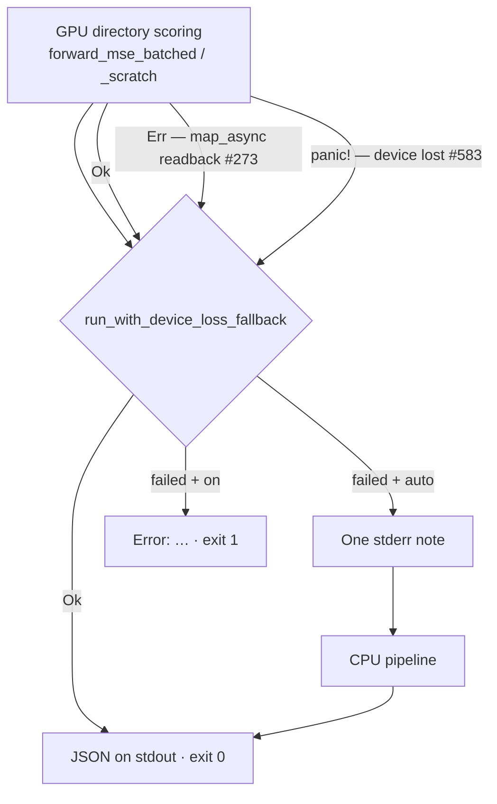

# Device loss falls back to CPU instead of exiting 101 (Issue #583)

## Summary

`wgpu` reports a lost device **fatally** — `Device::poll` calls
`handle_error_fatal`, which `panic!`s — so no `Result` the GPU runner returned
could ever report it. On a headless Linux host (no session, no
`XDG_RUNTIME_DIR`) the panic exited **101**, the NEAT-AI batch bridge turned
that into a `ScorerStrictError`, and a 1075-second evolve stage died with no
result. A lost device is an environmental event, not a bad creature, so it now
lands exactly where an absent adapter already lands.

New `rust_scorer/src/gpu/device_loss.rs` catches the unwind at the run boundary
and classifies it:

| Mode   | Device lost mid-run                                                                                     |
|--------|---------------------------------------------------------------------------------------------------------|
| `auto` | One stderr note, then the CPU pipeline finishes the batch — valid JSON, `gpuBackend: "cpu-fallback"`, **exit 0** |
| `on`   | `Error: the GPU device was lost mid-run (…)` and **exit 1** — a diagnostic, never a panic                 |
| `off`  | Never touches `wgpu`; unaffected                                                                          |

Alongside the guard, `BatchedRunner::score_chunk` no longer discards the
`Device::poll` result: a poll timeout previously let the readback map a buffer
of undefined contents and report it as a score.

Closes #583.

## Evidence

Backend/CLI change — no web interface to screenshot. The evidence is the test
suite plus the gate output below.

### What the run boundary now does



The `auto` note is one grep-able line, with the multi-line `wgpu` cause
flattened onto it:

```text
[gpu] auto fallback to CPU directory mode: the GPU device was lost mid-run (Error in Device::poll: Validation Error Caused by: Parent device is lost) — an environmental fault, not a scoring failure; scoring continues on the CPU pipeline
```

The default panic dump is suppressed **only** for a device-loss panic raised
inside the guard (the payload is returned to the caller and logged there);
every other panic keeps the default hook, so a genuine bug is never silenced.

### Acceptance criteria

| # | Acceptance | Where it is verified |
|---|------------|----------------------|
| 1 | Device loss during `Device::poll` — and anywhere else a `wgpu` call can report it — is caught, not panicked on | `catch_gpu_panic` wraps the whole GPU directory run and both `select_adapter` calls (`cli.rs`); `device_loss::tests::catches_a_device_lost_panic_as_a_typed_failure` |
| 2 | Under `auto` a lost device degrades to CPU with valid JSON and exit 0; under `on` it fails with a diagnostic, not a panic | `gpu_device_loss_fallback::auto_device_loss_returns_a_cpu_scored_result`, `…::on_reports_device_loss_as_a_diagnostic_not_a_panic` |
| 3 | The fallback is logged once, clearly | `device_loss::tests::fallback_note_is_one_line_naming_the_cpu_pipeline`, `gpu_device_loss_fallback::device_loss_note_is_one_grepable_line` |
| 4 | A test exercises the lost-device path and asserts a CPU-scored result | `gpu_device_loss_fallback.rs` — the GPU closure panics with the exact `wgpu` 29.0.4 payload; the result is compared against a direct CPU run over the same on-disk corpus and serialised to JSON |

The panic can only be raised for real by an adapter that really fails, so the
tests stub the device loss with the exact payload from the stage-failure dump
quoted in the issue and assert on what the run boundary does with it. `cli::main`
maps the resulting `Ok` to a `println!` of the JSON and exit 0; the
`cpu_directory_destination_exits_zero_with_valid_json` test pins that
destination end-to-end through the real binary.

### Test output

```text
$ cargo test --test gpu_device_loss_fallback
running 6 tests
test device_loss_note_is_one_grepable_line ... ok
test on_reports_device_loss_as_a_diagnostic_not_a_panic ... ok
test returned_readback_errors_keep_their_pre_583_behaviour ... ok
test auto_survives_a_non_device_loss_gpu_abort ... ok
test auto_device_loss_returns_a_cpu_scored_result ... ok
test cpu_directory_destination_exits_zero_with_valid_json ... ok
test result: ok. 6 passed; 0 failed
```

`./quality.sh` — shellcheck, all `scripts/check-*.sh` gates, bats, codespell,
`cargo deny`, `fmt --check`, clippy `-D warnings`, `cargo check`, `cargo build`,
`cargo doc` with `RUSTDOCFLAGS=-D warnings` and the release build all pass.

**One pre-existing failure remains, unrelated to this change:**
`tests/dual_role_parity.rs::directory_scoring_agrees_between_the_forms_and_separates_the_dropped_one`
asserts bit-exact score equality between the relay-free creature and its relay
workaround and fails by 2 ULP on x86-64 (`1.3229378675896557` vs
`1.3229378675896573`). It reproduces on a clean checkout of `Develop` with no
working-tree changes, and is unaffected by `NEAT_SCORER_FILE_THREADS`. Filed as
stSoftwareAU/NEAT-AI-scorer#585.

## Test Plan

Added:

- `rust_scorer/tests/gpu_device_loss_fallback.rs` — six integration tests: a
  stubbed device loss under `auto` returns a CPU-scored result equal to a direct
  CPU run (and serialises to valid JSON with `gpuBackend: "cpu-fallback"`); the
  note is one grep-able line carrying the `wgpu` cause; `--gpu on` returns a
  diagnostic rather than unwinding; the Issue #273 returned-readback-error path
  keeps its behaviour under both modes; a non-device-loss GPU abort still leaves
  `auto` with a result but is classified separately; and the CPU destination
  exits 0 with valid JSON through the real binary.
- `rust_scorer/src/gpu/device_loss.rs` unit tests — classification of the real
  `wgpu` wording and of unrelated failures, payload flattening, `String` /
  `&str` / non-string unwind payloads, the `Display` text, and the four
  mode × outcome combinations of `run_with_device_loss_fallback`.
- `forward_mse_batched::tests::poll_wait_result_{ok_on_completed_poll,err_on_poll_failure}`
  — the previously-discarded `Device::poll` result now becomes a recoverable
  `Err`.

Unchanged and still passing: the full workspace suite (`cargo test --workspace
--all-features`), including `directory_mode_tdd`, `gpu_preflight_tdd` and the
GPU parity suites (which skip cleanly with no adapter).
