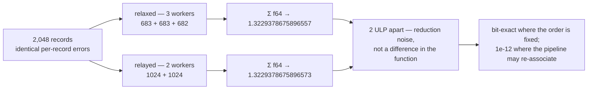

# Bound the dual-role parity score comparison to the reduction it can hold (Issue #585)

## Summary

`tests/dual_role_parity.rs::directory_scoring_agrees_between_the_forms_and_separates_the_dropped_one`
asserted **bit-exact** equality between the relay-free creature's
directory-pipeline score and its relay workaround's, and failed by 2 ULP
(`1.3229378675896557` vs `1.3229378675896573`). Closes #585.

The reported cause — x86-64, or the relay's extra `IDENTITY` neuron changing the
association order of the creature's own arithmetic — is not the cause. Directory
scoring folds each creature's chunk from **as many `f64` partial sums as that
creature was allotted workers**, and `multi_score::workers_per_creature_split`
allots a *ragged* count when `activation_threads` is not a multiple of the
population (3 creatures on 8 threads → `[3, 3, 2]`, Issue #537). The three
fixtures sort as `dropped`, `relaxed`, `relayed`, so `relaxed` reduces
`683 + 683 + 682` records while `relayed` reduces `1024 + 1024` — the same
per-record errors, a different association order, the last bits of an `f64` sum
apart. Nothing architecture-specific: the reported failure reproduces
bit-for-bit on this **aarch64** host under `NEAT_SCORER_ACTIVATION_THREADS=8`,
and disappears at `6`, `7` or `12`.

Encoding the contract (the issue's option 2 — a stated tolerance where the
requirement is not genuinely testable, bit-exactness where it is):

| Comparison | Bound |
|---|---|
| CPU activation vs the independent reference | bit-exact (unchanged) |
| relay-free vs relay activation, per record | bit-exact (unchanged) |
| relay-free vs relay whole-corpus loss, one partition | bit-exact (**new test**) |
| relay-free vs relay **directory-pipeline** score | `1e-12` relative (**was `==`**) |
| CPU vs GPU per-creature loss | `1e-3` relative (unchanged) |

Option 1 (forcing the two forms to reduce in an identical order) was rejected:
it would require every creature in a directory to receive the same worker count,
idling up to `n_creatures - 1` threads whenever the population is smaller than
the thread budget — a throughput regression to buy a property the new bit-exact
test already pins where it is real. No production scoring code changed.

## Evidence

Backend/CLI change with no web interface, so no screenshot: the evidence is the
reproduction and the gate.

**Reproduced, then fixed** — `directory_scoring_agrees_…` swept across activation
thread counts, before and after:

| `NEAT_SCORER_ACTIVATION_THREADS` | worker allotment | before | after |
|---|---|---|---|
| 3, 6, 12 | `[1,1,1]` / `[2,2,2]` / `[4,4,4]` | pass | pass |
| 5 | `[2,2,1]` | **FAIL** (`…6573` vs `…6493`) | pass |
| 7 | `[3,2,2]` | pass | pass |
| 8 | `[3,3,2]` | **FAIL** (`…6557` vs `…6573` — the issue's exact values) | pass |

Measured relative differences at the two failing counts:

```text
threads=5: parity_drift=6.04e-15  dropped_gap=9.01e-3
threads=8: parity_drift=1.17e-15  dropped_gap=9.01e-3
```

The `1e-12` bound sits ~165× above the worst drift and ~2× above the
`n_records × f64::EPSILON` ≈ `4.5e-13` re-association bound for this
2,048-record corpus, while a dropped branch edge — the divergence the guard
exists to catch — stays `9.0e-3` away, ten orders of magnitude clear.



**Quality gate.** `./quality.sh < /dev/null` runs clean up to the `codespell`
preflight, which cannot run on this container — `codespell` is not installed and
the image has no `pip`/`ensurepip` (`/usr/bin/python3: No module named pip`).
Every remaining step was then run individually and passed: `cargo fmt --all`,
`cargo clippy --workspace --all-targets --all-features -D warnings`,
`cargo check`, `cargo build --workspace`,
`cargo test --workspace --all-features -- --test-threads=2` (0 failures),
`RUSTDOCFLAGS=-D warnings cargo doc --workspace --no-deps`,
`cargo build --workspace --release`, plus `markdownlint-cli2` (0 issues in 188
files). CI runs the spell-check job for real.

## Test Plan

Added:

- `rust_scorer/tests/dual_role_parity.rs::the_whole_corpus_loss_is_bit_identical_between_the_forms`
  — reduces all 2,048 records through one `mse_sum_batch_packed` call per form
  and asserts the relay-free and relay losses are equal **to the bit**, with the
  dropped-edge creature differing. This is where "the relay changes nothing" is
  genuinely testable, and it is the assertion that would fail if the relaxed
  shape were ever mis-scored.
- `rust_scorer/src/multi_score.rs::tests::a_ragged_worker_allotment_partitions_the_same_chunk_differently`
  — calls `workers_per_creature_split(3, 8, 1, usize::MAX)` and
  `partition_packed_record_ranges` and asserts the same chunk is split into a
  different number of sub-ranges, each still tiling the whole buffer. Pins the
  mechanism as a fact about the partition rather than an observation about one
  host.

Modified (documented behaviour change):

- `directory_scoring_agrees_between_the_forms_and_separates_the_dropped_one` —
  the relaxed-vs-relayed comparison is now `relative_difference ≤ 1e-12`
  (`CPU_PIPELINE_REL_TOLERANCE`) instead of `==`, and the dropped-creature
  comparison is strengthened from `assert_ne!` to "differs by more than `1e6 ×`
  the tolerance", so loosening one end cannot quietly weaken the other. No test
  was removed or commented out.

Docs updated to state the same contract: the README
"Synapses are keyed by `(from, to, type)`" section (bound table, mechanism,
Mermaid diagram), the `dual_role_fixture.rs` module and
`relay_equivalent_if_creature_json` doc comments (which claimed the score
equality was "bit-exact and not a tolerance"), the `dual_role_parity.rs` module
"Documented tolerance" paragraph, and the CHANGELOG (new `Fixed` entry; the
Issue #581 `Added` entry's "score identically" wording corrected).
