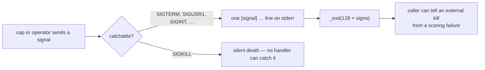

# External termination names itself instead of dying silently (Issue #591)

## Summary

The log attached to the issue records a production sampler run that hit its
3-hour per-task wall-clock cap while `rust_scorer` was mid-batch. The fleet
supervisor signalled the process group, the scorer died on the **default**
disposition of `SIGUSR1`, and everything the NEAT-AI batch bridge could report
was an exit code plus an unrelated GPU note:

```text
2026-09-03T08:16:35.295Z [ERROR] [scorer-strict] no-named-creature reason=EXEC_FAILURE exitCode=158 — not recoverable, failing the run as before
error: Uncaught (in promise) ScorerStrictError: Rust scorer batch call failed (exit 158) for 20 creature(s) in …
--- rust_scorer stderr ---
[gpu] auto fallback to CPU directory mode: deep scratch-kernel creatures are faster on CPU …
```

`158` is `128 + 30`, macOS `SIGUSR1` — the cap kill. Nothing in the scorer's own
output said so, so an environmental event was indistinguishable from a scoring
defect. Every other abnormal end already names itself (device loss #583,
serialisation #201, racing-protocol faults #308); external termination was the
one silent exit.

New `rust_scorer/src/signal_exit.rs` arms a handler for every catchable
termination signal (`SIGHUP`, `SIGINT`, `SIGQUIT`, `SIGTERM`, `SIGUSR1`,
`SIGUSR2`) at the top of `cli::main`, before any work starts. It writes one
grep-able line to stderr and exits `128 + signo` — the same status the caller
already observed, now with a reason attached:

```text
[signal] rust_scorer terminated by SIGUSR1 (signal 30) — external termination, not a scoring failure; no result JSON was produced; exiting 158
```

The handler runs in signal context, so it is async-signal-safe: no allocation,
no locks, only `write(2)` and `_exit(2)`. Skipping the stdout flush is
deliberate — a half-written result map is worse than none. `SIGKILL` stays
silent because no process can catch it, and a handler that fails to install is
reported on stderr rather than swallowed.

Closes #591.

## Evidence

Backend/CLI change — no web interface to screenshot. The evidence is the
command output below plus the test suite.

### Before and after, on a real signalled process

The scorer was parked mid-sweep under `--race-stdio` and sent `SIGUSR1`
(Linux, so `SIGUSR1` is 10 and the status is 138; on macOS it is 30 → 158, the
number in the issue log):

```text
# before this change
exit=138
--- stderr ---
                       ← nothing at all

# after this change
exit=138
--- stderr ---
[signal] rust_scorer terminated by SIGUSR1 (signal 10) — external termination, not a scoring failure; no result JSON was produced; exiting 138
```

### What a signal now does



### Gate

`./quality.sh` passes end to end (shellcheck, doc/citation/private-repo gates,
codespell, cargo-deny, `fmt --check`, clippy, check, build, `cargo test
--workspace --all-features`, rustdoc with `-D warnings`, release build):

```text
✅ All quality checks passed!
```

## Reproduction

- **symptom** — a cap kill mid-batch left `rust_scorer` dead with exit 158 and
  an empty stderr, so the NEAT-AI bridge classified an external termination as
  `EXEC_FAILURE` / `no-named-creature`
- **status** — `verified` — `rust_scorer/tests/signal_termination.rs` was run
  against the unfixed binary and failed (`stderr` empty, `status.code()` =
  `None`), and passes after the fix
- **regression test** —
  `rust_scorer/tests/signal_termination.rs::sigusr1_mid_sweep_names_itself_on_stderr`

## Test Plan

New unit tests in `rust_scorer/src/signal_exit.rs`:

- `exit_code_follows_the_128_plus_signo_convention` — pins the `158` the issue
  log shows for macOS `SIGUSR1`
- `handled_signals_map_to_their_names` / `unhandled_signals_have_no_name`
- `diagnostic_names_the_signal_the_cause_and_the_exit_code` — exact line
- `diagnostic_is_one_line` — one trailing newline, so the note stays grep-able
- `every_handled_signal_fits_the_buffer` — the stack buffer cannot truncate a
  handled signal's line
- `a_short_buffer_truncates_instead_of_panicking` — a handler must never unwind
- `unknown_signal_numbers_still_render`

New integration tests in `rust_scorer/tests/signal_termination.rs` — these drive
the compiled binary, park it mid-sweep with `--race-stdio` (the racing protocol
blocks on a verdict, so no sleeps and no flakiness) and deliver a real signal:

- `sigusr1_mid_sweep_names_itself_on_stderr`
- `sigusr1_mid_sweep_exits_128_plus_signo`
- `sigterm_mid_sweep_names_itself_on_stderr`
- `signalled_run_prints_no_partial_result_json` — a killed sweep must not emit a
  truncated result map

Documentation: README gains
[External termination names itself (Issue #591)](../../../README.md#external-termination-names-itself-issue-591);
`AGENTS.md` cites it alongside the #583 device-loss note.
