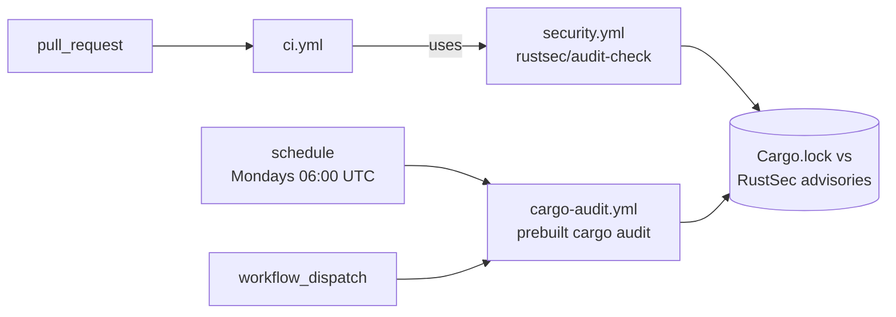

# PR Summary — Issue #603

## Summary

Every pull request ran `cargo audit` twice. `.github/workflows/cargo-audit.yml`
triggered on `pull_request` and audited `Cargo.lock` directly, while `ci.yml`
fired on the same event and called the reusable `security.yml`, whose
`rustsec/audit-check` step wraps `cargo audit` over the identical lockfile and
the identical RustSec advisory database. Two runs that can only ever agree, for
double the runner minutes and double the log noise.

This PR applies the issue's primary suggestion and then guards it:

- **`.github/workflows/cargo-audit.yml`** drops its `pull_request` trigger,
  keeping `schedule` (Mondays 06:00 UTC) and `workflow_dispatch`. The cron is
  the standalone workflow's non-redundant value — it catches advisories
  published *after* the last merge, when the lockfile has not changed but the
  advisory database has. PR-time auditing now has one owner: `ci.yml` →
  `security.yml`.
- **`scripts/check-cargo-audit-workflow.sh`** enforces the invariant so the
  duplication cannot silently return. It walks `.github/workflows`, starting
  from every workflow with a `pull_request` trigger and following local
  `uses: ./.github/workflows/<file>` calls to a fixed point, then counts the
  workflows in that reachable set that actually invoke an audit. Exactly one is
  `OK`; **two or more is a `FAIL`** (the duplication this issue is about) and
  **zero is also a `FAIL`** (losing PR-time coverage is a real security
  regression, so this cannot be "fixed" by deleting both audits). This mirrors
  `check-shellcheck-dedup.sh`, which has held the same one-home invariant for
  ShellCheck since Issue #157.
- Two supporting rule changes let the validator pass on the fixed tree rather
  than swapping one failure for another: the `pull_request` trigger is no
  longer *required* of the standalone workflow, and the `milestone/*`
  branch-filter rule (Issue #391) now applies only when a `pull_request`
  trigger is present — a schedule-only workflow has no filter to check.
- Documentation that named `cargo-audit.yml` as the every-PR auditor
  (`README.md`, `bump-deps.sh`'s header, its `run_audit` skip warning, and the
  `bump_deps.bats` header comment) now names `ci.yml` → `security.yml`.

Prose in a comment never counts as an invocation — both detectors anchor to the
`uses:`/`run:` step keyword, which matters because `security.yml` discusses
`cargo audit` in several comments. A reusable workflow that no `pull_request`
caller reaches is likewise not PR-time.

Closes #603.

## Evidence

Backend/CI change with no web interface, so no screenshot applies. The evidence
is the validator's own verdict before and after the workflow edit, plus the
BATS suite.

**Before** — the validator run against the pre-fix `cargo-audit.yml` alongside
the real workflows directory (paths shortened):

```text
FAIL <workflows>/cargo-audit.yml: PR-time cargo audit duplicated across 2
workflows — they read the same Cargo.lock against the same advisory database
on the same pull_request event, so the second run can only repeat the first
verdict at double the runner minutes (Issue #603):
<workflows>/cargo-audit.yml <workflows>/security.yml. ...
exit=1
```

**After** — `./scripts/check-cargo-audit-workflow.sh` on the committed tree:

```text
OK   .../cargo-audit.yml: triggers on schedule (cron)
OK   .../cargo-audit.yml: permissions block grants only contents: read
OK   .../cargo-audit.yml: actions/checkout pinned to a numeric major or 40-char SHA
OK   .../cargo-audit.yml: dtolnay/rust-toolchain present
OK   .../cargo-audit.yml: cargo audit invoked directly
OK   .../cargo-audit.yml: no pull_request trigger — schedule/dispatch only, PR-time auditing lives elsewhere (Issue #603)
OK   .../cargo-audit.yml: exactly one PR-time cargo audit across .github/workflows: .../security.yml
exit=0
```

`./quality.sh` passes end to end on the final tree (`✅ All quality checks
passed!`), which includes this validator, ShellCheck, the BATS suite,
cargo-deny, clippy, rustdoc and the release build.

Advisory coverage after the change — the two homes no longer overlap:



## Notes for the reviewer

- **Why the standalone trigger went, and not `security.yml`'s step.** The issue
  accepts either resolution and the new guard accepts either too. Dropping the
  standalone `pull_request` trigger is the smaller edit: `rustsec/audit-check`
  annotates the PR check run, and stripping it would leave `security.yml` with
  only the dependency-review step its sole caller already opts out of. The
  standalone workflow's faster prebuilt install (Issue #208) still serves the
  weekly cron.
- **This re-lands work reverted by a milestone roll-back.** PR #607 was reverted
  on `milestone/scan-20260907` by commit `2015ccd` (Issue #1730). That PR could
  only add the guard — it reported the duplication as a non-blocking `WARN` and
  escalated the YAML edit to a human, because the worker was believed to lack
  the `workflow` OAuth scope. That scope is evidently available now (Issue #630
  landed workflow YAML through this same worker, and the branch for this PR
  pushed the `cargo-audit.yml` change without complaint), so this run makes the
  actual edit and the guard hard-fails on a duplicate instead of warning.

## Test Plan

`tests/scripts/cargo_audit_workflow.bats` — 17 tests, all green. New and
changed cases:

- `passes without a pull_request trigger once another workflow owns the PR
  audit (Issue #603)` — the fixed end state: schedule-only standalone workflow
  plus a `ci.yml` → `security.yml` pair, exit 0, and the milestone branch-filter
  rule is not evaluated.
- `fails when a second PR-reachable workflow audits the same lockfile
  (Issue #603)` — the pre-fix shape, exit non-zero, naming both workflows.
- `fails when no workflow provides a PR-time cargo audit (Issue #603)` — the
  degenerate "delete both audits" resolution is rejected.
- `prose mentioning cargo audit does not count as a PR-time invocation
  (Issue #603)` — a `pull_request` workflow that only *mentions* `cargo audit`
  in a comment does not inflate the count.
- `a reusable workflow no caller reaches on pull_request is not PR-time
  (Issue #603)` — an auditing `workflow_call`-only file with no PR caller is
  excluded.
- `reports an error when the workflows directory does not exist` — the new
  `--workflows DIR` flag has the same not-found guard as `--workflow`.
- The canonical fixture is now the schedule-only shape, and the existing
  milestone branch-filter test drives a `pull_request`-triggered fixture so
  that rule is still exercised.

Also run: `tests/scripts/bump_deps.bats` (comment/message wording change) and
`tests/scripts/prebuilt_tool_install.bats` (cargo-audit.yml is still a
canonical prebuilt-install pair) — both green, then the full `./quality.sh`.
