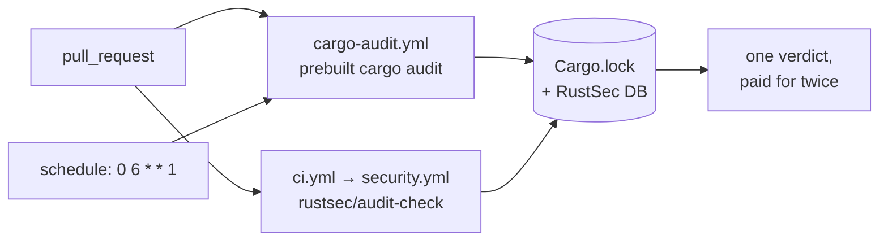
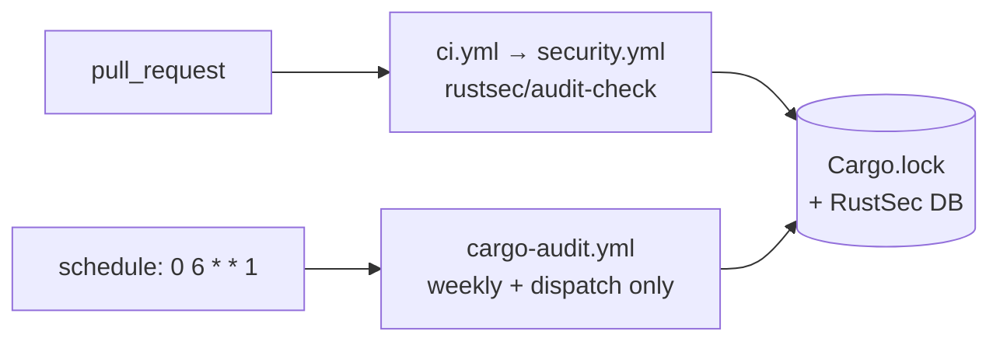

# PR Summary — Issue #603

## Summary

`cargo-audit.yml`'s `pull_request` trigger and `security.yml`'s
`rustsec/audit-check` step (reached from `ci.yml`) read the identical
`Cargo.lock` against the identical RustSec advisory database on the identical
`pull_request` event, so every PR into `Develop`/`milestone/**` pays for two
audits that can only ever agree.

`scripts/check-cargo-audit-workflow.sh` now enforces the dedup invariant that
`check-shellcheck-dedup.sh` enforces for ShellCheck (Issue #157): **exactly one
workflow may run a `cargo audit` on a pull request**, counting an audit reached
indirectly — the validator follows local `uses: ./.github/workflows/…` calls to
a fixed point, so `security.yml`'s audit is attributed to the `pull_request`
event that `ci.yml` brings it. A duplicate is a loud `WARN` naming both files;
losing PR-time coverage altogether is a hard `FAIL`.

Two supporting rule changes make the validator pass cleanly *after* the fix
rather than swapping one failure for another: the `pull_request` trigger is no
longer required (the weekly cron is the standalone workflow's non-redundant
value), and the `milestone/*` branch-filter rule (Issue #391) now applies only
when a `pull_request` trigger is present.

The `.github/workflows/` edit itself is **not** in this PR: the automation
worker's credentials carry no `workflow` OAuth scope, so per
[CONTRIBUTING → Human escalation](../../../CONTRIBUTING.md#human-escalation) the
issue is labelled `needs-human` with a comment spelling out the exact edit. The
`WARN` stays visible on every gate run until a maintainer lands it — the
deficiency never disappears into a silent pass.

Closes #603.

## Evidence

Backend/CI tooling change — no web interface to screenshot. Evidence is the
validator's own output against the real repository, which detects the
duplication through the reusable-workflow hop:

```text
$ ./scripts/check-cargo-audit-workflow.sh
OK   .github/workflows/cargo-audit.yml: triggers on schedule (cron)
OK   .github/workflows/cargo-audit.yml: permissions block grants only contents: read
OK   .github/workflows/cargo-audit.yml: actions/checkout pinned to a numeric major or 40-char SHA
OK   .github/workflows/cargo-audit.yml: dtolnay/rust-toolchain present
OK   .github/workflows/cargo-audit.yml: cargo audit invoked directly
OK   .github/workflows/cargo-audit.yml: triggers on pull_request
OK   .github/workflows/cargo-audit.yml: pull_request branch filter covers milestone/* branches
WARN .github/workflows/cargo-audit.yml: PR-time cargo audit duplicated across 2
     workflows — both read the same Cargo.lock against the same advisory database
     on the same pull_request event, so the second run can only repeat the first
     verdict at double the runner minutes (Issue #603):
     .github/workflows/cargo-audit.yml .github/workflows/security.yml. Drop the
     standalone workflow's pull_request trigger (keeping its weekly cron) or the
     reusable workflow's audit step — the edit is under .github/workflows/ and
     needs a maintainer (CONTRIBUTING "Human escalation")
exit=0
```

Today's duplicated graph, and the shape the maintainer edit leaves behind:





### The maintainer edit this PR cannot make

Delete lines 27–28 of `.github/workflows/cargo-audit.yml`, leaving `schedule:`
and `workflow_dispatch:`, and trim the now-stale `pull_request` bullet from the
header comment (lines 13–18):

```yaml
  pull_request:
    branches: ["*", "milestone/**"]
```

After that edit the validator reports
`OK … exactly one PR-time cargo audit across .github/workflows:
.github/workflows/security.yml` with no `WARN`, and the end state is already
covered by `cargo_audit_workflow.bats::passes without a pull_request trigger
once another workflow owns the PR audit`.

The issue's alternative — drop `security.yml`'s audit step instead — is equally
accepted by the new guard. It is noted on the issue with its trade-off
(`cargo-audit.yml` uses a *prebuilt* cargo-audit per Issue #208 and covers a
wider branch filter, but `rustsec/audit-check` annotates the check run and
removing it would leave `security.yml` with only the dependency-review step its
sole caller opts out of).

## Test Plan

`tests/scripts/cargo_audit_workflow.bats` — 16 tests, all passing. New and
changed coverage:

- **new** `warns when a second PR-reachable workflow audits the same lockfile
  (issue #603)` — fixture pair `ci.yml` (on `pull_request`, `uses:
  ./.github/workflows/security.yml`) + `security.yml` (`rustsec/audit-check`);
  asserts exit 0, a `WARN` naming both files, and no `FAIL`. This is the
  reusable-workflow reachability case.
- **new** `passes without a pull_request trigger once another workflow owns the
  PR audit (issue #603)` — the post-fix end state: exit 0, no `WARN`, and the
  milestone branch-filter rule not evaluated.
- **new** `fails when no workflow provides a PR-time cargo audit (issue #603)` —
  schedule-only with no sibling audit is a hard failure, so the duplication
  cannot be "resolved" by deleting both.
- **new** `prose mentioning cargo audit does not count as a second invocation
  (issue #603)` — the invocation patterns anchor to `uses:`/`run:`, so the
  several `cargo audit` mentions in `security.yml`'s comments are not miscounted.
- **new** `reports an error when the workflows directory does not exist` — the
  shared not-found contract for the new `--workflows DIR` flag.
- **changed** `passes on the canonical fixture` — now asserts 8 `OK` lines (was
  7; the dedup rule adds one) and no `WARN`.
- **removed** `fails when the workflow is not triggered on pull_request` — the
  business logic changed deliberately: a `pull_request` trigger on this workflow
  is now optional, which is the whole point of Issue #603. Its replacement is
  the pair of new tests above, which pin that dropping the trigger is a pass
  *only* while another workflow provides PR-time coverage.
- **unchanged** the schedule, permissions, checkout-pin, toolchain,
  audit-invoked, milestone-filter and real-repository tests.

### Quality gate

`./quality.sh` fails at a **pre-existing, unrelated** stage on this container:
`check-neat-core-version.sh` reports `breaking neat-core bump: 0.11.4 exceeds
handled baseline 0.10.0`, which needs its own deliberate upgrade PR (the sibling
clone has moved ahead of `neat-core.expected-version`). Verified pre-existing by
running the same suites against a pristine `HEAD` worktree.

Every stage that this diff can affect was run and passed: `bash -n` and
`shellcheck -x` over all scripts, all 37 other `scripts/check-*.sh` guards,
`codespell`, `cargo fmt --all --check`, and the full `bats tests/scripts` suite
(634 tests; the only two failures — the neat-core baseline above and `living
docs contain no box-drawing ASCII diagrams` — reproduce identically on pristine
`HEAD`, the latter because this container has no `en_US.UTF-8` locale, so the
test's `grep` character class degrades to byte matching on em dashes).
No Rust source changed in this PR.
