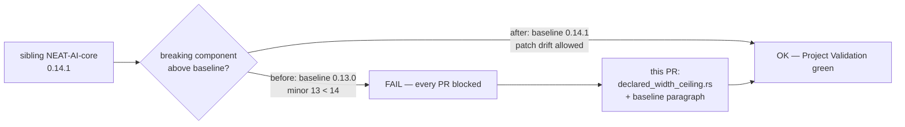

# Handle the neat-core 0.14.0 breaking bump and move the baseline off 0.13.0 (Issue #609)

## Summary

`Develop` recorded `0.13.0` in `neat-core.expected-version` while the sibling
`NEAT-AI-core` clone that every host and runner builds against had moved to
`0.14.x`. Pre-1.0 the minor is the breaking component, so the Issue #252
breaking-bump gate failed `Project Validation` on **every** PR and nothing in
the repository could merge:

```text
FAIL: breaking neat-core bump: 0.14.1 exceeds handled baseline 0.13.0 (pre-1.0 minor increased)
```

The unhandled bump is neat-core 0.14.0 (NEAT-AI-core#622 / PR #640): the
**declared** observation width is now bounded before it is walked.
`CreatureExport::input` is a declared count with no backing data in the JSON, so
a sub-100-byte creature saying `"input": 100000000` used to cost one owned
`String` UUID per declared input; `validate_creature_width` now refuses a
declared `input` above `MAX_NODE_COUNT` with `CreatureError::TooManyNodes`, and
`parse_creature_json`, `compile_creature`, `creature_to_json`,
`creature_to_json_pretty`, `validate_creature_topology` and
`cleanup_creature_with` all inherit that refusal.

It is a **behavioural narrowing, not a signature change** — no public type or
function signature `rust_scorer` names moved — and no scorer-reachable creature
can be caught by it. `compile_creature` has refused a **total** node count
(`input` plus the listed neurons) above the same ceiling with the same typed
error since neat-core #177, and the total is never below `input`, so every
creature the new width check refuses was already refused one step later; 0.14.0
only moves the refusal ahead of the allocation it was sizing. Production width
is 2461 inputs (`rust_scorer::prod_fixture`), twenty-six times below the
ceiling.

This PR is that deliberate acknowledgement: a regression suite pinning the new
refusal from the scorer's side, and the baseline moved to the sibling version
with the usual header paragraph. No production scorer code changed.
Closes #609.

## Evidence

This is a CLI/back-end change with no web interface to screenshot. The evidence
is the gate flipping green and the regression suite, both run in this worktree
against the sibling clone at `0.14.1` (`255b06e`).

**The gate, before and after:**

```text
$ ./scripts/check-neat-core-version.sh          # before
FAIL: breaking neat-core bump: 0.14.1 exceeds handled baseline 0.13.0 (pre-1.0 minor increased)
exit=1

$ ./scripts/check-neat-core-version.sh          # after
OK   neat-core 0.14.1 matches handled baseline 0.14.1 (patch-level drift allowed)
exit=0
```



**The regression suite** (`rust_scorer/tests/declared_width_ceiling.rs`), run
against a temporary `neat-core` worktree pinned at `0.13.0` (`59eb6e6`) and then
against the sibling clone at `0.14.1`:

```text
# against neat-core 0.13.0 — the unfixed core
test result: FAILED. 3 passed; 3 failed
  absurd_declared_width_is_refused_on_parse_with_the_typed_error
  no_boundary_accepts_a_declared_width_past_the_ceiling
  the_ceiling_is_inclusive

# against the sibling clone at 0.14.1
test result: ok. 6 passed; 0 failed; finished in 0.07s
```

The 0.13.0 run also reproduces the symptom the bump exists to remove: it took
**566 s**, because the CLI test's 100-million-input creature was walked into a
hundred-million-entry map. Against 0.14.1 the same suite finishes in **0.07 s**.

**Full gate:** `./quality.sh` passes end to end (exit 0) — 626 bats tests and
562 Rust tests, plus `cargo fmt --check`,
`cargo clippy --all-targets -- -D warnings`, `cargo-deny`, rustdoc and the
release build.

> Note for reviewers: this container has no `en_US.UTF-8` locale, which
> `tests/scripts/diagrams_mermaid.bats` sets in `setup()`. Under the failed
> `setlocale` the box-drawing bracket expression degrades to byte matching and
> every em dash in `README.md` looks like a box-drawing character, so that one
> bats test fails on `Develop` too — it is environmental and unrelated to this
> diff (`README.md` is not touched here). Running the same gate as
> `LC_ALL=C.UTF-8 ./quality.sh` — a valid UTF-8 locale, no repository change —
> passes everything, exit 0.

## Reproduction

- **symptom** — `Project Validation` failed on every PR against `Develop` at
  `./scripts/check-neat-core-version.sh`:
  `FAIL: breaking neat-core bump: 0.14.1 exceeds handled baseline 0.13.0
  (pre-1.0 minor increased)`, exit 1
- **status** — `verified` — the gate was observed exiting 1 on the unfixed
  branch and exiting 0 after the baseline bump, and the new regression suite was
  observed failing (3 of its 6 tests) against a `neat-core` 0.13.0 worktree and
  passing (6 of 6) against the sibling clone at 0.14.1
- **regression test** —
  `rust_scorer/tests/declared_width_ceiling.rs::absurd_declared_width_is_refused_on_parse_with_the_typed_error`
  (with `::the_ceiling_is_inclusive`, the other assertion that distinguishes
  0.13.0 from 0.14.1; the gate itself is re-run by `./quality.sh` and by CI)

## Acceptance Criteria

<!-- vibe-spec-review inputs="diff+issue-body" -->

- **met** — confirms no scorer-reachable creature legitimately declares an `input` above `MAX_NODE_COUNT`, with a regression test pinning the new `CreatureError::TooManyNodes` on the width path — evidence: `rust_scorer/tests/declared_width_ceiling.rs` (6 tests, all passing); the reviewer independently confirmed the scorer reaches only two of the six narrowed APIs (`rust_scorer/src/gpu/forward_mse_batched.rs:1521` is the sole other `MAX_NODE_COUNT` reference) and that production width 2461 (`rust_scorer/src/prod_fixture.rs:48`) sits 26× below the ceiling — reviewer: met
- **met** — bumps `neat-core.expected-version` to the sibling version with the usual header paragraph documenting the 0.13.0 -> 0.14.x bump and how it was verified — evidence: `neat-core.expected-version` (0.13.0 → 0.14.1 with the header paragraph); `./scripts/check-neat-core-version.sh` exits 0 — reviewer: met
- **unrequested** — `Cargo.lock` records `neat-core` 0.13.0 → 0.14.1 — reviewer: unrequested — reason: a mechanical consequence of building against the sibling at 0.14.1; leaving it stale would make the lock file wrong
- **unrequested** — `CHANGELOG.md` gains an Unreleased/Fixed entry — reviewer: unrequested — reason: required by `CONTRIBUTING.md` step 4 for every PR, not by the issue
- **unrequested** — `the_cli_reports_the_refusal_and_scores_nothing` drives the real binary and asserts no score JSON is emitted and the data directory is never touched — reviewer: unrequested — reason: it is the "scorer-reachable" half of criterion 1 — the refusal has to reach the scorer's own boundary, not just `neat-core`'s — and it mirrors the existing `rust_scorer/tests/input_output_width_guard.rs` shape; kept
- **unrequested** — `docs/archive/pr-summaries/pr-summary-609.md` — reviewer: unrequested — reason: this file; `CONTRIBUTING.md:155-164` requires one committed summary per PR

The Spec reviewer also raised three non-blocking accuracy points, all acted on
or recorded:

- Its finding that `absurd_declared_width_is_refused_on_compile_with_the_same_typed_error`
  pinned a **pre-existing** guarantee despite its name is correct — the compile
  refusal predates 0.14.0 (Issue #177), and that test only went red against
  0.13.0 through its parse precondition. Fixed here: renamed to
  `no_boundary_accepts_a_declared_width_past_the_ceiling`, with the split
  spelled out in the test and in the `neat-core.expected-version` paragraph.
- Its reading that the parse test against 0.13.0 "would attempt the 100M-entry
  walk" is not what was observed: `parse_creature_json` allocates nothing per
  declared input, so it returned an accepted creature and the assertion failed
  cleanly. The 566 s in the Evidence section came from the **CLI** test, which
  does compile.
- `rust_scorer/src/creature_width.rs` still enforces only the lower bound
  (`input >= 1`), so the scorer's own boundary guard is one-sided while the
  ceiling lives in `neat-core`. Left as is: the core refusal covers every path
  the scorer takes (it parses before it compiles), and an upper bound in the
  local guard is not something this issue asked for.

## Standards Review

<!-- vibe-standards-review inputs="diff+CODING-STANDARDS.md" -->

The repository has no `CODING-STANDARDS.md`; the reviewer used `CONTRIBUTING.md`
and `AGENTS.md`, which are its documented standards, and said so.

- **violation** — the PR summary was missing from the branch, against `CONTRIBUTING.md:160-163` ("PR summaries live there, one file per PR") — evidence: `docs/archive/pr-summaries/pr-summary-609.md` was untracked when the diff was reviewed — reason: fixed here; the file is committed in this PR
- **clean** — Australian English throughout the added lines (*behavioural*, *serialisers*), codespell exit 0
- **clean** — tests call real code: `parse_creature_json` / `compile_creature` directly and the real binary via `CARGO_BIN_EXE_rust_scorer`, asserting typed errors, stderr, exit status and empty stdout; no source-grepping tests
- **clean** — creature JSON built through `rust_scorer::fixture_json`, not hand-encoded (`CONTRIBUTING.md:141-148`)
- **clean** — no ASCII/box-drawing diagrams added; CHANGELOG entry under `## [Unreleased]` → `### Fixed`; breaking-bump gate acknowledged in the same PR; `cargo fmt --check`, `cargo clippy --all-targets -- -D warnings`, `check-pr-summary-archive.sh` and `check-docs-cross-references.sh` all clean; positional CLI contract and `.github/workflows/` untouched

## Test Plan

New file `rust_scorer/tests/declared_width_ceiling.rs` — six tests, all calling
real `neat-core` / `rust_scorer` entry points:

- `absurd_declared_width_is_refused_on_parse_with_the_typed_error` — a
  sub-200-byte creature declaring 100 000 000 inputs is refused by
  `parse_creature_json` with `CreatureError::TooManyNodes { count: 100_000_001 }`
  (`input` plus the listed neurons, the same declared node count the
  post-compile ceiling reports).
- `no_boundary_accepts_a_declared_width_past_the_ceiling` — the same width is
  refused by `compile_creature` with the same typed error. Only the parse half
  of this test is new behaviour: `compile_creature` has refused the width since
  Issue #177 through its total-node check, and 0.14.0 moved that refusal ahead
  of the walk. It is here so the suite pins that *no* boundary accepts the
  width, not just the one that moved.
- `the_ceiling_is_inclusive` — `input == MAX_NODE_COUNT` still parses;
  `MAX_NODE_COUNT + 1` does not. The narrowing starts exactly one input past the
  widest addressable network.
- `the_widest_compilable_creature_still_compiles` — `MAX_NODE_COUNT - 1` inputs
  plus one output neuron (total nodes exactly `MAX_NODE_COUNT`, the Issue #177
  ceiling) parses and compiles, and the compiled network reports those widths.
  This is the direct evidence that nothing compilable was lost.
- `production_width_parses_and_compiles_unchanged` — the production 2461-input
  shape parses, compiles and keeps its exact width; a compile-time assertion
  pins that width below the ceiling.
- `the_cli_reports_the_refusal_and_scores_nothing` — the real `rust_scorer`
  binary, pointed at an oversized creature and a data directory that does not
  exist, exits non-zero, carries the typed node-count wording on stderr, emits
  no score JSON, and never reaches the data directory.

No existing test was modified, commented out or removed.
