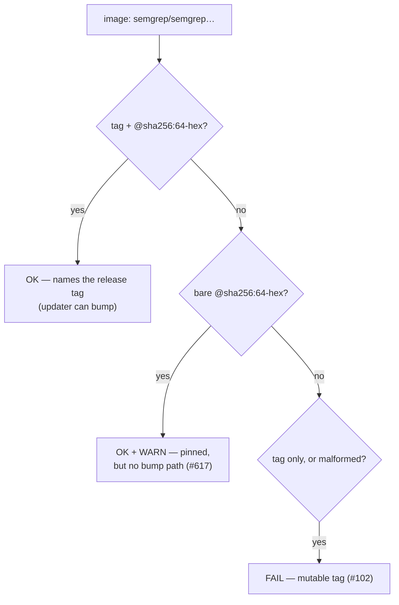

## Summary

The Semgrep container is pinned as `image: semgrep/semgrep@sha256:a9ea…0e35` — a
bare, immutable digest with no release tag. Renovate's `github-actions` manager
and Dependabot's `docker` ecosystem both resolve a bump from the **tag** and
then rewrite the digest beside it, so a bare digest gives them nothing to
resolve: the scanner is frozen at whatever `semgrep/semgrep` resolved to on
2026-05-18 and can never be bumped automatically.

`scripts/check-semgrep-workflow.sh` now accepts — and prefers — the shape that
fixes that, `semgrep/semgrep:<version>@sha256:<64-hex>`, naming the release tag
it found. The digest still decides which bytes run, so the pin is exactly as
immutable as before; a tag-only pin is still rejected (Issue #102), and a bare
digest still passes as a genuine pin but now raises a non-blocking `WARN`
saying no updater can bump it. `warn` is a new advisory in the shared check
harness, alongside `ok`/`fail`.

**The workflow YAML edit itself needs a maintainer.** The automation worker's
credentials carry no `workflow` OAuth scope, so `.github/workflows/semgrep.yml`
is deliberately untouched by this PR — see
[Human escalation](../../../CONTRIBUTING.md#human-escalation). Issue #617 is
labelled `needs-human` with the exact edit spelled out (below and on the issue).

Closes #617.

### Maintainer wiring — the one line to change

In `.github/workflows/semgrep.yml:53`, replace:

```yaml
      image: semgrep/semgrep@sha256:a9ea2d5621c29d815d90c2a3b2f9571da8972ef4ff855c9e4902681730240e35
```

with the same digest carrying its release tag:

```yaml
      image: semgrep/semgrep:1.86.0@sha256:a9ea2d5621c29d815d90c2a3b2f9571da8972ef4ff855c9e4902681730240e35
```

`1.86.0` is the version the workflow's own comment records for that digest;
confirm it with `docker buildx imagetools inspect semgrep/semgrep:1.86.0` before
committing, and if the digest no longer matches that tag, bump the tag and the
digest together per the file's existing bump protocol. Nothing else changes —
`./scripts/check-semgrep-workflow.sh` then reports
`pinned by digest and carries release tag 1.86.0` and the `WARN` disappears.

## Evidence

Backend/CLI change with no web interface to screenshot. Evidence is the
validator's own output against the two pin shapes.

Against the repository's current bare-digest pin (`exit 0`, advisory only):

```text
OK   …/.github/workflows/semgrep.yml: Semgrep container image is pinned by digest (semgrep/semgrep@sha256:<digest>)
WARN …/.github/workflows/semgrep.yml: digest pin carries no release tag — dependency updaters
     resolve a bump from the tag, so this pin can never be bumped automatically;
     use semgrep/semgrep:<version>@sha256:<64-hex> (Issue #617)
```

Against the tagged shape the maintainer will apply (no `WARN`):

```text
OK   …: Semgrep container image is pinned by digest and carries release tag 1.86.0 (semgrep/semgrep:<tag>@sha256:<digest>)
```

How rule 3 now classifies each pin shape:



### Quality gate

`./quality.sh` stops before the Rust stages on two **pre-existing** failures
that this diff does not touch and cannot fix:

1. `check-neat-core-version.sh` — the sibling clone is at neat-core **0.15.1**
   against the recorded baseline **0.14.1**, so the Issue #252 breaking-bump
   gate refuses the run. That is a separate, deliberate upgrade PR (the
   0.14.1 acknowledgement was Issue #609/PR #611); no open issue covered it, so
   this run filed **#618** for it.
2. `tests/scripts/diagrams_mermaid.bats::living docs contain no box-drawing
   ASCII diagrams` — the container has no `en_US.UTF-8` locale, so the test's
   `setlocale` fails, `grep` falls back to byte matching and every em dash in
   `README.md` is reported as a box-drawing character. Verified pre-existing by
   restoring the base `README.md` and re-running the suite: it fails
   identically. CI, which has the locale, is unaffected.

Everything the diff does touch was run and passes: the full ShellCheck sweep,
every `scripts/check-*.sh` validator, `spell-check.sh`, and the complete
`bats tests/scripts` suite bar the two failures above — including
`semgrep_workflow.bats` (20/20) and `check_harness.bats` (13/13).

## Test Plan

- `tests/scripts/semgrep_workflow.bats` — four new cases, red before the change:
  - `passes and names the release tag when the image carries tag + digest (issue #617)`
  - `warns when the digest pin carries no release tag (issue #617)`
  - `warns when the tag beside the digest is :latest (issue #617)`
  - `fails when a tagged image carries a malformed digest (issue #617)`
- `tests/scripts/check_harness.bats` — `warn reports WARN on stderr with the
  subject prefix and does not fail the run`.
- Unchanged and still green: the `:latest`, tag-only (Issue #102) and
  malformed-digest rejections, and `real repository semgrep workflow satisfies
  every rule`.
