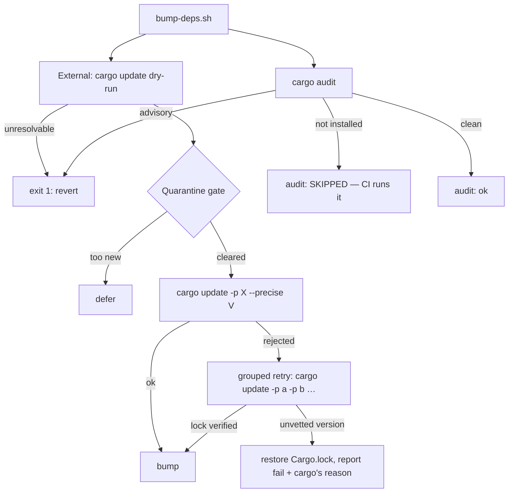

## Summary

`bump-deps.sh` exited non-zero on every run, so the worker reverted each bump
and dependency updates were effectively disabled for this repo. Two root causes
are fixed, both instances of a fault being reported as something it is not.
Closes #619.

1. **A missing `cargo-audit` is no longer a bump rejection.** The unattended
   container has no `cargo-audit` on `PATH`, so `run_audit` returned 1 and took
   the whole script with it. A missing tool is a tooling gap, not an advisory:
   the stage now prints `audit: SKIPPED (cargo-audit not installed)` plus two
   stderr warnings and carries on, leaving the scan to
   `.github/workflows/cargo-audit.yml`, which runs `cargo audit` on every PR.
   `--require-audit` (or `BUMP_DEPS_REQUIRE_AUDIT=1`) restores the fatal
   behaviour for incident work; a cargo-audit that *is* installed and reports an
   advisory still fails exactly as before.
2. **Interlocked crate families can now bump.** `wasm-bindgen`, `js-sys` and
   `web-sys` pin each other with `=` requirements, so `cargo update -p <crate>
   --precise <v>` is always rejected while the rest of the graph stays locked —
   the seven `fail: … (cargo update rejected)` lines in the issue. Rejected
   crates now get one grouped retry (`cargo update -p a -p b …`) that moves the
   family together. A grouped resolve is more permissive than `--precise`, so
   the resulting `Cargo.lock` is verified against the vetted candidate list: any
   package changed to a version the quarantine gate did not clear restores the
   lockfile and reports the crates as failed. Cargo's own error is printed
   instead of being discarded into `/dev/null`.

A `cargo update --dry-run` that cannot resolve the graph is now an error rather
than being reported as `no updates` — a broken tree must not read as a clean
no-op.



## Evidence

Backend/CLI change — no web interface to screenshot. Evidence is command output
and tests.

Before, in this container (the exact issue symptom):

```text
$ ./bump-deps.sh --skip-external --skip-build
internal: NEAT-AI-core resolved via path dependency — no SHA pin to refresh
Error: cargo audit not available — install with 'cargo install cargo-audit --locked'
EXIT=1
```

After:

```text
$ ./bump-deps.sh --skip-external --skip-build
internal: NEAT-AI-core resolved via path dependency — no SHA pin to refresh
Warning: cargo audit not available — advisory scan deferred to CI (.github/workflows/cargo-audit.yml runs it on every PR).
Warning: install locally with 'cargo install cargo-audit --locked'; pass --require-audit to make this fatal.
audit: SKIPPED (cargo-audit not installed)
bump-deps: no bumps (internal=path dependency (no SHA pin); external=skipped; audit=skipped (cargo-audit not installed); build=skipped)
EXIT=0
```

The interlock was reproduced against **real cargo and real crates.io** in a
throwaway workspace locked to the same versions as this repo
(`js-sys 0.3.104` / `wasm-bindgen 0.2.127`):

```text
$ cargo update -p wasm-bindgen --precise 0.2.128
error: failed to select a version for the requirement `wasm-bindgen = "=0.2.127"`
candidate versions found which didn't match: 0.2.128
required by package `js-sys v0.3.104`
EXIT=101

$ cargo update -p wasm-bindgen -p js-sys -p wasm-bindgen-macro \
      -p wasm-bindgen-macro-support -p wasm-bindgen-shared
    Updating js-sys v0.3.104 -> v0.3.105
    Updating wasm-bindgen v0.2.127 -> v0.2.128
    …
EXIT=0
```

and the fixed script drove that same real workspace end to end:

```text
$ ./bump-deps.sh --repo /tmp/bumpprobe --skip-internal --skip-audit --skip-build --quarantine-hours 0
  bump: js-sys -> 0.3.105
  bump: syn -> 3.0.5
  bump: wasm-bindgen -> 0.2.128
  bump: wasm-bindgen-macro -> 0.2.128
  bump: wasm-bindgen-macro-support -> 0.2.128
  bump: wasm-bindgen-shared -> 0.2.128
external: 6 bumped, 0 deferred, 0 failed
EXIT=0
```

`./quality.sh` passes end to end (`✅ All quality checks passed!`), including
all 641 `tests/scripts/*.bats` cases.

## Reproduction

- **symptom** — `bump-deps.sh` exited 1 on every run (`Error: cargo audit not
  available`), so the worker reverted each bump; separately, seven interlocked
  wasm-bindgen-family crates reported `cargo update rejected` with the reason
  discarded
- **status** — `verified` — both regression tests were observed failing against
  the unfixed script (`not ok 15`, `not ok 21`) and passing after the fix
- **regression test** — `tests/scripts/bump_deps.bats::audit stage: a missing
  cargo-audit is a skip, not a bump rejection (Issue #619)` and
  `tests/scripts/bump_deps.bats::external stage: interlocked crates are retried
  as one grouped update (Issue #619)`

## Out-of-scope change, disclosed

`tests/scripts/diagrams_mermaid.bats` forced `LC_ALL=en_US.UTF-8`, a locale the
unattended container does not ship — bash warned, fell back to `C`, and the
box-drawing `grep` then matched every em dash in `README.md`. `./quality.sh` was
already red at `HEAD` for this reason alone (confirmed by running the test
against a pristine `git archive HEAD` tree), so the gate could not be made green
without it. The fix picks a UTF-8 locale the host actually provides, preferring
the historical `en_US.UTF-8`, and fails loud if there is none. It is committed
separately (`fix: pick an available UTF-8 locale in the diagram check`).

## Test Plan

Added to `tests/scripts/bump_deps.bats` (10 new cases, all driving the real
script through a scripted `cargo` stand-in and asserting on exit codes, output
and the resulting `Cargo.lock`):

- `audit stage: a missing cargo-audit is a skip, not a bump rejection`
- `audit stage: --require-audit makes a missing cargo-audit fatal`
- `audit stage: BUMP_DEPS_REQUIRE_AUDIT=1 makes a missing cargo-audit fatal`
- `audit stage: an installed cargo-audit still runs and reports ok`
- `audit stage: a reported advisory still fails the bump`
- `--help advertises --require-audit`
- `external stage: interlocked crates are retried as one grouped update`
- `external stage: a regrouped update that smuggles an unvetted version is
  reverted`
- `external stage: a failed regroup surfaces cargo's own error`
- `external stage: a failing cargo update --dry-run fails loud`

No existing test was modified or removed. Docs updated in the same change:
`README.md` (the `bump-deps.sh` stage list, exit contract, flag list and
flowchart) and `SECURITY.md` (`--require-audit` during an emergency bump).
