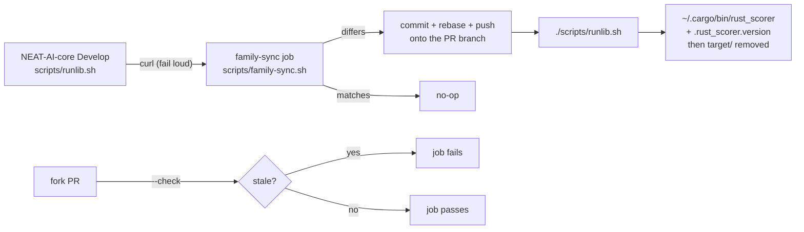

# Adopt the canonical NEAT-AI-core runlib.sh with a family-sync CI job

## Summary

`scripts/runlib.sh` is now a **byte-identical copy** of `scripts/runlib.sh` on
NEAT-AI-core `Develop` (the repo-local script that landed in PR #631 is
replaced) and is never edited here. `scripts/family-sync.sh` fetches the
canonical copy and refreshes the local one when they differ; the `family-sync`
job in `.github/workflows/family-sync.yml` runs it on every pull request and
commits the refresh back onto the branch with `version-increment.yml`'s push
identity (App token → `ACTIONS_PUSH` → `GITHUB_TOKEN`, same-repo guard,
credential-free checkout, SHA-pinned actions, hardened push step, rebase before
push). A fork PR cannot be pushed to, so it runs the same script in `--check`
mode instead and goes red on a stale copy rather than green-unverified.

Closes #629.

## Evidence

Backend/CLI and CI plumbing only — no web interface to screenshot. What was run
in this container:

- **Byte identity, live** — `./scripts/family-sync.sh --check` fetches
  `https://raw.githubusercontent.com/stSoftwareAU/NEAT-AI-core/Develop/scripts/runlib.sh`
  and reports `scripts/runlib.sh matches NEAT-AI-core Develop` (exit 0). With a
  line appended to the local copy it reports `differs from NEAT-AI-core
  Develop` (exit 1), and a plain
  run restores the canonical bytes (`git status` clean afterwards).
- **The real install path** — `./scripts/runlib.sh` from the repo root built
  `rust_scorer v1.1.79` in 55 s and printed the installed path on stdout;
  `$CARGO_HOME/bin/rust_scorer` (6.8 MB, executable) and
  `$CARGO_HOME/bin/.rust_scorer.version` (`1.1.79`) were written. A second run
  printed `[rust_scorer] already installed v1.1.79` on stderr and the same path
  on stdout, with no build. This container sets `CARGO_TARGET_DIR` outside the
  checkout, so the live run took the documented "kept … (outside the checkout)"
  branch; the in-checkout `target/` removal is covered hermetically.
- **Guards** — `./scripts/check-family-sync-workflow.sh` passes all 11 rules;
  `actionlint` clean; `shellcheck -x -s bash` clean on every new/changed script;
  `check-bot-push-token.sh`, `check-push-step-hardening.sh`,
  `check-persist-credentials.sh`, `check-workflow-concurrency.sh`,
  `check-workflow-timeouts.sh`, `check-run-block-safety.sh`,
  `check-workflow-action-versions.sh` all pass with the new workflow in their
  default lists.
- **Suites** — `bats tests/scripts`: 664 pass, 1 fail; `scripts/test-runlib.sh`:
  22/22; `cargo fmt --check`, `cargo clippy --workspace --all-targets
  --all-features -D warnings`, `cargo test --workspace --all-features`,
  `cargo deny check` and `RUSTDOCFLAGS="-D warnings" cargo doc` all pass.

### Pre-existing failure, not from this change

The one red test is `check-neat-core-version.sh` /
`neat_core_version_gate.bats::real repository baseline matches the sibling
neat-core when present`: `neat-core.expected-version` records `0.17.0` while
NEAT-AI-core `Develop` is now `0.22.5`. It fires on every PR in this repo (CI's
`Project Validation` job checks out core `Develop`), touches nothing in this
diff, and clearing it is the deliberate baseline-bump PR the gate's own message
demands — the pin work tracked by #630. For the record, this workspace **builds
and passes its whole test suite against neat-core 0.22.5**, so the code side of
that bump appears already handled; only the recorded baseline is stale.

### Cross-repo follow-up raised in NEAT-AI-core

The canonical script's manifest-only fast path declines any crate with more than
one `[[bin]]` table, which is exactly this crate's shape (the CLI plus four
bench bins) — so an already-installed run here still costs one `cargo metadata`
call before printing `already installed`. That is a change to the canonical copy,
not to this one: branch `runlib-fast-path-multi-bin-tables` is pushed to
NEAT-AI-core (reads every `[[bin]]` name and claims the bin when one names the
crate; core's 95-case `tests/scripts/runlib.bats` passes). Once it lands, the
family-sync job carries the improvement here automatically.

## Acceptance Criteria

<!-- vibe-spec-review inputs="diff+issue-body" -->

- **met** — `scripts/runlib.sh` is byte-identical to core's Develop copy; a stale copy on a PR branch is refreshed by CI — evidence: `cmp` against the live raw URL is clean, `tests/scripts/family_sync.bats::a stale copy is refreshed byte-for-byte and made executable`, `.github/workflows/family-sync.yml` — reviewer: met
- **met** — `./scripts/runlib.sh` installs `~/.cargo/bin/rust_scorer` and `.rust_scorer.version`, then removes `target/`; a second run prints `[rust_scorer] already installed v<x>` and runs no cargo command — evidence: live run above, `scripts/test-runlib.sh` (22 assertions: install, stamp, `target/` removed on success and kept on failure, `--bin rust_scorer` only) — reviewer: met — reason: the reviewer recorded one caveat and a second, narrower gap stands. The caveat: this container's external `CARGO_TARGET_DIR` meant the live run could not demonstrate the in-checkout `target/` removal (hermetic coverage only). The gap: "runs no cargo command" holds for a single-`[[bin]]` crate (`scripts/test-runlib.sh::no cargo command ran`) but this crate declares four bench bins beside the CLI, so one `cargo metadata` call still runs — no build, no install. The fix belongs in the canonical copy and is pushed to NEAT-AI-core as `runlib-fast-path-multi-bin-tables`
- **met** — tests and quality checks pass — evidence: `bats tests/scripts` 664/665, `scripts/test-runlib.sh` 22/22, clippy/fmt/test/doc/cargo-deny clean; the single failure is the pre-existing neat-core baseline drift described above — reviewer: met
- **met** — register the job wherever the workflow-check scripts enumerate workflows — evidence: `scripts/check-bot-push-token.sh`, `scripts/check-push-step-hardening.sh`, `scripts/check-persist-credentials.sh`, `scripts/check-workflow-concurrency.sh` — reviewer: partial — reason: the reviewer found `check-workflow-concurrency.sh`'s hard-coded `PILE_UP_PRONE` list still missing; it was added in `523c1f7`. `check-ci-job-graph.sh` is deliberately untouched — it validates `ci.yml`'s graph and this job lives in its own workflow, with the consequence the reviewer noted: a failed sync is not part of `ci.yml`'s required-checks aggregator
- **unrequested** — `scripts/check-family-sync-workflow.sh` (11 rules) and `tests/scripts/family_sync_workflow.bats` — reviewer: unrequested — reason: the issue's Failure Detection asks that "the repo's workflow-check scripts fail CI when the job is misdeclared"; this repository has one guard script per workflow (`check-auto-format-workflow.sh`, `check-gitleaks-workflow.sh`, …) and no existing guard covers a family-sync job, so the convention is followed rather than invented
- **unrequested** — `scripts/family-sync.sh` refuses a fetched file whose first line is not `#!/usr/bin/env bash` or which declares no `runlib_install` — reviewer: unrequested — reason: kept deliberately. A 200-response error page would otherwise be installed over a working script; the refusal is loud (exit 2, local copy untouched) and an upstream shebang rename fails visibly rather than silently corrupting the copy
- **unrequested** — `scripts/family-sync.sh --check` and the `family-sync-check` job — reviewer: unrequested — reason: the reviewer flagged `--check` as a dead path and, separately, that a fork PR skipped the job and reported green with an unverified copy; the fork job now uses `--check` and closes both
- **unrequested** — README gains a section with a Mermaid diagram rather than one line on the install path — reviewer: unrequested — reason: the copy contract and the sync job are new behaviour a reader needs, and the fleet standards ask for a diagram where it aids understanding

## Standards Review

<!-- vibe-standards-review inputs="diff+CODING-STANDARDS.md" -->

- **violation** — CONTRIBUTING.md "Human escalation" says the automation worker holds no `workflow` OAuth scope and must not create anything under `.github/workflows/` — evidence: `.github/workflows/family-sync.yml:1`, `CONTRIBUTING.md:231` — reason: the constraint is stale, not breached in ignorance: this run's credentials carry `read:org, repo, user, workflow` and the branch carrying the workflow file pushed successfully. The issue asks for the job explicitly, and CODEOWNERS still forces a maintainer review on `.github/workflows/`. Correcting the claim spans `CONTRIBUTING.md`, `AGENTS.md`, `README.md` (×2) and a `docs_cross_references.bats` fixture — a docs sweep deliberately kept out of this diff and reported to the maintainers instead
- **violation** — the new bats suite restated the shared missing-target contract inline and never exercised the unknown-flag contract — evidence: `tests/scripts/family_sync_workflow.bats:149` — reason: fixed in `523c1f7`; both now call `assert_missing_target_rejected` / `assert_unknown_flag_rejected` from the harness
- **violation** — the guard's whole-file greps let a second `run:` block without `set -euo pipefail`, a rebase mentioned only in prose, or a `contents: write` on any job satisfy rules 10, 8 and 4 — evidence: `scripts/check-family-sync-workflow.sh:123`, `:136`, `:79` — reason: fixed in `523c1f7` — strict bash is checked per `run: |` block, comments are stripped before the rebase command is looked for, and the permissions rule reads the top-level block only
- **violation** — a fork PR skipped the job entirely and reported green carrying a copy nothing had compared against the canonical one ("no failure marker" read as success) — evidence: `.github/workflows/family-sync.yml:36` — reason: fixed in `523c1f7` — the read-only `family-sync-check` job runs `scripts/family-sync.sh --check` on fork PRs
- **violation** — no `docs/archive/pr-summaries/pr-summary-629.md` — evidence: `docs/archive/pr-summaries/` — reason: fixed — this file
- **clean** — `scripts/runlib.sh` byte-identical to upstream and unedited locally; both actions pinned to 40-char SHAs with version comments; least-privilege `permissions`; `timeout-minutes` and a concurrency group on every job; `persist-credentials: false`; push step hardened (absolute `/usr/bin/git` + `/usr/bin/base64`, `core.hooksPath=/dev/null`, PAT on stdin, no repository script in scope); no `${{ github.* }}` inside `run:`; bash 3.2-safe scripts; every failure path in `family-sync.sh` exits non-zero with a distinct message and leaves the local copy untouched; tests call the real scripts and assert exit codes, output and on-disk state; Australian English; no hidden or secret files staged

## Test Plan

- `scripts/test-runlib.sh` — rewritten for the canonical script: the no-cargo
  skip on a single-bin crate, the skip with bench bins beside the CLI (no
  build), a stale stamp building `--bin rust_scorer` only and installing the
  CLI + stamp with `target/` removed, and a failed build that keeps `target/`
  and the previously installed CLI and stamp. Driven in CI by
  `tests/scripts/runlib.bats`.
- `tests/scripts/family_sync.bats` — 11 cases over `scripts/family-sync.sh`:
  in-sync no-op, byte-for-byte refresh, `--check` stale/fresh, missing source,
  empty fetch, error page, a bash script that is not `runlib.sh`, a fetch with
  no curl, an unknown argument, and the committed `runlib.sh` through the
  guards.
- `tests/scripts/family_sync_workflow.bats` — 12 cases over
  `scripts/check-family-sync-workflow.sh`, one per rule plus the shipped
  workflow.
- `tests/scripts/bot_push_token.bats`, `push_step_hardening.bats`,
  `persist_credentials.bats` — updated to assert `family-sync.yml` is covered by
  each guard's default run.
