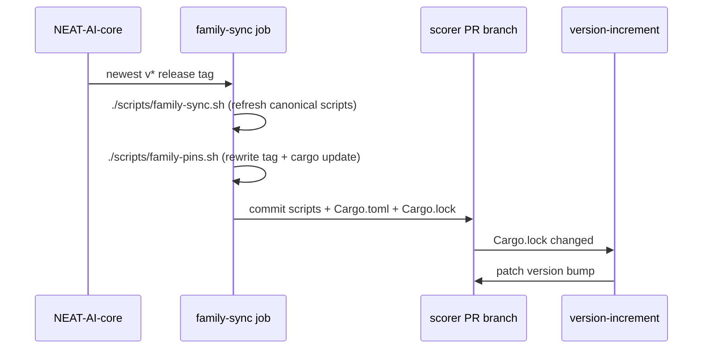

# PR Summary — Issue #630: pin `neat-core` to a release tag and refresh the pin on every PR

## Summary

`rust_scorer` consumed `neat-core` through an unpinned `path` dependency on a
sibling NEAT-AI-core clone, so every host built against whatever core happened
to be checked out beside it and every workflow had to clone and symlink that
sibling. This PR replaces the path dependency with a git dependency pinned to a
NEAT-AI-core **release tag**, and moves that pin automatically on every PR so
the repository always carries the current core. Closes #630.

- `rust_scorer/Cargo.toml` pins
  `neat-core = { git = "https://github.com/stSoftwareAU/NEAT-AI-core", tag = "v0.22.5" }`
  (core's newest release); `Cargo.lock` records the commit that tag resolves to.
- `scripts/family-pins.sh` is copied byte-for-byte from NEAT-AI-core `Develop`
  (core#681). `scripts/family-sync.sh` now syncs **both** canonical family
  scripts (`runlib.sh`, `family-pins.sh`), selectable with `--file NAME`, and
  the `family-sync` job runs the refreshed pin mover before pushing — so a pin
  behind core's latest release is moved, `Cargo.lock` follows, and
  `version-increment.yml` bumps the patch on the same PR.
- `.github/actions/setup-neat-core` and its six call sites are retired;
  `scripts/check-neat-core-composite-action.sh` is now the retirement guard
  (action absent, no workflow reaches for the clone, manifest still pins a
  release tag), and the redundant `scripts/check-workflow-paths.sh` is removed
  with it.
- `scripts/check-neat-core-version.sh` reads the pinned release from
  `Cargo.lock` (`git+…?tag=v<semver>`) instead of a sibling manifest, so the
  breaking-bump gate runs everywhere and keeps a breaking core release behind a
  deliberate migration.
- `deny.toml` allows that one git source; every other git dependency stays
  denied (`unknown-git = "deny"` would otherwise fail `cargo deny check`).
- README, `AGENTS.md`, `CONTRIBUTING.md` and `CHANGELOG.md` describe the pin and
  how it moves.

## Evidence

Backend/CLI change — no web interface to screenshot. The evidence is command
output and tests.

**Acceptance criterion 1 — release build with no sibling checkout.** This
container has no `NEAT-AI-core` beside the repo — only unrelated sibling
checkouts — which is why the pre-change tree could not build here at all:

```text
$ cargo build --release -p rust_scorer
   Compiling neat-core v0.22.5 (https://github.com/stSoftwareAU/NEAT-AI-core?tag=v0.22.5#771ad136)
   Compiling rust_scorer v1.1.80
    Finished `release` profile [optimized] target(s) in 1m 17s
$ ./target/release/rust_scorer --help
Full-dataset fitness score for a NEAT creature (native, minimal CLI).
```

**Acceptance criterion 3 — the pin is what the fleet resolves.** `Cargo.lock`
records the tag *and* the commit, so a new core release reaches nothing until
this repo's pin moves:

```text
[[package]]
name = "neat-core"
version = "0.22.5"
source = "git+https://github.com/stSoftwareAU/NEAT-AI-core?tag=v0.22.5#771ad136ed106d1a13a3388e6634c451f4256f5f"
```

**Acceptance criterion 4 — the gate.** `./quality.sh < /dev/null` passes end to
end (3m39s, "✅ All quality checks passed!"), including `cargo deny check`
(`sources ok`), clippy with `-D warnings`, 330 unit tests + integration suites +
33 doctests, rustdoc with `-D warnings`, and the 678-test `bats` suite.

How the pin moves:



## Acceptance Criteria

<!-- vibe-spec-review inputs="diff+issue-body" -->

- **met** — `cargo build --release -p rust_scorer` succeeds with no sibling `NEAT-AI-core` checkout beside the repo — evidence: release build above; `rust_scorer/Cargo.toml:67`, `Cargo.lock:754` — reviewer: met
- **met** — a PR whose pin is behind core's latest release receives a CI commit moving the tag and `Cargo.lock`, followed by the patch bump — evidence: `.github/workflows/family-sync.yml:110-131` (run + change detection) and `:169-180` (stage/commit/push); `version-increment.yml:11-19` fires on `synchronize` ignoring only `**.md` / `docs/**`; `tests/scripts/family_pins.bats::the shipped rust_scorer pin is discovered in the workspace member and moved` — reviewer: met — reason: the reviewer notes fork PRs are verified rather than moved (`family-sync.yml:47-65`), which the job cannot change — it cannot push to a fork — and that the patch bump is once per PR, so a pin moved after an earlier bump adds no second bump while the branch version still differs from base
- **met** — a new core release changes nothing on the fleet until this repo's pin moves and its version bumps — evidence: `Cargo.lock:754` records the tag *and* the resolved commit; `scripts/runlib.sh` installs per crate version — reviewer: met
- **met** — tests and quality checks pass — evidence: `./quality.sh < /dev/null` green (includes `cargo deny check` → `sources ok`, clippy `-D warnings`, 330 tests + 33 doctests, rustdoc, release build, 678-test `bats` suite) — reviewer: met
- **met** — `rust_scorer/Cargo.toml` git+tag pin on the latest `v*`; `Cargo.lock` regenerated — evidence: `rust_scorer/Cargo.toml:67` pins `tag = "v0.22.5"`, core's newest release per `git ls-remote` — reviewer: met
- **met** — copy `scripts/family-pins.sh` from core Develop; family-sync keeps it byte-identical and runs it before pushing — evidence: `scripts/family-pins.sh` is byte-identical to core `Develop` (reviewer diffed it against a core clone); `scripts/family-sync.sh:31-33` + `cmp -s`; `.github/workflows/family-sync.yml:96-131` — reviewer: met
- **met** — retire `.github/actions/setup-neat-core` and its uses; update `check-neat-core-composite-action.sh`; repoint `check-neat-core-version.sh` at the pinned tag in `Cargo.lock` — evidence: action deleted, all six `uses:` steps removed; `scripts/check-neat-core-composite-action.sh:86-127`; `scripts/check-neat-core-version.sh:113-128` — reviewer: met
- **met** — README describes the pin and how it moves — evidence: `README.md:1295-1337` (pin section + sequence diagram), `README.md:12`, `:42`, `:1292` — reviewer: met
- **unrequested** — `scripts/check-workflow-paths.sh` and `tests/scripts/workflow_neat_ai_core_path.bats` deleted, with their `quality.sh` step — reviewer: unrequested — reason: the script existed only to police the sibling-checkout `path:` strategy the issue retires, and its one live rule ("no out-of-workspace NEAT-AI-core checkout") is subsumed by the stricter retirement guard, so keeping it would have left a guard that can never fail
- **unrequested** — `scripts/family-sync.sh` gained a `--file NAME` selector alongside the multi-file loop — reviewer: unrequested — reason: multi-file sync is required; the selector is how a single script is synced or verified in isolation (and is what `tests/scripts/family_sync.bats` drives), one flag rather than a second script
- **unrequested** — two new rules in `scripts/check-family-sync-workflow.sh` (runs `family-pins.sh`; the `git add` stages the pin) — reviewer: unrequested — reason: the issue's Failure Detection asks the workflow-check scripts to fail CI when the wiring is wrong, and the reviewer's finding that rule 13 was weaker than its message is fixed in this diff (`scripts/check-family-sync-workflow.sh:174-205` now joins continuations and inspects the `git add` itself, covered by two new tests)
- **unrequested** — `deny.toml` allows the NEAT-AI-core git source — reviewer: unrequested — reason: hard prerequisite, `unknown-git = "deny"` with an empty `allow-git` failed `cargo deny check` on the new git dependency
- **unrequested** — `Install Rust toolchain` step added to the `family-sync` job — reviewer: unrequested — reason: `family-pins.sh` runs `cargo update --package neat-core` when it moves a pin
- **unrequested** — `CHANGELOG.md`, `AGENTS.md`, `CONTRIBUTING.md` and stale-comment updates (`bump-deps.sh`, `scripts/check-run-block-safety.sh`, `scripts/check-ci-job-graph.sh`, `scripts/check-auto-format-workflow.sh`, `scripts/auto-format.sh`, `tests/scripts/cargo_metadata.bats`, `docs/release-process/neat-core-semver-signalling.md`, `neat-core.expected-version`) — reviewer: unrequested — reason: the issue asked for README only, but CONTRIBUTING.md step 4 requires a changelog entry and the house rule owes a docs change wherever the retired path dependency was documented

## Standards Review

<!-- vibe-standards-review inputs="diff+CODING-STANDARDS.md" -->

- **violation** — the change-detection step was blind to untracked files, so a canonical script recreated by `family-sync.sh` (deleted on the branch) would report `changed=false` and the job would go green having dropped the sync — evidence: `.github/workflows/family-sync.yml:118` — reason: fixed here — the step now uses `git status --porcelain --untracked-files=all` over the same explicit paths and the commit stages them with `git add -A --`
- **violation** — `bump-deps.sh:9` still described `neat-core` as a `path = "..."` sibling clone — evidence: `bump-deps.sh:9` — reason: fixed here; it now names the release-tag pin and says the internal stage is a no-op in this repo
- **violation** — `scripts/check-run-block-safety.sh:16` still listed the NEAT-AI-core sibling symlink block (five copies) as a guarded shape this diff deletes — evidence: `scripts/check-run-block-safety.sh:16` — reason: fixed here; the bullet and the usage text now describe symlink creation generically, and the `ln -s` detection rule stays
- **violation** — `scripts/check-ci-job-graph.sh:52` cited `check-workflow-paths.sh`, deleted by this diff — evidence: `scripts/check-ci-job-graph.sh:52` — reason: fixed here; the comment no longer cites a deleted script
- **violation** — `docs/release-process/neat-core-semver-signalling.md:9` and `:46` claimed in the present tense that scorer depends on `neat-core` via a path dependency — evidence: `docs/release-process/neat-core-semver-signalling.md:9` — reason: fixed here; both passages are now past tense and cross-link the pin section
- **violation** — `tests/scripts/cargo_metadata.bats:6-7` still said the workspace pins `neat-core` via a `path:` dep — evidence: `tests/scripts/cargo_metadata.bats:6` — reason: fixed here
- **violation** — no `docs/archive/pr-summaries/pr-summary-630.md` (CONTRIBUTING.md step 5, Issue #508) — evidence: `docs/archive/pr-summaries/` — reason: the reviewer read the tree before this file was written; it exists in the final diff and `scripts/check-pr-summary-archive.sh` passes
- **violation** — the diff rewrites workflow YAML, which CONTRIBUTING.md "Human escalation" says needs a maintainer because the worker holds no `workflow` OAuth scope — evidence: `.github/workflows/family-sync.yml:1` — reason: it stands as written, deliberately. The issue's own task list is *"extend the family-sync job"*, and the immediately preceding sibling issue landed `.github/workflows/family-sync.yml` through this same worker (commit `260e65d`, PR #632), so the scope is evidently available — and the branch carrying these workflow changes **pushed successfully** in this run, so no escalation is warranted. **Had the push been rejected**, the maintainer's job would have been: apply the `family-sync.yml` diff (refresh step → `Install Rust toolchain` → `./scripts/family-pins.sh` + `git status` change detection → `git add -A --` of `scripts/runlib.sh scripts/family-pins.sh rust_scorer/Cargo.toml Cargo.lock`) and delete the `uses: ./.github/actions/setup-neat-core` step from `ci.yml` (×3), `cargo-quality.yml`, `sbom.yml`, `security.yml` and `auto-format.yml`; everything else in this PR lands unchanged.
- **clean** — Australian English throughout (codespell clean); every `uses:` SHA-pinned with a version comment; least-privilege `permissions:`; `persist-credentials: false` on every non-pushing checkout; every multi-line `run:` opens with `set -euo pipefail`; no `${{ github.* }}` inside a `run:` body (`PR_HEAD_REF` passes through `env:`); `shellcheck -x` clean; bash 3.2 safe (parallel arrays, no `declare -A`/`mapfile`, guarded empty-array access); fail-loud error handling in both family scripts; tests drive real code against real local git remotes and a recording `cargo` shim rather than grepping source text; no hidden paths, secrets or key material staged; the renamed `--core-manifest` → `--lockfile` flag has no surviving references.

## Test Plan

Added:

- `tests/scripts/family_pins.bats` (8 tests) — drives the copied
  `family-pins.sh` against **this repository's real manifests** in a fixture
  checkout whose family remote is a local bare git repo carrying real `v*` tags
  (reached through a throwaway `url.insteadOf` rewrite, so `git ls-remote` never
  leaves the machine) and a `cargo` shim that records its invocations: the pin
  in the workspace member `rust_scorer/Cargo.toml` is discovered and moved,
  `cargo update --package neat-core` runs, an already-current pin is a
  byte-for-byte no-op that runs no cargo command, a pre-release is never chosen,
  an unlistable remote and a failed `cargo update` both fail the run non-zero,
  and a second pass is idempotent.
- `tests/scripts/family_sync.bats` — 7 new tests for the second canonical
  script: the committed `family-pins.sh` syncs byte-for-byte, a bash script that
  is not `family-pins.sh` is refused, `--check` reports it stale without writing
  it, a non-canonical `--file` and a `--source` with no file selection are
  refused, and a **default run** refreshes/verifies every canonical script
  (driven through a stub `curl` serving local fixtures from a temporary repo
  root, so the multi-file loop is exercised offline).
- `tests/scripts/family_sync_workflow.bats` — 3 new tests: dropping the
  `family-pins.sh` run fails, a run only promised in a comment fails, and a
  commit that does not stage `rust_scorer/Cargo.toml` + `Cargo.lock` fails.
- `tests/scripts/neat_core_version_gate.bats` — new cases for the lockfile
  reader: no `neat-core` git-tag pin in the lock fails loud, and the reader
  takes the `neat-core` package's tag rather than another git dependency's.
- `tests/scripts/neat_core_composite_action.bats` — rewritten for the
  retirement: the guard fails when the composite action is resurrected, when a
  workflow references it, when a workflow inlines a NEAT-AI-core checkout, when
  the manifest reverts to a `path` dependency, and when the git dependency
  carries no release tag.

Modified (documented, with the reason in each file's header):

- `tests/scripts/neat_core_version_gate.bats` — fixtures are now lockfiles and
  the flag is `--lockfile`; every breaking/non-breaking decision case is
  unchanged.
- `tests/scripts/persist_credentials_shell_checks.bats` — the two cases that
  parsed the composite action's YAML are gone with the file they parsed; the
  Issue #379 guarantee is now asserted on the `shell-checks` job's own checkout,
  plus a stronger assertion that the job reaches for **no** NEAT-AI-core clone.
- `tests/scripts/workflow_neat_ai_core_path.bats` — removed with its subject
  (`scripts/check-workflow-paths.sh`), whose one remaining rule ("no
  out-of-workspace NEAT-AI-core checkout") is subsumed by the retirement guard's
  stricter "no NEAT-AI-core checkout at all".

Full suite: `bats tests/scripts` → 678 passing; `cargo test --workspace
--all-features` → 330 + 33 doctests passing; `./quality.sh < /dev/null` green.
