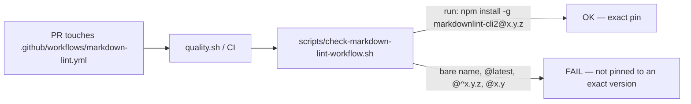

# Pin the CI install of `markdownlint-cli2` to an exact version (Issue #639)

## Summary

`.github/workflows/markdown-lint.yml` installed the linter with
`npm install -g markdownlint-cli2` — no version. The job therefore executed
whatever the registry served at that moment: a hijacked or malicious release
would have run on the runner with the workflow's `GITHUB_TOKEN` in scope, the
instant it was published and with no embargo. `uses:` SHA-pinning does not
reach inside a `run:` block, so nothing in the existing pin policy covered this
step.

The install is now pinned to `markdownlint-cli2@0.23.3`, and
`scripts/check-markdown-lint-workflow.sh` gained a rule (5b) that fails the
gate if the pin ever floats again — rejecting a bare name, a dist-tag
(`@latest`) and any range (`@^1.2.3`, `@1.2`, `@*`, `@>=1.2.3`), all of which
resolve at install time, while accepting an exact pre-release such as
`@0.24.0-rc.1`, which is immutable.

The issue's suggested Renovate `customManagers` entry was **not** added: this
repository has no Renovate configuration (no `renovate.json` / `.renovaterc`),
so the entry would have had nowhere to live. The pin is kept current the way
every other pin in this repo is — a deliberate edit to the workflow YAML,
guarded by the checker above.

`0.23.3` was published 2026-09-20, more than 24 hours before this change, so the
external-dependency quarantine floor is satisfied. It carries the same
`markdownlint` core (0.41.1) as the 0.23.2 build already in the container, so
the rule set CI applies is unchanged.

Closes #639.



## Evidence

This is a CI/CLI change with no web interface, so no screenshot applies. The
evidence is the checker's own output and the linter run.

The guard script, run against the real repository workflow after the pin
(8 rules, all `OK`):

```text
OK   .github/workflows/markdown-lint.yml: triggers on pull_request
OK   .github/workflows/markdown-lint.yml: permissions block grants only contents: read
OK   .github/workflows/markdown-lint.yml: actions/checkout pinned to a numeric major or 40-char SHA
OK   .github/workflows/markdown-lint.yml: actions/setup-node pinned to a numeric major
OK   .github/workflows/markdown-lint.yml: markdownlint-cli2 install step present
OK   .github/workflows/markdown-lint.yml: markdownlint-cli2 install pinned to an exact version
OK   .github/workflows/markdown-lint.yml: markdownlint-cli2 invoked
OK   .github/workflows/markdown-lint.yml: no push trigger — the lint workflow gates the PR only (Issue #371)
```

The pinned version was installed locally and run against the tree, so the
version CI will now fetch is the one the gate was verified against:

```text
markdownlint-cli2 v0.23.3 (markdownlint v0.41.1)
Linting: 195 files
Summary: 0 issues in 0 files
```

`actionlint .github/workflows/markdown-lint.yml` is clean, and the full
`./quality.sh` gate passed end to end after the final edit.

## Test Plan

`tests/scripts/markdown_lint_workflow.bats` — 18 tests, all passing. Three are
new, and each was observed failing against the unpinned checker before the rule
landed:

- `fails when the markdownlint-cli2 install carries no version pin (Issue #639)`
  — the bare `npm install -g markdownlint-cli2` the issue reports.
- `fails when the markdownlint-cli2 install uses a floating spec (Issue #639)`
  — table-driven over `latest`, `^0.23.3`, `~0.23.3`, `>=0.23.3`, `*` and the
  partial `0.23`; every one resolves at install time and must be rejected.
- `accepts an exact pre-release pin (Issue #639)` — `@0.24.0-rc.1` is exact and
  immutable, so the rule must not reject it.

Two existing tests were updated rather than replaced: the canonical fixture now
carries the pinned install (it is the shape the workflow must have), and
`passes on the canonical fixture` asserts 8 `OK` markers instead of 7 because
the new rule is evaluated separately from the install-present rule. No test was
removed or disabled.
