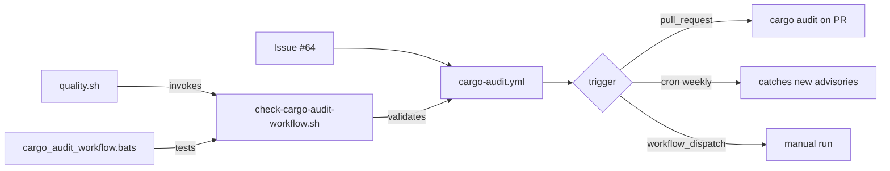

## Summary

Added a standalone Cargo Security Audit workflow at
`.github/workflows/cargo-audit.yml` that runs `cargo audit` on every pull
request, on a weekly cron schedule (`0 6 * * 1`), and on demand via
`workflow_dispatch`. The reusable `security.yml` already runs `cargo
audit` on PRs, but it has no schedule — so a freshly published RustSec
advisory against a pinned dependency would only surface on the next
merge. The weekly schedule closes that gap.

The workflow is hardened to match the rest of `.github/workflows/`:
least-privilege permissions (`contents: read`), pinned action majors
(`actions/checkout@v5`, `dtolnay/rust-toolchain@stable`), and a
`concurrency` group so scheduled / dispatch runs do not pile up.

Hardening rules are encoded in a dedicated validator
(`scripts/check-cargo-audit-workflow.sh`) wired into `quality.sh`, so any
future regression in the workflow YAML fails the local gate before CI.

Closes #64.

## Evidence

This is a pure CI / shell change with no UI surface. Verification:

- New BATS suite `tests/scripts/cargo_audit_workflow.bats` (11 tests)
  drives the validator end-to-end against synthetic fixtures and the
  real workflow file.
- `./quality.sh` passes locally with the new validator wired in
  (shellcheck, all workflow validators, codespell, bats, cargo-deny,
  clippy, check, build, test, doc, release build).

## Test Plan

- New `tests/scripts/cargo_audit_workflow.bats` (11 tests) covering:
  - canonical fixture passes
  - missing `pull_request` trigger fails
  - missing `schedule` trigger fails
  - missing `permissions: contents: read` block fails
  - unpinned `actions/checkout` fails
  - missing `dtolnay/rust-toolchain` fails
  - missing `cargo audit` invocation fails
  - `rustsec/audit-check` action accepted as the audit entry point
  - missing workflow file reports an error
  - unknown flag prints usage and exits non-zero
  - real repository workflow satisfies every rule
- Existing `scripts/check-workflow-action-versions.sh` and
  `scripts/check-workflow-paths.sh` were re-run to confirm the new
  workflow does not regress the Node 24 policy or the NEAT-AI-core path
  strategy (cargo-audit does not check out the sibling so the path
  validator correctly skips it).
- `./quality.sh` passes end-to-end on a fresh checkout with the
  `NEAT-AI-core` sibling cloned.
