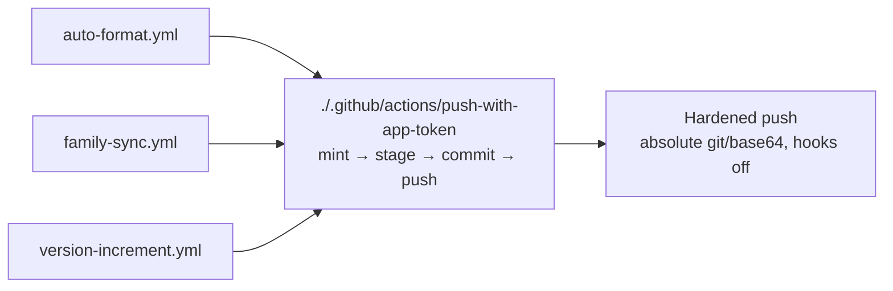

# PR summary — stSoftwareAU/NEAT-AI-scorer#641

## Summary

`auto-format.yml`, `family-sync.yml` and `version-increment.yml` each carried
their own copy of the same security-sensitive block: mint a short-lived
repo-scoped installation token with `actions/create-github-app-token`, fall
back through `ACTIONS_PUSH` / `GITHUB_TOKEN`, then commit and push with the
hardened absolute-path `git` / `base64` invocation. Nothing tied the three
copies together, so a future hardening fix — or a regression — applied to one
was easy to miss in the other two.

The sequence now has one home,
[`.github/actions/push-with-app-token/action.yml`](../../../.github/actions/push-with-app-token/action.yml),
with the branch, commit message, staged paths and rebase flag as inputs. Both
guards follow the logic there: `scripts/check-push-step-hardening.sh` and
`scripts/check-bot-push-token.sh` now validate the action itself and accept a
workflow that delegates to it, while a workflow that neither hardens a push
step of its own nor delegates still fails the gate — an unvalidated push path
is never reported green. A delegating workflow is still held to the one rule
that stays its own: handing the action a `fallback-token` of
`secrets.ACTIONS_PUSH || secrets.GITHUB_TOKEN`, since a composite action cannot
read the `secrets` context.

Closes #641.

### Not landed here — the three workflow call sites (needs a maintainer)

The automation worker's credentials carry no `workflow` OAuth scope, so it
cannot modify anything under `.github/workflows/`
([Human escalation](../../../CONTRIBUTING.md#human-escalation)). The three
workflows therefore still carry their inline copies, which keep passing both
guards unchanged. A maintainer completes the consolidation by replacing each
`Mint repo-scoped push token` + `Commit and push …` pair with a single step —
the exact YAML for all three is in the README section added here and on the
issue. The job-level `PUSH_APP_CONFIGURED` env flag goes away with it: the
action decides for itself whether the App is configured, from whether both
credential inputs are non-empty.

## Evidence

Backend/CI change with no web interface to screenshot. Evidence is the guard
and test output:

- `./quality.sh` — full gate, passed (shellcheck, every `check-*.sh` guard, the
  691-test `bats` suite, cargo-deny, fmt, clippy, check, build, test, doc,
  release build).
- `./scripts/check-push-step-hardening.sh` — 20 `OK` lines: the three shipped
  workflows **and** `.github/actions/push-with-app-token/action.yml` pass all
  five hardening rules (absolute `git`/`base64`, hooks disabled on every
  invocation, no repository script beside the credential).
- `./scripts/check-bot-push-token.sh` — 20 `OK` lines: the action's mint step is
  SHA-pinned, `permission-contents: write`, `repositories:`-scoped and sets no
  `owner:`.
- `bats tests/scripts` — 691 passed, 0 failed.

## Test Plan

Tests were written first and observed failing against the unimplemented action
and guards (6 red), then green after the change.

- `tests/scripts/push_step_hardening.bats`
  - `passes a workflow that delegates its push to the shared hardened action`
    — a caller holding no credential of its own validates cleanly.
  - `fails when the shared action's push step is not hardened` — an
    unhardened composite action fails, so delegation cannot launder the block
    past the gate.
  - `shipped workflows and the shared push action validate cleanly` — extended
    to assert the action is in the default target set.
- `tests/scripts/bot_push_token.bats`
  - `passes a workflow that delegates the push to the shared action`.
  - `fails when a delegating workflow drops the ACTIONS_PUSH fallback chain`.
  - `fails when a delegating workflow passes no fallback-token at all`.
  - `shipped workflows and the shared push action validate cleanly` — extended
    to assert the action is in the default target set.

Existing tests in both suites are unchanged in substance; only the two
"shipped … validate cleanly" cases gained an assertion (and their titles were
updated to match).
