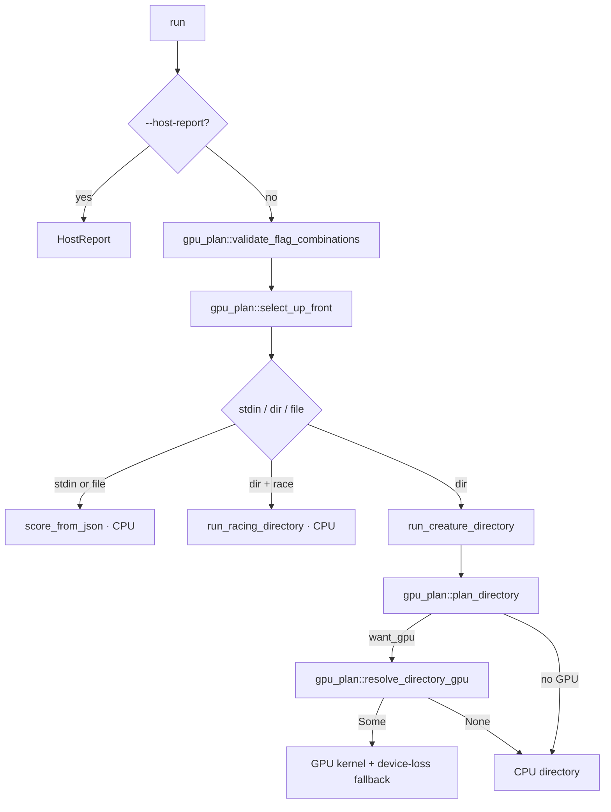

## Summary

Splits `rust_scorer/src/cli.rs::run()` along its concern boundaries, so a
GPU-, cost- or racing-only change no longer edits the ~260-line CLI entry
point. Closes #648.

- New `rust_scorer/src/cli/gpu_plan.rs` (a `cli` submodule) owns the decisions
  `run()` used to inline:
  - `validate_flag_combinations` — `--race-stdio` conflicts (NEAT-AI#3928) and
    the `--gpu on` + CPU-only cost guard (#121/#339/#316).
  - `select_up_front` — `--gpu on` adapter selection behind the #583 panic guard;
    `off`/`auto` defer (#180).
  - `plan_directory` → `DirectoryGpuPlan { want_gpu, notes }` — the
    cost/topology routing and its `[gpu] auto fallback …` notes (#83, #205,
    #317, #467). Never creates a device.
  - `resolve_directory_gpu` — the `auto` pre-flight + deferred adapter
    selection (#180, #583).
- `run()` now sequences host-report → mode/sample → plan → stdin / directory /
  single-file dispatch; the directory GPU/CPU run moved to
  `run_creature_directory`.

Behaviour is unchanged: the same checks run in the same order with the same
messages. The only difference is that the cost fallback note is printed after
the topology probe. The probe only runs for GPU-supported costs, and the cost
note only appears for costs that are not GPU-supported, so the two never
happen in the same run.

## Evidence

CLI/backend refactor with no web UI. Before the split, the routing could only
be tested through the whole `run()`. The new `gpu_plan` tests call it directly
and need no GPU. The screenshot is their run, rendered with the container's
headless Chromium (the Playwright MCP tools were not exposed to this session):

## Test Plan

- Added `rust_scorer/src/cli/gpu_plan.rs` tests:
  `validate_accepts_every_honourable_combination`,
  `validate_refuses_race_stdio_with_creature_stdin`,
  `validate_refuses_race_stdio_with_gpu_on`,
  `validate_refuses_gpu_on_with_cpu_only_cost`,
  `select_up_front_defers_for_off_and_auto`,
  `plan_off_and_on_ignore_topology`,
  `plan_auto_cpu_only_cost_falls_back_with_cost_note`,
  `plan_auto_all_private_pool_wants_gpu_silently`,
  `plan_auto_deep_scratch_pool_falls_back_with_topology_note`,
  `resolve_directory_gpu_without_selection_is_cpu`.
- The existing `cli` unit tests and the `racing_stdio_cli` integration suite
  pass without modification. Only one test's doc comment changed, to point at
  where the guard now lives.
- `./quality.sh < /dev/null` passed after the final edit ("All quality checks passed!").
- `CHANGELOG.md` gains one `### Changed` entry.
