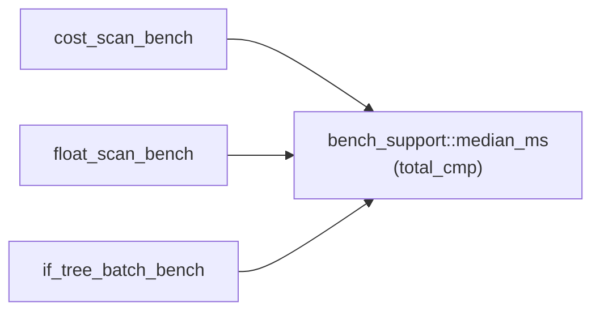

# PR Summary — Issue #649

## Summary

Closes #649

Three bench binaries each reimplemented the median helper. Two of those copies
sorted with `partial_cmp(..).unwrap()`, so a `NaN` timing would panic the
bench. There is now one shared helper,
`rust_scorer::bench_support::median_ms(&mut [f64]) -> f64`:

- It sorts with `f64::total_cmp`, so `NaN` is ordered rather than panicking.
- It panics with a clear message on an empty slice. Before this change, the
  two `partial_cmp` copies underflowed on `--runs 0`.

- [x] `rust_scorer/src/bench_support.rs`: the shared helper and its unit tests
- [x] `cost_scan_bench.rs` and `float_scan_bench.rs` now call it; their local copies are removed
- [x] `if_tree_batch_bench.rs` sorts a clone, so `times_ms` stays in run order for the report
- [x] `CHANGELOG.md` has an `[Unreleased]` entry

## Evidence

This is a refactor of the CLI bench binaries with no UI, so the evidence is the
`bench_support` unit tests below. All three binaries still build under
`cargo clippy --all-targets -- -D warnings`.

## Test Plan

- `cargo test --lib bench_support`:
  - `odd_length_returns_middle_value`
  - `even_length_returns_mean_of_middle_pair`
  - `single_value_is_its_own_median`
  - `sorts_the_slice_in_place`
  - `nan_timing_does_not_panic`
  - `identical_values_return_that_value`
  - `empty_slice_panics_loudly`
- `./quality.sh` (full gate)
