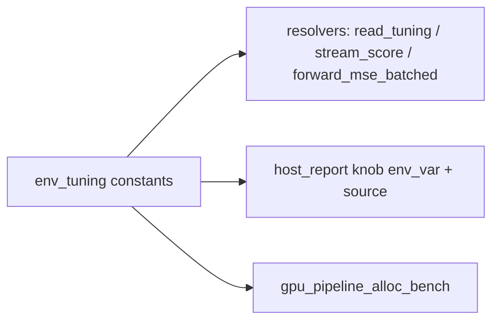

# PR Summary — Issue #650

## Summary

Closes #650.

The four numeric tuning env-var names were repeated as bare string literals:
each resolver read one, and `--host-report` named each twice (the
`env_source_*(…)` call and the `env_var: Some(…)` field). A typo in any copy
would have made the report describe a different variable from the one that is
actually read.

- `rust_scorer/src/env_tuning.rs` now holds one `pub const` per variable:
  `NEAT_SCORER_READ_BYTES`, `NEAT_SCORER_GPU_SCRATCH_BYTES`,
  `NEAT_SCORER_ACTIVATION_THREADS` and `NEAT_SCORER_FILE_THREADS`.
- Every non-test literal now references those constants:
  - `read_tuning.rs`
  - `stream_score.rs`
  - `gpu/forward_mse_batched.rs` (the scratch-budget resolver, which the issue did not list)
  - `host_report.rs`
  - `bin/gpu_pipeline_alloc_bench.rs`
- The variable names are unchanged, so operators and the integration tests are
  unaffected.

## Evidence

This is a backend refactor with no visual surface, so the evidence is the tests.

- `env_tuning::tests::env_var_name_constants_match_the_documented_names` pins each constant to its documented name.
- `host_report::tests::overridable_knobs_name_the_shared_env_var_constants` asserts that every overridable knob's `env_var` is the shared constant.

TDD red step: before the constants existed, both tests failed to compile (`E0425` / `E0433`).

## Test Plan

- [x] `cargo fmt --check`
- [x] `cargo clippy --all-targets -- -D warnings`
- [x] `cargo test --lib -- env_tuning host_report` (18 passed), plus the `env_tuning` doctest
- [x] `./quality.sh` — all checks passed
- [x] `CHANGELOG.md` `[Unreleased]` → `### Changed` entry
