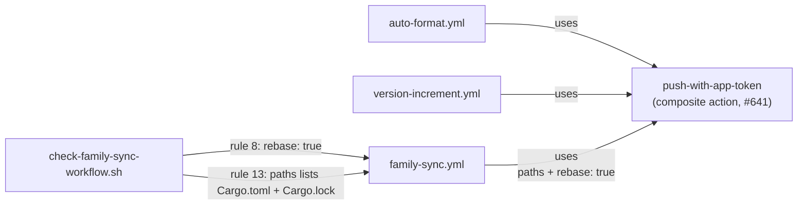

# PR Summary — Issue #656

## Summary

Closes #656

Issue #641 moved the mint-token-then-push sequence into one composite action,
`.github/actions/push-with-app-token`. `auto-format.yml`, `family-sync.yml` and
`version-increment.yml` still carry their own copies of that sequence. Each
copy should become one `uses: ./.github/actions/push-with-app-token` step.

The worker has no `workflow` OAuth scope, so it cannot push changes under
`.github/workflows/` (see
[CONTRIBUTING.md#human-escalation](../../../CONTRIBUTING.md#human-escalation)).
This PR does the part the worker can do and gets the gate ready for the swap:

- **The family-sync guard now accepts a delegated push.**
  `scripts/check-family-sync-workflow.sh` rule 8 (rebase before push) and
  rule 13 (stage the pin and the lock) previously only read a `run:` script.
  Delegating the push would have failed the gate. They now also accept a step
  that delegates to `push-with-app-token`:
  - rule 8 passes when that step has `rebase: "true"`;
  - rule 13 passes when that step's `paths:` lists both
    `rust_scorer/Cargo.toml` and `Cargo.lock`.
- **Rule 13 no longer exits silently.** When no `git add` line was found, its
  `grep` stopped the script under `pipefail` without printing a verdict. It now
  prints the failure message.
- **Scope of the new checks.** A `rebase` or `paths` key on any other step
  does not count, and neither does a key that only appears in a comment. A
  `paths` list missing either file still fails, and so does no `paths` at all,
  because an empty `paths` means `commit -am`.

`check-push-step-hardening.sh` and `check-bot-push-token.sh` already accept a
delegated step (Issue #641).

- [x] `scripts/check-family-sync-workflow.sh`: rules 8 and 13 accept a delegated push
- [x] `tests/scripts/family_sync_workflow.bats`: 8 new tests (18–25)
- [x] `README.md` and `CHANGELOG.md` updated
- [ ] **Maintainer:** apply the workflow wiring below (the worker cannot push `.github/workflows/`)

## Maintainer wiring (needs `workflow` scope)

Apply the patch below to the three workflows. In each one it does three things:

1. deletes the job-level `PUSH_APP_CONFIGURED` env;
2. deletes the `Mint repo-scoped push token` step;
3. replaces the `Commit and push …` `run:` step with a
   `push-with-app-token` step.

Each step keeps its existing `if:` condition. Each call site passes only what
is specific to it:

| Workflow | `commit-message` | `paths` | `rebase` |
| --- | --- | --- | --- |
| `auto-format.yml` | `steps.detect.outputs.commit_message` | *(empty → `commit -am`)* | default `false` |
| `version-increment.yml` | the auto-bump message | `rust_scorer/Cargo.toml` | default `false` |
| `family-sync.yml` | the family-sync message | the two scripts, `rust_scorer/Cargo.toml` and `Cargo.lock` | `"true"` |

Each step also passes the same credentials:

```yaml
          branch: ${{ github.event.pull_request.head.ref }}
          app-client-id: ${{ secrets.ACTIONS_PUSH_APP_CLIENT_ID }}
          app-private-key: ${{ secrets.ACTIONS_PUSH_APP_PRIVATE_KEY }}
          fallback-token: ${{ secrets.ACTIONS_PUSH || secrets.GITHUB_TOKEN }}
```

Full patch, from the repository root, against `Develop` at `63296dd`:

```diff
diff --git a/.github/workflows/auto-format.yml b/.github/workflows/auto-format.yml
index 97479c7..f1912e6 100644
--- a/.github/workflows/auto-format.yml
+++ b/.github/workflows/auto-format.yml
@@ -44,14 +44,6 @@ jobs:
     # Skip forks — neither GITHUB_TOKEN nor ACTIONS_PUSH can push to a
     # fork's branch. Formatting on fork PRs is the author's responsibility.
     if: github.event.pull_request.head.repo.full_name == github.repository
-    env:
-      # The `secrets` context is unavailable in a step-level `if:`, so the
-      # push App's configured/not-configured state is hoisted to a job-level
-      # env flag (Issue #498). Until an organisation admin creates the App and
-      # stores its secrets this is 'false': the mint step is skipped and the
-      # push falls back to ACTIONS_PUSH / GITHUB_TOKEN.
-      PUSH_APP_CONFIGURED: ${{ secrets.ACTIONS_PUSH_APP_CLIENT_ID != '' && secrets.ACTIONS_PUSH_APP_PRIVATE_KEY != '' }}
-
     steps:
       - name: Checkout PR branch
         uses: actions/checkout@93cb6efe18208431cddfb8368fd83d5badbf9bfd  # v5
@@ -101,52 +93,15 @@ jobs:
             echo "AUTO_FORMAT_COMMIT_MESSAGE_EOF"
           } >>"$GITHUB_OUTPUT"
 
-      # Mint a short-lived installation token scoped to `contents: write` on
-      # THIS repository only (Issue #498). It expires within the hour and the
-      # action's post step revokes it, so a token that leaks reaches nothing
-      # beyond this repository — unlike the long-lived organisation-level
-      # ACTIONS_PUSH PAT, which carries write access to every org repo. The
-      # push stays attributed to a trusted non-GITHUB_TOKEN identity, so the
-      # Issue #435 behaviour is preserved.
-      - name: Mint repo-scoped push token
-        id: push-token
-        if: steps.detect.outputs.changed == 'true' && env.PUSH_APP_CONFIGURED == 'true'
-        uses: actions/create-github-app-token@bcd2ba49218906704ab6c1aa796996da409d3eb1  # v3
-        with:
-          client-id: ${{ secrets.ACTIONS_PUSH_APP_CLIENT_ID }}
-          private-key: ${{ secrets.ACTIONS_PUSH_APP_PRIVATE_KEY }}
-          repositories: ${{ github.event.repository.name }}
-          permission-contents: write
-
-      # Push with the minted repo-scoped token, falling back to the org-level
-      # ACTIONS_PUSH PAT (then GITHUB_TOKEN) until the App exists, so the
-      # resulting `synchronize` event is attributed to a trusted identity and
-      # PR checks run without the "Awaiting approval / Approve and run" gate
-      # that GITHUB_TOKEN bot pushes create (Issue #435). The credential is
-      # passed via env + a per-command extraheader so it never lives in
-      # `.git/config` (mirrors NEAT-AI update-package-version.yml).
-      #
-      # Earlier steps in this job run PR-head code, so this step is hardened
-      # against in-job poisoning of the PAT (Issue #497): git and base64 are
-      # pinned to absolute paths (immune to a $GITHUB_ENV PATH override —
-      # base64 is piped $GH_PAT on stdin), every git invocation disables
-      # repository hooks (a planted `.git/hooks/pre-commit` would otherwise run
-      # with $GH_PAT in scope), and no repository script is executed here.
-      # Enforced by `scripts/check-push-step-hardening.sh`.
+      # Mint a repo-scoped App token (falling back to ACTIONS_PUSH, then
+      # GITHUB_TOKEN) and commit and push via the shared, hardened
+      # push-with-app-token action (Issues #435, #497, #498, #641, #656).
       - name: Commit and push rustfmt / lock sync fixes
         if: steps.detect.outputs.changed == 'true'
-        env:
-          PR_HEAD_REF: ${{ github.event.pull_request.head.ref }}
-          COMMIT_MESSAGE: ${{ steps.detect.outputs.commit_message }}
-          GH_PAT: ${{ steps.push-token.outputs.token || secrets.ACTIONS_PUSH || secrets.GITHUB_TOKEN }}
-        run: |
-          set -euo pipefail
-          GIT=/usr/bin/git
-          BASE64=/usr/bin/base64
-          "$GIT" -c core.hooksPath=/dev/null config user.name "github-actions[bot]"
-          "$GIT" -c core.hooksPath=/dev/null config user.email "41898282+github-actions[bot]@users.noreply.github.com"
-          "$GIT" -c core.hooksPath=/dev/null commit -am "$COMMIT_MESSAGE"
-          AUTH_HEADER="AUTHORIZATION: basic $(printf 'x-access-token:%s' "$GH_PAT" | "$BASE64" -w0)"
-          "$GIT" -c core.hooksPath=/dev/null \
-            -c http.https://github.com/.extraheader="$AUTH_HEADER" \
-            push origin "HEAD:$PR_HEAD_REF"
+        uses: ./.github/actions/push-with-app-token
+        with:
+          branch: ${{ github.event.pull_request.head.ref }}
+          commit-message: ${{ steps.detect.outputs.commit_message }}
+          app-client-id: ${{ secrets.ACTIONS_PUSH_APP_CLIENT_ID }}
+          app-private-key: ${{ secrets.ACTIONS_PUSH_APP_PRIVATE_KEY }}
+          fallback-token: ${{ secrets.ACTIONS_PUSH || secrets.GITHUB_TOKEN }}
diff --git a/.github/workflows/family-sync.yml b/.github/workflows/family-sync.yml
index 6c812c3..6580210 100644
--- a/.github/workflows/family-sync.yml
+++ b/.github/workflows/family-sync.yml
@@ -72,13 +72,6 @@ jobs:
     # Never attempt to push onto a fork's branch — a fork PR keeps whatever
     # copy it carries and the maintainer resolves it on merge.
     if: github.event.pull_request.head.repo.full_name == github.repository
-    env:
-      # The `secrets` context is unavailable in a step-level `if:`, so the
-      # push App's configured/not-configured state is hoisted to a job-level
-      # env flag (Issue #498). Until an organisation admin creates the App and
-      # stores its secrets this is 'false': the mint step is skipped and the
-      # push falls back to ACTIONS_PUSH / GITHUB_TOKEN.
-      PUSH_APP_CONFIGURED: ${{ secrets.ACTIONS_PUSH_APP_CLIENT_ID != '' && secrets.ACTIONS_PUSH_APP_PRIVATE_KEY != '' }}
     steps:
       - name: Checkout PR branch
         uses: actions/checkout@93cb6efe18208431cddfb8368fd83d5badbf9bfd  # v5
@@ -129,60 +122,27 @@ jobs:
             echo "changed=true" >>"$GITHUB_OUTPUT"
           fi
 
-      # Mint a short-lived installation token scoped to `contents: write` on
-      # THIS repository only (Issue #498). It expires within the hour and the
-      # action's post step revokes it, so a token that leaks reaches nothing
-      # beyond this repository — unlike the long-lived organisation-level
-      # ACTIONS_PUSH PAT, which carries write access to every org repo.
-      - name: Mint repo-scoped push token
-        id: push-token
-        if: steps.sync.outputs.changed == 'true' && env.PUSH_APP_CONFIGURED == 'true'
-        uses: actions/create-github-app-token@bcd2ba49218906704ab6c1aa796996da409d3eb1  # v3
-        with:
-          client-id: ${{ secrets.ACTIONS_PUSH_APP_CLIENT_ID }}
-          private-key: ${{ secrets.ACTIONS_PUSH_APP_PRIVATE_KEY }}
-          repositories: ${{ github.event.repository.name }}
-          permission-contents: write
-
-      # Push with the minted repo-scoped token, falling back to the org-level
-      # ACTIONS_PUSH PAT (then GITHUB_TOKEN) until the App exists, so the
-      # resulting `synchronize` event is attributed to a trusted identity and
-      # PR checks run without the "Awaiting approval / Approve and run" gate
-      # that GITHUB_TOKEN bot pushes create (Issue #435). The branch is rebased
-      # onto its remote head first so a commit pushed while this job ran is
-      # never clobbered.
-      #
-      # Earlier steps in this job run PR-head code, so this step is hardened
-      # against in-job poisoning of the PAT (Issue #497): git and base64 are
-      # pinned to absolute paths (immune to a $GITHUB_ENV PATH override —
-      # base64 is piped $GH_PAT on stdin), every git invocation disables
-      # repository hooks (a planted `.git/hooks/pre-commit` would otherwise run
-      # with $GH_PAT in scope), and no repository script is executed here.
-      # Enforced by `scripts/check-push-step-hardening.sh`.
+      # Mint a repo-scoped App token (falling back to ACTIONS_PUSH, then
+      # GITHUB_TOKEN) and commit and push via the shared, hardened
+      # push-with-app-token action (Issues #435, #497, #498, #641, #656).
+      # The branch is rebased onto its remote head first so a commit pushed
+      # while this job ran is never clobbered.
       - name: Commit and push the refreshed scripts and moved pin
         if: steps.sync.outputs.changed == 'true'
-        env:
-          PR_HEAD_REF: ${{ github.event.pull_request.head.ref }}
-          GH_PAT: ${{ steps.push-token.outputs.token || secrets.ACTIONS_PUSH || secrets.GITHUB_TOKEN }}
-        run: |
-          set -euo pipefail
-          GIT=/usr/bin/git
-          BASE64=/usr/bin/base64
-          "$GIT" -c core.hooksPath=/dev/null config user.name "github-actions[bot]"
-          "$GIT" -c core.hooksPath=/dev/null config user.email "41898282+github-actions[bot]@users.noreply.github.com"
-          # `-A` so a recreated (untracked) canonical script is staged too, and
-          # explicit paths so nothing else in the tree can ride along.
-          "$GIT" -c core.hooksPath=/dev/null add -A -- \
-            scripts/runlib.sh scripts/family-pins.sh \
-            rust_scorer/Cargo.toml Cargo.lock
-          "$GIT" -c core.hooksPath=/dev/null commit -m "chore: sync canonical family scripts and move the neat-core pin
+        uses: ./.github/actions/push-with-app-token
+        with:
+          branch: ${{ github.event.pull_request.head.ref }}
+          commit-message: |-
+            chore: sync canonical family scripts and move the neat-core pin
 
-          Closes part of #629, #630 — canonical family-script sync and the
-          neat-core release pin refresh."
-          AUTH_HEADER="AUTHORIZATION: basic $(printf 'x-access-token:%s' "$GH_PAT" | "$BASE64" -w0)"
-          "$GIT" -c core.hooksPath=/dev/null \
-            -c http.https://github.com/.extraheader="$AUTH_HEADER" \
-            pull --rebase origin "$PR_HEAD_REF"
-          "$GIT" -c core.hooksPath=/dev/null \
-            -c http.https://github.com/.extraheader="$AUTH_HEADER" \
-            push origin "HEAD:$PR_HEAD_REF"
+            Closes part of #629, #630 — canonical family-script sync and the
+            neat-core release pin refresh.
+          paths: |
+            scripts/runlib.sh
+            scripts/family-pins.sh
+            rust_scorer/Cargo.toml
+            Cargo.lock
+          rebase: "true"
+          app-client-id: ${{ secrets.ACTIONS_PUSH_APP_CLIENT_ID }}
+          app-private-key: ${{ secrets.ACTIONS_PUSH_APP_PRIVATE_KEY }}
+          fallback-token: ${{ secrets.ACTIONS_PUSH || secrets.GITHUB_TOKEN }}
diff --git a/.github/workflows/version-increment.yml b/.github/workflows/version-increment.yml
index bd33445..3802582 100644
--- a/.github/workflows/version-increment.yml
+++ b/.github/workflows/version-increment.yml
@@ -86,13 +86,6 @@ jobs:
     if: needs.guard.outputs.should_bump == 'true'
     runs-on: ubuntu-latest
     timeout-minutes: 10
-    env:
-      # The `secrets` context is unavailable in a step-level `if:`, so the
-      # push App's configured/not-configured state is hoisted to a job-level
-      # env flag (Issue #498). Until an organisation admin creates the App and
-      # stores its secrets this is 'false': the mint step is skipped and the
-      # push falls back to ACTIONS_PUSH / GITHUB_TOKEN.
-      PUSH_APP_CONFIGURED: ${{ secrets.ACTIONS_PUSH_APP_CLIENT_ID != '' && secrets.ACTIONS_PUSH_APP_PRIVATE_KEY != '' }}
     steps:
       - name: Checkout PR branch
         uses: actions/checkout@93cb6efe18208431cddfb8368fd83d5badbf9bfd  # v5
@@ -128,55 +121,19 @@ jobs:
             echo "changed=true" >>"$GITHUB_OUTPUT"
           fi
 
-      # Mint a short-lived installation token scoped to `contents: write` on
-      # THIS repository only (Issue #498). It expires within the hour and the
-      # action's post step revokes it, so a token that leaks reaches nothing
-      # beyond this repository — unlike the long-lived organisation-level
-      # ACTIONS_PUSH PAT, which carries write access to every org repo. The
-      # push stays attributed to a trusted non-GITHUB_TOKEN identity, so the
-      # Issue #435 behaviour is preserved.
-      - name: Mint repo-scoped push token
-        id: push-token
-        if: steps.bump.outputs.changed == 'true' && env.PUSH_APP_CONFIGURED == 'true'
-        uses: actions/create-github-app-token@bcd2ba49218906704ab6c1aa796996da409d3eb1  # v3
-        with:
-          client-id: ${{ secrets.ACTIONS_PUSH_APP_CLIENT_ID }}
-          private-key: ${{ secrets.ACTIONS_PUSH_APP_PRIVATE_KEY }}
-          repositories: ${{ github.event.repository.name }}
-          permission-contents: write
-
-      # Push with the minted repo-scoped token, falling back to the org-level
-      # ACTIONS_PUSH PAT (then GITHUB_TOKEN) until the App exists, so the
-      # resulting `synchronize` event is attributed to a trusted identity and
-      # PR checks run without the "Awaiting approval / Approve and run" gate
-      # that GITHUB_TOKEN bot pushes create (Issue #435). The credential is
-      # passed via env + a per-command extraheader so it never lives in
-      # `.git/config` (mirrors NEAT-AI update-package-version.yml).
-      #
-      # Earlier steps in this job run PR-head code, so this step is hardened
-      # against in-job poisoning of the PAT (Issue #497): git and base64 are
-      # pinned to absolute paths (immune to a $GITHUB_ENV PATH override —
-      # base64 is piped $GH_PAT on stdin), every git invocation disables
-      # repository hooks (a planted `.git/hooks/pre-commit` would otherwise run
-      # with $GH_PAT in scope), and no repository script is executed here.
-      # Enforced by `scripts/check-push-step-hardening.sh`.
+      # Mint a repo-scoped App token (falling back to ACTIONS_PUSH, then
+      # GITHUB_TOKEN) and commit and push via the shared, hardened
+      # push-with-app-token action (Issues #435, #497, #498, #641, #656).
       - name: Commit and push bump
         if: steps.bump.outputs.changed == 'true'
-        env:
-          PR_HEAD_REF: ${{ github.event.pull_request.head.ref }}
-          NEXT_VERSION: ${{ needs.guard.outputs.next_version }}
-          GH_PAT: ${{ steps.push-token.outputs.token || secrets.ACTIONS_PUSH || secrets.GITHUB_TOKEN }}
-        run: |
-          set -euo pipefail
-          GIT=/usr/bin/git
-          BASE64=/usr/bin/base64
-          "$GIT" -c core.hooksPath=/dev/null config user.name "github-actions[bot]"
-          "$GIT" -c core.hooksPath=/dev/null config user.email "41898282+github-actions[bot]@users.noreply.github.com"
-          "$GIT" -c core.hooksPath=/dev/null add rust_scorer/Cargo.toml
-          "$GIT" -c core.hooksPath=/dev/null commit -m "chore: auto-bump rust_scorer version to ${NEXT_VERSION}
+        uses: ./.github/actions/push-with-app-token
+        with:
+          branch: ${{ github.event.pull_request.head.ref }}
+          commit-message: |-
+            chore: auto-bump rust_scorer version to ${{ needs.guard.outputs.next_version }}
 
-          Closes part of #20 — guarded auto-version increment."
-          AUTH_HEADER="AUTHORIZATION: basic $(printf 'x-access-token:%s' "$GH_PAT" | "$BASE64" -w0)"
-          "$GIT" -c core.hooksPath=/dev/null \
-            -c http.https://github.com/.extraheader="$AUTH_HEADER" \
-            push origin "HEAD:$PR_HEAD_REF"
+            Closes part of #20 — guarded auto-version increment.
+          paths: rust_scorer/Cargo.toml
+          app-client-id: ${{ secrets.ACTIONS_PUSH_APP_CLIENT_ID }}
+          app-private-key: ${{ secrets.ACTIONS_PUSH_APP_PRIVATE_KEY }}
+          fallback-token: ${{ secrets.ACTIONS_PUSH || secrets.GITHUB_TOKEN }}
```

After applying the patch, run `./quality.sh`. The family-sync, push-hardening
and bot-push-token guards should all pass against the delegated workflows.

## Evidence

This change only affects the gate, so the evidence is the guard's own output
and its bats suite. There is no UI to screenshot.



- `bats tests/scripts/family_sync_workflow.bats` passes 25/25. That includes
  the 8 new cases, and they are covered in both directions:
  - **should pass:** a delegated push;
  - **should fail:**
    - no `rebase`, `rebase: false`, or a rebase only mentioned in a comment;
    - `rebase` set on a different step;
    - `paths` missing `Cargo.lock`;
    - no `paths` at all;
    - no `git add` line (fails loud).
- With the patch above applied locally, `./scripts/check-family-sync-workflow.sh`
  prints an OK line for every rule. It still passes against the shipped
  `run:`-based workflow.

## Test Plan

- [x] `bats tests/scripts/family_sync_workflow.bats` — 25/25
- [x] `shellcheck -x scripts/check-family-sync-workflow.sh` — clean
- [x] `./quality.sh` — full local gate
- [ ] Maintainer applies the wiring patch; CI stays green on the follow-up push

## Security self-check

- [x] No secrets, hidden files or `.github/workflows/` changes staged
- [x] The guard only reads workflow YAML; no new shell, network or `eval` surface
- [x] The wiring patch keeps SHA pins, least-privilege `permissions:` and the #497 hardening (now centralised in the composite action)
