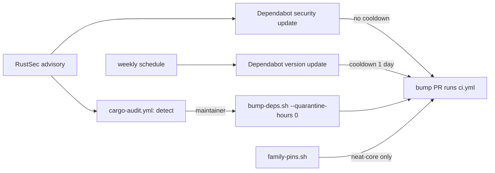

# Turn on a Dependabot cargo update channel (Issue #658)

## Summary

Closes #658

Nothing in the repository opened a dependency-bump PR on its own:

- `bump-deps.sh` ran only when the worker happened to prepare an unrelated
  PR. #105 removed its weekly schedule.
- `cargo-audit.yml` detects advisories, but does not fix them.
- The emergency path in `SECURITY.md` is manual.

A published fix for a vulnerable crate therefore waited until someone noticed.

This PR takes the issue's cheaper option: a minimal `.github/dependabot.yml`.

- **One `cargo` entry for the workspace root** (`directory: "/"`, where
  `Cargo.lock` lives), on a **weekly** schedule.
- **`cooldown.default-days: 1`** for version updates, which mirrors
  `bump-deps.sh`'s 24-hour quarantine. Dependabot security updates bypass
  cooldown, so advisory fixes are not held back.
- **`neat-core` is ignored**, because `scripts/family-pins.sh` / family-sync
  owns that release-tag pin (Issue #630). A second bumper would race it.

`bump-deps.sh`, `cargo-audit.yml` and the `SECURITY.md` emergency procedure are
unchanged, and the quarantine length is out of scope.

`scripts/check-dependabot-config.sh` is new and wired into `quality.sh`. It
fails the gate if the config loses any of these:

- `version: 2`;
- the cargo entry, or its root directory;
- a daily or weekly schedule;
- a cooldown of at least one day;
- the `neat-core` ignore.

It reports every violation, not only the first.

Docs: README (new *Dependabot update channel* section with a Mermaid flow),
`SECURITY.md`, `AGENTS.md` and `CHANGELOG.md`.

**Maintainer follow-up:** the repository's *Dependabot alerts* and *Dependabot
security updates* settings must be on for security-update PRs to open. That
is a repo setting, so this PR does not change it.

Deliberately left out, to stay in scope: a `github-actions` ecosystem entry,
`groups`, and `target-branch`. The default branch is already `Develop`.

## Evidence



The validator run against the committed config:

```text
OK   .github/dependabot.yml: declares version: 2
OK   .github/dependabot.yml: has an updates entry for package-ecosystem: cargo
OK   .github/dependabot.yml: cargo entry covers the workspace root directory
OK   .github/dependabot.yml: cargo schedule interval is weekly
OK   .github/dependabot.yml: cargo cooldown default-days is 1
OK   .github/dependabot.yml: cargo entry ignores neat-core (owned by scripts/family-pins.sh)
```

## Test Plan

- [x] `tests/scripts/dependabot_config.bats` was written first and ran red,
      because the script was missing. It has 17 tests and now passes.
  - Happy paths: the canonical fixture, the real repo config, a daily
    schedule with single quotes, comments and a sibling ecosystem, and a
    `directories:` list.
  - Each rule broken on its own: version, cargo entry, root directory,
    monthly or missing schedule, missing or zero cooldown, neat-core not
    ignored, and a neat-core ignore on a sibling ecosystem only.
  - A multi-violation config, a missing config, an unknown flag, and `-h`.
- [x] `shellcheck -x -s bash scripts/check-dependabot-config.sh`
- [x] `check-security-policy.sh`, `check-docs-cross-references.sh` and
      `check-readme-ci-alignment.sh` still pass.
- [x] `./quality.sh < /dev/null`
