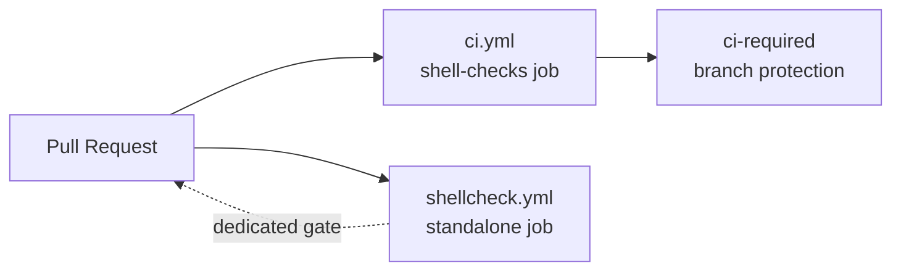

## Summary

Add a standalone ShellCheck Lint workflow (`.github/workflows/shellcheck.yml`)
so workflow-sync tooling can discover a dedicated `shellcheck.yml` by
filename. ShellCheck already runs as the `shell-checks` job inside `ci.yml`;
this dedicated workflow gives feature branches and stacked PRs the same
shell-lint gate without spinning up the full CI graph, mirroring the existing
pattern used for `cargo-quality.yml`, `cargo-audit.yml`, and
`dependency-review.yml`. Closes #67.

The action pinning policy (Issue #24) is enforced: `actions/checkout@v5`
(numeric major) and `ludeeus/action-shellcheck@2.0.0` (tagged release — the
suggested `@master` ref from the issue template is rejected by the validator
because a compromised upstream commit on `master` would silently alter CI
behaviour). `severity:` is declared explicitly so the gate stays
deterministic across upstream default changes.

The validator hooks into `quality.sh` so the workflow's hardening cannot
silently regress.

## Evidence

This is a CI-only change (no UI, no runtime code). Verified end-to-end via:

- `bats tests/scripts/shellcheck_workflow.bats` — 10/10 pass.
- `./scripts/check-shellcheck-workflow.sh` — every rule reports OK.
- `./scripts/check-workflow-action-versions.sh` — both pinned actions in the
  new workflow satisfy the Node 24 compatibility policy.
- `./scripts/check-ci-job-graph.sh` — existing `ci.yml` graph still validates
  (no jobs were moved out of `ci.yml`, so branch protection on `ci-required`
  is undisturbed).
- `./quality.sh` — full local gate passes (shellcheck, cargo-deny, fmt,
  clippy, check, build, test, doc with `-D warnings`, release build).

## Test Plan

- Added `tests/scripts/shellcheck_workflow.bats` (10 cases) covering:
  - canonical fixture passes,
  - missing `pull_request` trigger fails,
  - missing `permissions: contents: read` fails,
  - unpinned `actions/checkout` (e.g. `@main`) fails,
  - `ludeeus/action-shellcheck@master` fails,
  - missing `ludeeus/action-shellcheck` step fails,
  - missing `severity:` fails,
  - missing workflow file reports an error,
  - unknown CLI flag prints usage and exits non-zero,
  - the real repository workflow satisfies every rule.
- Added `scripts/check-shellcheck-workflow.sh` and wired it into `quality.sh`
  so any future regression in the standalone workflow's hardening fails the
  local gate.
- README updated to document the new workflow alongside the other standalone
  per-tool workflows.
